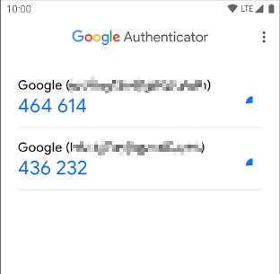

# 参考资料

[动态令牌是怎么生成的？（OTP & TOTP 简单介绍） - 知乎 (zhihu.com)](https://zhuanlan.zhihu.com/p/484991482)

[2FA & TOTP 测试 (moyuscript.github.io)](https://moyuscript.github.io/2fa-test/)

# 概念了解

## 2FA

全称 **Two Factor Authorization**，双重因素认证，在身份认证时需要两个条件，比如一个密码，一个短信验证码这种。这种机制是为了防止密码泄露后不法人员盗用密码进行登录。只要符合需要双重认证才能登录的机制都可以算作双重认证，比如短信验证码，邮箱验证码，以及我最近了解到的TOTP。

## TOTP

全称 **Time-based One-time Password**，基于时间的一次性密码，顾名思义便是随当前时间变化的密码。以谷歌身份验证器为例，其界面长这个样子



其中的六位数变为基于时间生成的一次性密码，而后面的进度条则是当前密码的剩余生效时间。有意思的是，即使在断网的情况下，谷歌验证器仍然可以生成密钥，并且可以用于登录。

首先，为了让用户能够有足够的时间输入TOTP，要保证TOTP是有存活时间的，这就使得需要在一定时间范围内，使用当时的时间戳可以生成相同的密码，这一机制的实现主要是靠步数step：

```
T = floor(timestamp/step)
```

以谷歌验证器为例，其步长为30秒，也就是step=30000，这样可以保证在30秒的时间内生成的密码是相同的。

密码的一次性我们有判断依据了，那我们还需要一个因素来确保不通的用户在同一时间段内生成的TOTP是不同的，故对于不同的用户，还需要分发一个密钥，在使用时间戳生成TOTP的同时需要这个密钥来影响他的结果。

故TOTP的值由两个变量控制，一个是当前系统的时间戳，另一个是双方约定好的密钥。

可以想到，只要保证双方系统的时间戳保持同步，双方完全不需要通信便可以生成完全相同的TOTP。这就是为什么谷歌验证器在断网的情况下生成的密钥仍然可以用于登录。

# java实现

```xml
 <dependencies>
     <!-- https://mvnrepository.com/artifact/commons-codec/commons-codec -->
     <dependency>
         <groupId>commons-codec</groupId>
         <artifactId>commons-codec</artifactId>
         <version>1.16.0</version>
     </dependency>
</dependencies>
```

```java
package com.boranget.wsdl;

import org.apache.commons.codec.binary.Base32;

import javax.crypto.Mac;
import javax.crypto.spec.SecretKeySpec;
import java.security.InvalidKeyException;
import java.security.NoSuchAlgorithmException;

/**
 * @author boranget
 * @date 2023/12/6
 */
public class TOTPTest {

    // otpauth://totp/Passkou?secret=6shyg3uens2sh5slhey3dmh47skvgq5y&issuer=Test
    public static void main(String[] args) {
        String key = "6shyg3uens2sh5slhey3dmh47skvgq5y";
        System.out.println(getTOTPNum(key));

    }

    /**
     * 获取当前TOTP
     * @param key
     * @return
     */
    static String getTOTPNum(String key){
        String res = "";
        // base32解码器
        Base32 base32 = new Base32();
        // base32解码结果
        final byte[] decodeKey = base32.decode(key.toUpperCase());
        // 获取除去步数的时间戳
        final long timestampWithStep = System.currentTimeMillis() / 1000 / 30;
        // 使用时间戳与密钥通过HmacSHA1算法生成hmac数组
        final byte[] hmac = genHMAC(TimetoBytes(timestampWithStep), decodeKey);
        // 取出低四位,低四位超不出16，故可以用于做hmac的数组下标
        int offset = hmac[19] & 0xf;
        // 这里注意移位之前需要先将数据通过位与的方式转为int，否则以byte方式移位会丢失内容
        int v1 = (hmac[offset] & 0x007f) << 24;
        int v2 = (hmac[offset + 1] & 0x00ff) << 16;
        int v3 = (hmac[offset + 2] & 0x00ff) << 8;
        int v4 = (hmac[offset + 3] & 0x00ff) ;
        // 组合为一个整数
        final int x = v1 | v2 | v3 | v4;
        // 取结果的后六位，不足六位前方补0
        res = String.valueOf(x);
        if(res.length()<6){
            int bu = 6-res.length();
            for(int i = 0; i < bu; i ++){
                res = 0+res;
            }
        }
        res = res.substring(res.length()-6);
        return res;
    }
    /**
     * 获取HMAC编码
     * @param data 加密内容
     * @param key 加密密钥
     * @return
     */
    public static byte[] genHMAC(byte[] data, byte[] key) {
        final String HMAC_SHA1_ALGORITHM = "HmacSHA1";
        byte[] result = null;
        try {
            //根据给定的字节数组构造一个密钥,第二参数指定一个密钥算法的名称
            SecretKeySpec signinKey = new SecretKeySpec(key, HMAC_SHA1_ALGORITHM);
            //生成一个指定 Mac 算法 的 Mac 对象
            Mac mac = Mac.getInstance(HMAC_SHA1_ALGORITHM);
            //用给定密钥初始化 Mac 对象
            mac.init(signinKey);
            //完成 Mac 操作
            result = mac.doFinal(data);

        } catch (NoSuchAlgorithmException e) {
            System.err.println(e.getMessage());
        } catch (InvalidKeyException e) {
            System.err.println(e.getMessage());
        }
        return result;
    }

    /**
     * 时间戳转为byte数组
     * @param num
     * @return
     */
    static byte[] TimetoBytes(long num) {
        byte[] bytes = new byte[8];
        for(int i=7 ; i>=0 ; --i) {
            bytes[i] = (byte)(num & (255));
            num = num >> 8;
        }
        return bytes;
    }
}

```

