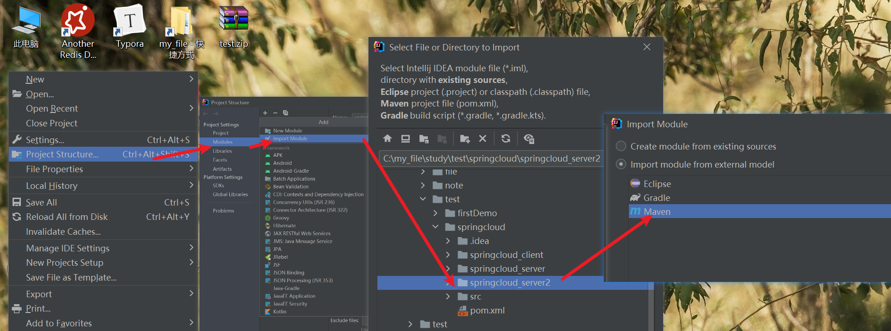
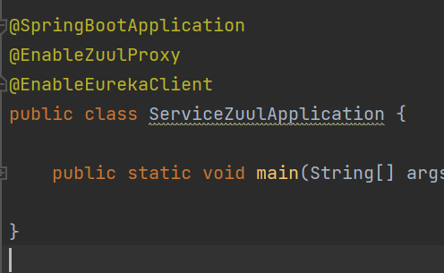
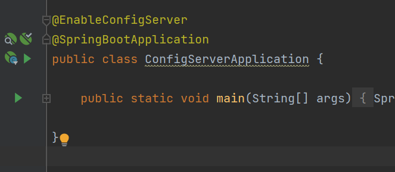
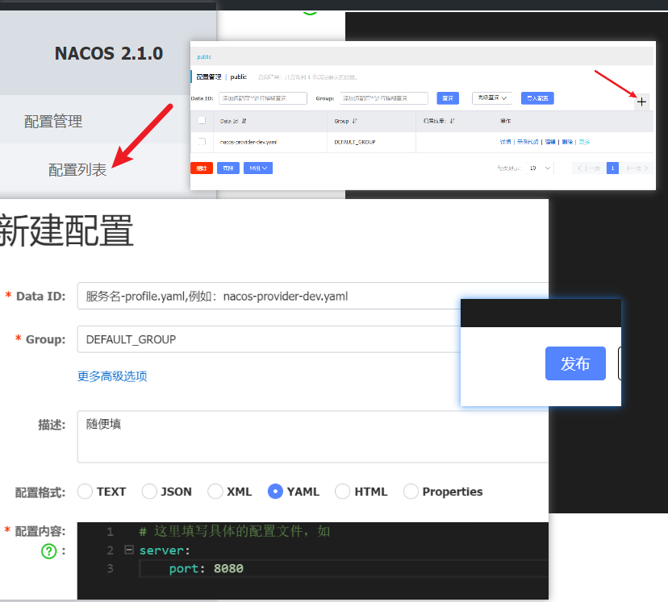
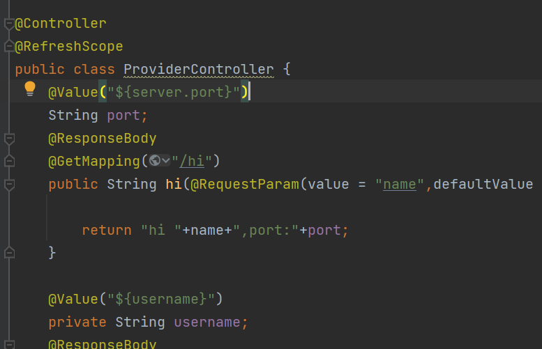

# 发现的一些问题

## 启动闪退

spring cloud client客户端需要引入web环境依赖，否则启动后会自动停止

## nacos无法识别服务名

服务名不能有下划线

## gateway "Service Unavailable"

Springcloud2020弃用了ribbon， Alibaba在2021版本nacos中删除了Ribbon的jar包。因此无法通过lb路由到指定微服务，出现了503的情况

需要引入

```xml
<dependency>
    <groupId>org.springframework.cloud</groupId>
    <artifactId>spring-cloud-starter-loadbalancer</artifactId>
</dependency>
```

# Module的复制

复制一个server module,将其中冲突的地方重命名

打开项目管理, 将复制的module以maven工程的身份导入当前项目:



# CAP

CAP原则：
C（Consistency）：一致性
A（Availablitity）：可用性
P（Partition tolerance）：分区容错性


# ribbon负载均衡

## 何为负载均衡

顾名思义，负载均衡就是将受到的压力均匀的分散给各个部分，在开发中，受到的压力通常为接收到的请求，当同一时间系统接收大量请求时，单一服务器或许就无法来得及处理，这时可以再复制几份服务实例。在接受请求时先判断  当前任务适合分发给哪个实例，从而达到分散压力的目的。

## 自定义负载均衡

- 创建自定义的规则类继承AbstractLoadBalancerRule

  ```java
  public class MyRule extends AbstractLoadBalancerRule {
  
  
      private static Logger log = LoggerFactory.getLogger(MyRule.class);
  
      public Server choose(ILoadBalancer lb, Object key) {
          if (lb == null) {
              log.warn("no load balancer");
              return null;
          }
  
          Server server = null;
          int count = 0;
          while (server == null && count++ < 10) {
              List<Server> reachableServers = lb.getReachableServers();
              List<Server> allServers = lb.getAllServers();
              int upCount = reachableServers.size();
              int serverCount = allServers.size();
  
              if ((upCount == 0) || (serverCount == 0)) {
                  log.warn("No up servers available from load balancer: " + lb);
                  return null;
              }
              // 这里的请求端ip为一串0，服务端ip为10.211.169.187
              for (Server server1 : allServers) {
                  // 这里获取ip地址
                  DiscoveryEnabledServer discoveryEnabledServer = (DiscoveryEnabledServer) server1;
                  if (discoveryEnabledServer.getInstanceInfo().getIPAddr().equals(getRequestHost())) {
                      server = server1;
                  }
              }
              // 没有相同地址，则随便返回一个
              if (server == null) {
                  int i = new Random().nextInt();
                  // 去除负数
                  i = i < 0 ? i : -i;
                  server = reachableServers.get(i % reachableServers.size());
              }
  
  
              if (server == null) {
                  /* Transient. */
                  Thread.yield();
                  continue;
              }
  
              if (server.isAlive() && (server.isReadyToServe())) {
                  return (server);
              }
  
              // Next.
              server = null;
          }
  
          if (count >= 10) {
              log.warn("No available alive servers after 10 tries from load balancer: "
                      + lb);
          }
          return server;
  
      }
  
      static String requestHost = "";
  
      public static String getRequestHost() {
  
          return requestHost;
      }
  
      @Override
      public Server choose(Object key) {
          return choose(getLoadBalancer(), key);
      }
  
  
      @Override
      public void initWithNiwsConfig(IClientConfig iClientConfig) {
  
      }
  }
  ```

  - 其中获取ip地址的工具类

    ```java
    public static String getIpAddr(HttpServletRequest request) {
            String ipAddress = null;
            try {
                ipAddress = request.getHeader("x-forwarded-for");
                if (ipAddress == null || ipAddress.length() == 0 || "unknown".equalsIgnoreCase(ipAddress)) {
                    ipAddress = request.getHeader("Proxy-Client-IP");
                }
                if (ipAddress == null || ipAddress.length() == 0 || "unknown".equalsIgnoreCase(ipAddress)) {
                    ipAddress = request.getHeader("WL-Proxy-Client-IP");
                }
                if (ipAddress == null || ipAddress.length() == 0 || "unknown".equalsIgnoreCase(ipAddress)) {
                    ipAddress = request.getRemoteAddr();
                    if (ipAddress.equals("127.0.0.1")) {
                        // 根据网卡取本机配置的IP
                        InetAddress inet = null;
                        try {
                            inet = InetAddress.getLocalHost();
                        } catch (UnknownHostException e) {
                            e.printStackTrace();
                        }
                        ipAddress = inet.getHostAddress();
                    }
                }
                // 对于通过多个代理的情况，第一个IP为客户端真实IP,多个IP按照','分割
                if (ipAddress != null && ipAddress.length() > 15) { // "***.***.***.***".length()
                    // = 15
                    if (ipAddress.indexOf(",") > 0) {
                        ipAddress = ipAddress.substring(0, ipAddress.indexOf(","));
                    }
                }
            } catch (Exception e) {
                ipAddress="";
            }
            // ipAddress = this.getRequest().getRemoteAddr();
    
            return ipAddress;
        }
    ```

  - controller同时将ip存储

    ```java
     @GetMapping(value = "/hi")
        public String hi(@RequestParam String name, HttpServletRequest request) {
            MyRule.requestHost = Utils.getIpAddr(request);
            return helloService.hiService( name );
        }
    ```

    

- 配置类将该类作为Bean交与spring管理

  ```java
  @Configuration
  public class MyConfiguration {
      @Bean
      public IRule myRule(){
          return new MyRule();
      }
  }
  
  ```

- 启动类中定义该规则所适用的服务

  - 这里的服务名需要全部大写

  ```java
  @RibbonClient(name = "SPRINGCLOUD-CLIENT" ,configuration = MyRule.class)
  
  ```

  

## 问题

- Request URI does not contain a valid hostname
  - ribbon请求地址中不能含有下划线_，只能含有中划线-
- 在yml文件中更改服务名后, eureka一直不生效
  - 因为properties文件中同样配置了服务名，有冲突，删掉properties文件即可

# 服务降级及熔断

- 熔断：熔断是分发服务发现目标服务已经挂掉，无法响应，于是干脆不再把通向该服务的请求发给该服务，而是转而发给一个备用服务。

- 降级：降级是分发服务发现目标服务器压力比较大，为了不使服务器挂掉，于是便将该请求拦了下来，直接返回一个提醒或者默认值

  区别：熔断是服务器已经挂掉而采取的补救措施，降级是为了防止服务器挂掉而采取的预防措施

在获取不到服务信息时, 可以自己搞一个备用方法, 使用Hystrix, 在获取不到服务信息时, 会自动调用通过注解指定的备用方法.

```java
 @HystrixCommand(fallbackMethod = "hiError")
    public String hiService(String name){
        return restTemplate.getForObject("http://springcloud-client/hi?name="+name,String.class);
    }
    public String hiError(String name) {
        return "hi,"+name+",sorry,error!";
    }
```

依赖:

```xml
   <dependency>
            <groupId>org.springframework.cloud</groupId>
            <artifactId>spring-cloud-starter-netflix-hystrix</artifactId>
        </dependency>
```

启动类注解

```java
@EnableHystrix
```

# Feign

使用注解的方式进行远程方法的调用

- 添加依赖

  ```xml
  <dependency>
              <groupId>org.springframework.cloud</groupId>
              <artifactId>spring-cloud-starter-netflix-eureka-client</artifactId>
          </dependency>
          <dependency>
              <groupId>org.springframework.boot</groupId>
              <artifactId>spring-boot-starter-web</artifactId>
          </dependency>
          <dependency>
              <groupId>org.springframework.cloud</groupId>
              <artifactId>spring-cloud-starter-openfeign</artifactId>
          </dependency>
  ```

  

- 启动类ServiceFeignApplication 加上@EnableFeignClients注解开启Feign的功能

- 在fegin发送请求端创建一个service,其中方法对标服务端的controller层,类名上以FeignClient注解标记

  - 请求地址\方法\参数等需相同
  - feignClient注解中value为对标的服务,fallback为发生异常进行的降级类,该降级类实现了本接口,并对请求做了备用解决

  ```java
  @FeignClient(value = "springcloud-client",fallback = SchedualServiceHiHystric.class)
  public interface SchedualServiceHi {
      @RequestMapping(value = "/hi",method = RequestMethod.GET)
      String sayHiFromClientOne(@RequestParam(value = "name") String name);
  }
  ```

- 在fegin端controller曾代理请求, 调用service层方法

```java
@RestController
public class HiController {
    @Autowired
    SchedualServiceHi schedualServiceHi;

    @GetMapping(value = "/hi")
    public String sayHi(@RequestParam String name) {
        return schedualServiceHi.sayHiFromClientOne( name );
    }
}
```

## 一些问题

- 通过fegin传输对象时在接收端的controller需要使用requestBody接收,否则接受不到数据

## Fegin传输文件MultipartFile

### 上传文件

报错org.springframework.web.multipart.MultipartException:Current request is not a multipart request

the request was rejected because no multipart boundary was found

解决:

```java
@ApiOperation("上传一个文件")
@RequestMapping(value = "/file/uploadfile", method = RequestMethod.POST, consumes = MediaType.MULTIPART_FORM_DATA_VALUE)
public CommonResult fileupload(@RequestPart MultipartFile uploadfile, @RequestParam String bucket,
                               @RequestParam(required = false) String objectName);
```

其中 consumes = MediaType.MULTIPART_FORM_DATA_VALUE 解决"Current request is not a multipart request"

@RequestPart MultipartFile uploadfile 解决"the request was rejected because no multipart boundary was found"

### 下载文件

feignClient：

```java
@ApiOperation("下载一个文件")
    @RequestMapping(value = "/file/downloadFile", method = RequestMethod.GET)
    public Response downloadFile(@RequestParam String bucket, @RequestParam String objectName);
```

注意返回值不是void而是一个feign包中的Response类

controller:

```java
 Response feignResponse = fileService.downloadFile(BUCKET_NAME,objectName);
InputStream inputStream = feignResponse.body().asInputStream();
```

# nacos结合ribbon

## nacos客户端配置

pom:

```xml
<dependency>
            <groupId>org.springframework.cloud</groupId>
            <artifactId>spring-cloud-starter-alibaba-nacos-discovery</artifactId>
            <version>0.9.0.RELEASE</version>
        </dependency>
<dependency>
            <groupId>org.springframework.cloud</groupId>
            <artifactId>spring-cloud-alibaba-nacos-config</artifactId>
            <version>0.9.0.RELEASE</version>
        </dependency>
```

yml:

```yml
# application.yml
server:
  port: 8765
spring:
  application:
    name: nacos-provider
  cloud:
    nacos:
      discovery:
        server-addr: 127.0.0.1:8848
# bootstrap.yml
spring:
  application:
    name: nacos-provider
  cloud:
    nacos:
      config:
        server-addr: 127.0.0.1:8848
        file-extension: yaml
        prefix: nacos-provider
  profiles:
    active: dev
```

启动类


- 一个consumer，两个provider


## 开启ribbon饥饿加载

```yml
ribbon:
  eager-load:
    clients: nacos-provider #,这里为需要开启饥饿加载的服务,多个逗号分割
    enabled: true
```


## 一些问题

- 阿里nacos中默认引入了ribbon，单独引入会报错

# sentinel

- 引入
  - 安装控制台
  - 新建工程，引入依赖，配置
- 需要注意启动类上需要添加discovery注解
- 先启动控制台，刚开始没有信息，在有请求进来之后会出现请求状态

# ZUUL

网关

- 需要引入zuul依赖, 注意版本问题

```xml
 <dependency>
            <groupId>org.springframework.cloud</groupId>
            <artifactId>spring-cloud-starter-zuul</artifactId>
        </dependency>
```


## 配置文件

```yml
eureka:
  client:
    serviceUrl:
      defaultZone:  http://eurekaA.com:7001/eureka/ # 同样这里需要向注册中心注册
server:
  port: 8769
spring:
  application:
    name: service-zuul
zuul:
  routes:
    api-a:
      path: /api-a/** # 请求路径
      serviceId: springcloud-ribbon # 对应的服务
    api-b:
      path: /api-b/**
      serviceId: service-feign

```

## 启动类



添加@EnableXuulProxy注解

## 忽略原服务名

配置文件中添加:

```yml
zuul:
  ignored-services: '*' # 忽略全部原服务名
  
```

```yml
zuul: 
	ignored-services: microservicecloud-dept # 忽略具体服务名
```

这里的ignored-service是个集合

## 添加前缀

```yml
prefix: /tt
```

# 配置中心

可动态的更改配置

## config-server

负责从git仓库获取配置,传给客户端

### pom文件:

```xml
<dependencies>
        <dependency>
            <groupId>org.springframework.boot</groupId>
            <artifactId>spring-boot-starter-web</artifactId>
        </dependency>
        <dependency>
            <groupId>org.springframework.cloud</groupId>
            <artifactId>spring-cloud-config-server</artifactId>
        </dependency>
    </dependencies>
```

### 配置文件

```yml
spring:
  application:
    name: config-server
  cloud:
    config:
      server:
        git:
          uri: https://gitee.com/gitora/spring-cloud-config-test # git仓库地址
#          search-paths: yml # 仓库中文件夹路径

      label: master # 仓库分支

server:
  port: 8888
```

### 启动类:



## config-client

从config-server获取自己的配置

### pom文件

```xml
  <dependency>
            <groupId>org.springframework.cloud</groupId>
            <artifactId>spring-cloud-starter-config</artifactId>
        </dependency>

        <dependency>
            <groupId>org.springframework.boot</groupId>
            <artifactId>spring-boot-starter-web</artifactId>
        </dependency>

        <dependency>
            <groupId>org.springframework.boot</groupId>
            <artifactId>spring-boot-starter-test</artifactId>
            <scope>test</scope>
        </dependency>
```

### 配置文件

```yml
spring:
  application:
    name: config-client # git中文件名需要符合服务名
  cloud:
    config:
      label: master # 分支
      profile: dev # 当前使用文件,可以理解为文件后缀
      uri: http://localhost:8888/ # config-server的地址:请求配置的地址
server:
  port: 8881

```

# nacos 配置中心

## nacos 准备



## 获取配置文件端

在resources文件夹下新建一个文件叫"bootstrap.yml"

>  bootstrap.yml 与 application.yml的区别为:  bootstrap.yml 用来程序引导时执行，应用于更加早期配置信息读取。可以理解成系统级别的一些参数配置，这些参数一般是不会变动的。一旦bootstrap.yml 被加载，则内容不会被覆盖。

内容如下:

```yml
spring:
  application:
    name: nacos-provider
  cloud:
    nacos:
      config:
        server-addr: 127.0.0.1:8848
        file-extension: yaml
        prefix: nacos-provider
  profiles:
    active: dev
```

### 热部署设置

获取动态配置的类上面添加@RefresnhScope, 可以实时更新nacos端设置的配置



# 一些问题

- fegin调用的时候，被调用方的controller层方法用的什么注解，调用方的service层就用什么注解，需要相同，单个参数最好使用requestParam注解并指明value，如果是传具体的对象则使用requestBody注解，

  - 否则出现500错误

- 前端通过网关调用别的微服务时，会出现跨域问题，使得出现问题：通过ajax得不到数据，但是浏览器可以直接访问得到数据。

  - 解决方法：在网关配置允许跨域

    ```java
    package com.example.zuul;
    
    import org.springframework.context.annotation.Bean;
    import org.springframework.context.annotation.Configuration;
    import org.springframework.web.cors.CorsConfiguration;
    import org.springframework.web.cors.reactive.CorsWebFilter;
    import org.springframework.web.cors.reactive.UrlBasedCorsConfigurationSource;
    import org.springframework.web.util.pattern.PathPatternParser;
    @Configuration
    public class CrossConfiguration{
    
        @Bean
        public CorsWebFilter corsFilter() {
            CorsConfiguration config = new CorsConfiguration();
            //允许所有请求方法，例如get，post等
            config.addAllowedMethod("*");
            //允许所有的请求来源
            config.addAllowedOrigin("*");
            //允许所有请求头
            config.addAllowedHeader("*");
            //允许携带cookie
            config.setAllowCredentials(true);
    
            UrlBasedCorsConfigurationSource source = new UrlBasedCorsConfigurationSource(new PathPatternParser());
            //对所有经过网关的请求都生效
            source.registerCorsConfiguration("/**", config);
    
            return new CorsWebFilter(source);
        }
    }
    ```

    ```yml
    spring:
      application:
        name: getaway
      cloud:
        gateway:
          globalcors:
            corsConfigurations:
              '[/**]':
                # 允许携带认证信息
                allow-credentials: true
                # 允许跨域的源(网站域名/ip)，设置*为全部
                allowedOrigins: "*"
                # 允许跨域的method， 默认为GET和OPTIONS，设置*为全部
                allowedMethods: "*"
                # 允许跨域请求里的head字段，设置*为全部
                allowedHeaders: "*"
    
    ```

    