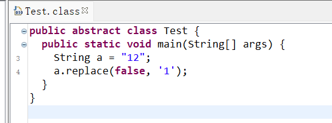

# 字符串replace问题

某系统升级后并不是向下兼容的，新系统在运行后，自定义的模块一直报错NoSuchMethodException，查阅代码发现该方法属于在旧系统中存在但是新系统中移除的一个方法，为保证自定义模块继续执行，需要反编译新系统的源码添加该方法来适配自定义的调用。但在某个类的反编译结果中出现了一个很奇怪的现象。该段代码通过jd-gui反编译的结果如下：

```java
String a;
...
a.replace(false, '1');
```

已知String类没有首个参数为布尔值的replace方法，不做修改的话编译肯定是无法通过的。根据经验，猜测应该是原字符转成数字之后，jd-gui又转成布尔值了，而表示成布尔值之后为false的数，按理来说是0。于是使用java的命令行反编译工具javap，反编译结果如下：

```powershell
javap -c -v Trace.class > Trace.txt
```

```
4: iconst_0
5: bipush        49
7: invokevirtual #3    // Method java/lang/String.replace:(CC)Ljava/lang/String;
```

果然是iconst_0，说明这里确实是塞了一个0进去，由于java是用Unicode来编码字符的，那么能作为0保存的字符，按理来说就是 '\\0' 了。

于是自己编写了一段代码测试了一下：

```java
public abstract class Test {
    public static void main(String[] args) {
        String a = "12";
        a.replace('\0','1');
    }
}
```

该方法字节码如下

```
 0 ldc #2 <12>
 2 astore_1
 3 aload_1
 4 iconst_0
 5 bipush 49
 7 invokevirtual #3 <java/lang/String.replace : (CC)Ljava/lang/String;>
10 pop
11 return
```

果然有相同的iconst_0操作，于是再次使用jd-gui打开class文件



成功复现，证明了源代码这里确实应该是 '\\0'

# 编译jar包中的一个类

基本思路为将该类脱出来进行反编译后，进行修改，再次编译后塞回jar包

那在编译该类时，便需要依赖该jar包，编译设置依赖的方法如下

```powershell
java -classpath ./test.jar Test.java
```

其中test.jar便是Test.class所属的jar包

若需要配置多个位置的类路径，中间用冒号分隔

```powershell
java -classpath ./lib:./test.jar Test.java
```

