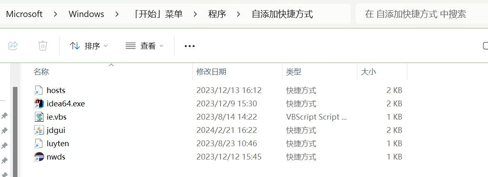
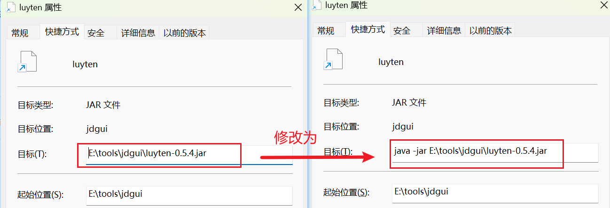

# 概述

使用windows徽标键后会弹出开始菜单，此时窗口焦点在搜索框上，直接输入文字便可检索开始菜单中的内容，配合回车键便可快速打开文件或者启动应用，流畅程度不亚于utools。

操作：win徽标>搜索>回车启动

# 增强

对于在安装过程中已经添加到开始菜单的软件，可直接使用上述方式启动，但有些软件安装过程中并没有加入到开始菜单，或者有些自己的文件也想要快速启动，此时可以通过如下操作实现：

原理为：开始菜单中的内容实际上就是某个文件夹的内容，该文件夹的路径为：

`C:\Users\用户名\AppData\Roaming\Microsoft\Windows\Start Menu`

当将一个文件放入该文件中时，该文件便会被开始菜单索引，此时便可通过开始菜单中的搜索定位

我们可以在该文件夹中新建一个文件夹，用于存放我们自添加的文件，如：

`C:\Users\用户名\AppData\Roaming\Microsoft\Windows\Start Menu\Programs\自添加快捷方式`

在自添加快捷方式这个文件夹中，便可以存放一些应用的快捷方式，比如：

此时便可通过开始菜单来快捷启动idea64

# 打开文件

对于一些文件也可以这样操作，若文件有默认打开方式，则可以直接回车打开，但如果没有配置默认打开方式，比如jar包，则可以通过修改快捷方式的操作来达到直接运行jar包的目的：

点击应用后，由于配置了环境变量，java会自动变为其绝对路径，此时确定即可