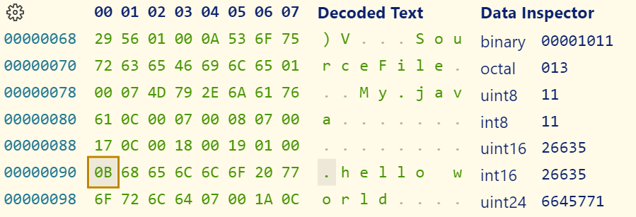

# 原理

Java文件在编译为class文件后，字符串内容会存储在字节码的常量池部分，理论上若有需求，可以修改此部分的值达到修改程序运行结果的目的。

字符串常量的字节码结构如下图：


# 实验

## 实验文件

测试程序为标准的helloworld程序，这里只输出hello，后续操作补上world

```java
class My{
    public static void main(String[] args) {
        System.out.println("hello");
    }
}
```

## 修改过程

若目的为将hello改为world，则仅需要下载一个vscode插件“Hex Editor”，该插件支持直接修改二进制数据，我们只需要找到常量池部分的hello内容将其修改为world即可。


但该插件只能修改已有字节，如果要更改文件的长度比如添加或删除内容，是不支持的，所以这里写了个Java程序，通过写字节数组到文件的方法，在其中插入内容。

```java

public class Test {
    public static void main(String[] args) throws IOException {
        // 修改的起始位置
        final int index = 149;
        // 获取原始文件的字节数组
        final byte[] x = Files.readAllBytes(Paths.get("My.class"));
        // 创建存放修改后内容的字节数组（多了6个字符）
        byte [] y = new byte[x.length+6];
        for(int i = 0; i < x.length; i++){
            // 之前的内容无需改动
            if(i<index){
                y[i]=x[i];
            }else if(i == index){
                // 改变长度值
                y[i-5]=(byte) (x[i-5]+6);
                y[i]=x[i];
                // 添加内容
                y[i+1]=' ';
                y[i+2]='w';
                y[i+3]='o';
                y[i+4]='r';
                y[i+5]='l';
                y[i+6]='d';
            // 补充完剩下的内容
            }else{
                y[i+6]=x[i];
            }
        }
        // 写入文件
        final FileOutputStream fileOutputStream = new FileOutputStream("My.class");
        fileOutputStream.write(y);
        fileOutputStream.close();
    }
}
```

查看字节码可以看到修改成功：



运行成功：


# 遇到的问题

- 只顾着添加字符串，忘记调整长度了，在运行的时候报错 java.lang.ClassFormatError: Unknown constant tag。。。。