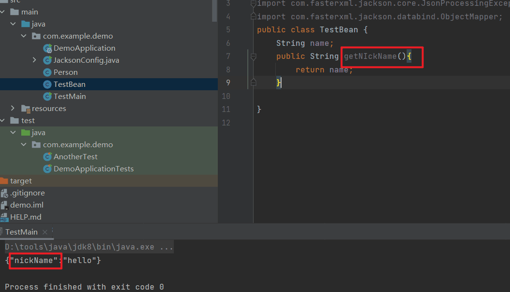
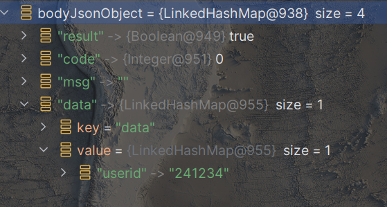

# 参考资料

https://blog.csdn.net/qq_41834086/article/details/111152470

# 序列化与反序列化

实例实体类

```java
package com.example.demo;

public class Person {
    public String getUsername() {
        return username;
    }

    public void setUsername(String username) {
        this.username = username;
    }

    public int getAge() {
        return age;
    }

    public void setAge(int age) {
        this.age = age;
    }

    String username;
    int age;
}
```

序列化与反序列化过程

```java
public static void main(String[] args) throws IOException {
    // 将json字符串转为对象
    String json ="{\"username\":\"zhangsan\",\"age\":15}";
    Person person = new ObjectMapper().readValue(json, Person.class);
    // 将对象转为字符串
    String s = new ObjectMapper().writeValueAsString(person);
    // 将对象转为字符串并输出
    new ObjectMapper().writeValue(System.out,person);
}
```

# 定制反序列化

```java
class PersonDeSerializer extends StdDeserializer<Person> {
    
    protected PersonDeSerializer(Class<?> vc) {
        super(vc);
    }

    @Override
    public Person deserialize(JsonParser jsonParser, DeserializationContext deserializationContext) throws IOException, JacksonException {
        Person person = new Person();
        while (!jsonParser.isClosed()){
            JsonToken jsonToken = jsonParser.nextToken();
            if(JsonToken.FIELD_NAME.equals(jsonToken)){
                String fieldName = jsonParser.getCurrentName();
                System.out.println(fieldName);
                jsonToken = jsonParser.nextToken();
                if("username".equals((fieldName))){
                    person.setUsername(jsonParser.getValueAsString().toUpperCase());
                }
                if("age".equals(fieldName)){
                    person.setAge(jsonParser.getValueAsInt());
                }
            }
        }
        return person;
    }
}

public static void main(String[] args) throws IOException {
        String json ="{\"username\":\"zhangsan\",\"age\":15}";
        ObjectMapper objectMapper = new ObjectMapper();
        SimpleModule simpleModule = new SimpleModule();
        simpleModule.addDeserializer(Person.class,new PersonDeSerializer(Person.class));
        objectMapper.registerModule(simpleModule);
        Person person = objectMapper.readValue(json, Person.class);
        objectMapper.writeValue(System.out,person);
    }
```

# 定制化序列化

```java
class PersonSerializer extends StdSerializer<Person>{

    protected PersonSerializer(Class<Person> t) {
        super(t);
    }

    @Override
    public void serialize(Person person, JsonGenerator jsonGenerator, SerializerProvider serializerProvider) throws IOException {
        jsonGenerator.writeStartObject();
        jsonGenerator.writeStringField("his name",person.getUsername());
        jsonGenerator.writeStringField("his age",String.valueOf(person.getAge()));
        jsonGenerator.writeEndObject();
    }
}

public static void main(String[] args) throws IOException {
    String json ="{\"username\":\"zhangsan\",\"age\":15}";
    ObjectMapper objectMapper = new ObjectMapper();
    SimpleModule simpleModule = new SimpleModule();
    simpleModule.addSerializer(Person.class,new PersonSerializer(Person.class));
    objectMapper.registerModule(simpleModule);
    Person person = objectMapper.readValue(json, Person.class);
    objectMapper.writeValue(System.out,person);
}
```

# SpringBoot更改@RequestBody参数注入逻辑（参数名映射）

[springboot项目配置参数请求及返回均为下划线方式_springboot responsebody 指定返回的格式 为下划线分割_偶系渣渣灰的博客-CSDN博客](https://blog.csdn.net/breakaway_01/article/details/119033959)

```yaml
spring:
  jackson:
     property-naming-strategy: SNAKE_CASE #下划线参数
```

# 序列化后字段变多

```java
实体类
@Data
@AllArgsConstructor //全参构造
@NoArgsConstructor //无参构造
//@Component
@TableName("staff")
public class Staff {
    @TableId(value = "User",type=IdType.NONE)
    public String user;//用户账号
    @TableField(value = "Password")
    public String password;//用户密码
    @TableField(value = "IDstate")
    public Integer idState;//账号状态 0停用 1启用
    @TableField(value = "SName")
    public String sName;//用户姓名
    @TableField(value = "SID")
    public String sID;//用户id 身份证号
    @TableField(value = "SPhone")
    public String sPhone;//用户手机
    @TableField(value = "SSex")
    public String sSex;//用户性别
    @TableField(value = "SJob")
    public String sJob;//职员岗位
    @TableField(value = "SDepartment")
    public String sDepartment;//所属部门
}
Controller
@RequestMapping(value = "/findstaffs",method = RequestMethod.GET)
    public Result selectStaffByCondition(@RequestBody Staff staff){
    System.out.println("0000");
    List<Staff> staffs=staffService.selectStaffByCondition(staff);
    return Result.success(staffs);
}

```

```json
postman调用的结果，为什么序列化后的json有多出来的字段
{
    "code": "200",
    "message": "请求成功",
    "res": [
        {
            "user": "fgyonghu3",
            "password": "staff03",
            "idState": 1,
            "sName": "用户3",
            "sID": "440105111100000003",
            "sPhone": "12345678903",
            "sSex": "女",
            "sJob": "职员",
            "sDepartment": "房屋管理二所",
            "sjob": "职员",
            "ssex": "女",
            "sdepartment": "房屋管理二所",
            "sphone": "12345678903",
            "sid": "440105111100000003",
            "sname": "用户3"
        }
    ]
}
```

因为使用小辣椒生成的get方法会将首字母大写，而序列化后的key会将开头的所有大写转为小写，导致出现“sid”，但为什么还会有sID呢？待解决。



解决办法

**使用`@JsonProperty`注解**：
在`Staff`类的每个字段上，使用`@JsonProperty`注解来明确指定JSON中的属性名称。这样，序列化库就会只序列化这些明确指定的属性。

```java
@JsonProperty("sName")  
public String sName;  
// 其他字段也加上@JsonProperty注解
```

**或者使用规范的小驼峰**

# 企图用泛型控制反序列化结果

譬如如下代码

```java
 String body = "{\r\n" +
                "  \"result\": true,\r\n" +
                "  \"code\": 0,\r\n" +
                "  \"msg\": \"\",\r\n" +
                "  \"data\": {\r\n" +
                "    \"userid\": \"241234\"\r\n" +
                "  }\r\n" +
                "}";
ObjectMapper om = new ObjectMapper();
Map<String, String> bodyJsonObject = null;
try {
    bodyJsonObject = om.readValue(body, Map.class);
} catch (Throwable e2) {
    // TODO Auto-generated catch block
}
```

在bodyJsonObject声明时使用的泛型是没有效果的，最终的bodyJsonObject的转换结果如下：



可以看到value并没有被约束为String类型

多数情况下使用Map是要临时提取其中的值，此时较好的方法可使用JsonNode代替

# JsonNode

类似于fastJson中的JsonObject

```java
public static void main(String[] args) throws Exception {
    String jsonStr =
            "{\n" +
            "  \"result\": false,\n" +
            "  \"code\": 1007,\n" +
            "  \"msg\": \"不合法的token\",\n" +
            "  \"data\": {\n" +
            "    \"userId\": \"123456\"\n" +
            "  },\n" +
            "  \"arrayData\": [\n" +
            "    {\n" +
            "      \"k1\": \"v1\"\n" +
            "    },\n" +
            "    {\n" +
            "      \"k2\": \"v2\"\n" +
            "    }\n" +
            "  ],\n" +
            "  \"stringArray\": [\n" +
            "    \"001\",\n" +
            "    \"002\"\n" +
            "  ]\n" +
            "}";
    ObjectMapper objectMapper = new ObjectMapper();
    JsonNode jsonNode = objectMapper.readTree(jsonStr);
    boolean result = jsonNode.get("result").asBoolean();
    String userId = jsonNode.get("data").get("userId").asText();
    String k1 = jsonNode.get("arrayData").get(0).get("k1").asText();
    String arr1 = jsonNode.get("stringArray").get(0).asText();
}
```

# ObjectNode

**JsonNode作用**

JsonNode是Jackson中为了处理[JOSN](https://so.csdn.net/so/search?q=JOSN&spm=1001.2101.3001.7020)文本的树模型(tree model)。可以将JSON文本转成JsonNode，也可以将JsonNode转成JOSN文本。JsonNode是只读的，不可修改，用它可以方便的获取JSON中某字段的值。

可使用如下代码创建一个空节点

```java
ObjectMapper mapper = new ObjectMapper(); 
ObjectNode rootNode = mapper.createObjectNode();
```


**JsonNode VS ObjectNode**

ObjectNode和ArrayNode都是JsonNode类的扩展，不同的是JsonNode是只读的，而ObjectNode和ArrayNode是可以修改的。如果只是从JSON文本中读取数据，用JsonNode就够了。

ObjectNode是一个节点，ArrayNode就是一个数组，可以包含多个ObjectNode。