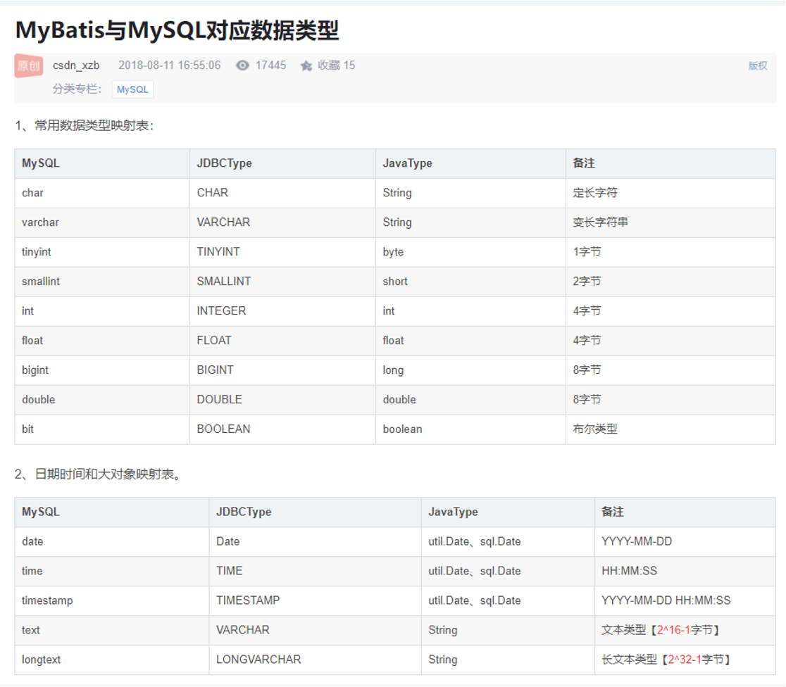

# 数据源配置

```yml
spring:
  datasource:
    type: com.alibaba.druid.pool.DruidDataSource
    driver-class-name: com.mysql.cj.jdbc.Driver
    url: jdbc:mysql://localhost:3306/sstestdb?useUnicode=true&characterEncoding=utf-8&serverTimezone=Asia/Shanghai
    username: root
    password: 123456
```

# 引入依赖


```xml
<!--druid-->
<dependency>
    <groupId>com.alibaba</groupId>
    <artifactId>druid</artifactId>
    <version>1.2.8</version>
</dependency>
<!--mysql-->
<dependency>
    <groupId>mysql</groupId>
    <artifactId>mysql-connector-java</artifactId>
</dependency>
<!--mybatis-->
<dependency>
    <groupId>org.mybatis.spring.boot</groupId>
    <artifactId>mybatis-spring-boot-starter</artifactId>
    <version>2.2.0</version>
</dependency>
```

一般: SpringBoot官方的Starter命名格式为：spring-boot-starter-*

第三方命名格式为： *-spring-boot-starter

# 一对一查询

association 标签

需要注意的是, association必须在collection之前

且必须要有一个column属性

```xml
 <resultMap id="RoleResultMap" type="com.orange.eneity.OrangeRole">
        <id column="id" property="id"/>
        <result column="name" property="name"/>
        <result column="desc" property="desc"/>
        <association property="user"
                     javaType="com.orange.eneity.User"
                     select="selectAllUser"
                     column="id"
        />
        <collection property="derivedRoleList"
                    ofType="com.orange.eneity.OrangeRole"
                    select="selectDerivedRoleList"
                    column="id"
        />
        <collection property="baseRoleList"
                    ofType="com.orange.eneity.OrangeRole"
                    select="selectBaseRoleList"
                    column="id"
        />

    </resultMap>
```


# 一对多查询

- xml配置

  ```xml
  <mapper namespace="com.example.firstdemo.domain.repository.HandStudentCourseCoreRepository">
      <resultMap id="HandStudentCourseCoreResultMap" type="com.example.firstdemo.domain.vo.HandStudentCourseCore">
              <result column="STUDENT_NO" property="studentNo"/>
          <collection property="studentCourseCore"
                      ofType="com.example.firstdemo.domain.entity.HandStudentCore"
                      foreignColumn="STUDENT_NO">
              <id column="STUDENT_NO" property="studentNo"/>
              <id column="COURSE_NO" property="courseNo"/>
              <id column="CORE" property="core"/>
          </collection>
      </resultMap>
      <select id="selectHandStudentCourseCore" resultMap="HandStudentCourseCoreResultMap">
          select hs.STUDENT_NO,
                 hsc.*
          from hand_student hs left join hand_student_core hsc on hs.STUDENT_NO = hsc.STUDENT_NO
          where hs.STUDENT_NO = #{studentNo};
      </select>
  
  </mapper>
  ```

- vo类构造

  ```java
  @Data
  public class HandStudentCourseCore {
      private String studentNo;
      List<HandStudentCore> studentCourseCore;
  }
  ```

- 运行结果

  ```txt
  HandStudentCourseCore(
  studentNo=s001,
  studentCourseCore=[
  HandStudentCore(studentNo=s001, courseNo=c001, core=58.9), HandStudentCore(studentNo=s001, courseNo=c002, core=82.9), HandStudentCore(studentNo=s001, courseNo=c003, core=59.0)
  ])
  ```

# resultType/Map的区别

- resultTpye:必须字段名与属性名完全对应
- resultMap:可以自定义映射关系

除去简单的区别外，resultType由于是固定的实体类，所以只有填充功能，但resultMap中可以自定义查询，也就是说，如果将查询结果指定resultMap， 若resultMap中有查询操作，则会调用该查询操作。

```xml
 <resultMap id="RoleResultMap" type="com.orange.eneity.OrangeRole">
        <id column="id" property="id"/>
        <result column="name" property="name"/>
        <result column="desc" property="desc"/>
        <collection property="derivedRoleList"
                    ofType="com.orange.eneity.OrangeRole"
                    select="selectDerivedRoleList"
                    column="id"
        />
        <collection property="baseRoleList"
                    ofType="com.orange.eneity.OrangeRole"
                    select="selectBaseRoleList"
                    column="id"
        />
    </resultMap>
```

像这里的collection中就包含一个select操作

# mybatis配置

```yml
# 配置mybatis规则
mybatis:
  config-location: classpath:mybatis/mybatis-config.xml  #全局配置文件位置
  mapper-locations: classpath:mybatis/mapper/*.xml  #sql映射文件位置
  configuration:
    map-underscore-to-camel-case: true # 下划线到驼峰的转换

```

# 接口

**注解模式**

```java
@Mapper
public interface CityMapper {
    @Select("select * from city where id=#{id}")
    public City getById(Long id);
    public void insert(City city);
}
```


# 一些问题

1. mapper上使用@Repository出现无法扫描到mapper的情况

   在springboot 中，给mapper的接口上加上@Repository，无法生成相应的bean,从而无法@Autowired，这是因为spring扫描注解时，自动过滤掉了接口和抽象类。

   这种情况下可以在启动的类前加上@MapperScan（“×××.×××.mapper”)，从而使mapper可以自动注入，但是idea还会提示bean无法找到，但是不会影响运行。

2. set自动消除多余的逗号需要把逗号后置

# 数据类型映射



# VO/DO/DTO

- VO
  - 前端展示的数据所对应
- DO
  - 数据库中的表所对应
- DTO
  - 其他需要传递的数据

使用原因:

1. 不需要的字段也会传输到前端,臃肿且不安全
2. 某些字段需要先行处理再展示
3. 某些信息需要展示但不需要存入数据库

# MyBatis Plus

```xml
<dependency>
    <groupId>com.baomidou</groupId>
    <artifactId>mybatis-plus-boot-starter</artifactId>
    <version>最新版本</version>
</dependency>
```

# Type Handler

实体类中特定参数到数据库中字段的映射

比如map->json字符串的需求

**编写typeHandler,这里注意要放入Bean容器中,不然会提示映射异常**

```java
@Component
public class MapTypeHandler extends BaseTypeHandler<Map<String,String>> {
    @Override
    public void setNonNullParameter(PreparedStatement preparedStatement, int i, Map map, JdbcType jdbcType) throws SQLException {
        String s = JSONObject.toJSONString(map);
        preparedStatement.setString(i,s);
    }

    @Override
    public Map getNullableResult(ResultSet resultSet, String s) throws SQLException {
        Map map = JSONObject.parseObject(resultSet.getString(s), Map.class);
        return map;
    }

    @Override
    public Map getNullableResult(ResultSet resultSet, int i) throws SQLException {
        Map map = JSONObject.parseObject(resultSet.getString(i), Map.class);
        return map;
    }

    @Override
    public Map getNullableResult(CallableStatement callableStatement, int i) throws SQLException {
        Map map = JSONObject.parseObject(callableStatement.getString(i), Map.class);
        return map;
    }
}
```

**mapper文件**

```xml 
<mapper namespace="com.orange.frame.job.mapper.JobInfoMapper">

    <resultMap id="jobInfo" type="com.orange.frame.job.entity.OrangeJobInfo">
        <id column="id" property="jobId"/>
        <result column="job_name" property="jobName"/>
        <result column="job_group" property="jobGroup"/>
        <result column="job_status" property="jobStatus"/>
        <result column="target_url" property="targetUrl"/>
        <result column="headers" property="headers" typeHandler="com.orange.frame.job.util.MapTypeHandler"/>
        <result column="method" property="method"/>
        <result column="params" property="params" typeHandler="com.orange.frame.job.util.MapTypeHandler"/>
        <result column="body" property="body"/>
        <result column="corn" property="corn"/>
        <result column="create_user_id" property="createUserId"/>
        <result column="create_time" property="createTime"/>
    </resultMap>
    <select id="listAllJobInfo" resultMap="jobInfo">
        select *
        from job_info
    </select>
    <insert id="saveJobInfo" useGeneratedKeys="true" keyProperty="jobId" parameterType="com.orange.frame.job.entity.OrangeJobInfo">
        insert into job_info
        ( job_name
        , job_group
        , job_status
        , target_url
        , headers
        , method
        , params
        , body
        , corn
        , create_user_id
        , create_time)
        values ( #{jobName}
               , #{jobGroup}
               , #{jobStatus}
               , #{targetUrl}
               , #{headers,typeHandler=com.orange.frame.job.util.MapTypeHandler}
               , #{method}
               , #{params,typeHandler=com.orange.frame.job.util.MapTypeHandler}
               , #{body}
               , #{corn}
               , #{createUserId}
               , #{createTime})
    </insert>
</mapper>
```

查询使用result Map,其中配置特定字段使用的TypeHandler

insert中,在values中配置使用的TypeHandler

# 插入数据返回主键问题

在insert语句中添加如下属性，在将传入对象插入到数据库中后，传入对象的主键会被修改为插入之后的数据的id

```xml
useGeneratedKeys="true" keyProperty="实体类中保存id的属性名" 
```

e.g.

```xml
<insert id="saveJobInfo" useGeneratedKeys="true" keyProperty="jobId" parameterType="com.orange.frame.job.entity.OrangeJobInfo">
        insert into job_info
        ( job_name
        , job_group
        , job_status
        , target_url
        , headers
        , method
        , params
        , body
        , corn
        , create_user_id
        , create_time)
        values ( #{jobName}
               , #{jobGroup}
               , #{jobStatus}
               , #{targetUrl}
               , #{headers,typeHandler=com.orange.frame.job.util.MapTypeHandler}
               , #{method}
               , #{params,typeHandler=com.orange.frame.job.util.MapTypeHandler}
               , #{body}
               , #{corn}
               , #{createUserId}
               , #{createTime})
    </insert>
```

