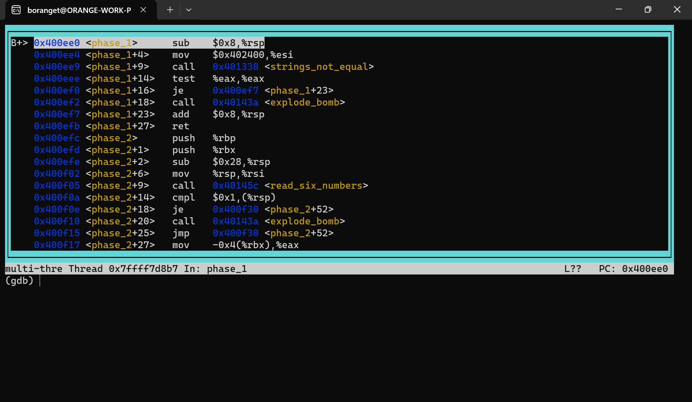

# 参考资料

[手把手教你拆解 CSAPP 的 炸弹实验室 BombLab - 知乎 (zhihu.com)](https://zhuanlan.zhihu.com/p/451623574)

# 环境准备

WSL2的ubuntu，安装了vim，gcc以及gdb

# 炸弹下载

```bash
wget csapp.cs.cmu.edu/3e/bomb.tar
```

压缩包中包括可执行文件bomb本体，源码bomb.c，以及一份README

# 源码

```c
/***************************************************************************
 * Dr. Evil's Insidious Bomb, Version 1.1
 * Copyright 2011, Dr. Evil Incorporated. All rights reserved.
 *
 * LICENSE:
 *
 * Dr. Evil Incorporated (the PERPETRATOR) hereby grants you (the
 * VICTIM) explicit permission to use this bomb (the BOMB).  This is a
 * time limited license, which expires on the death of the VICTIM.
 * The PERPETRATOR takes no responsibility for damage, frustration,
 * insanity, bug-eyes, carpal-tunnel syndrome, loss of sleep, or other
 * harm to the VICTIM.  Unless the PERPETRATOR wants to take credit,
 * that is.  The VICTIM may not distribute this bomb source code to
 * any enemies of the PERPETRATOR.  No VICTIM may debug,
 * reverse-engineer, run "strings" on, decompile, decrypt, or use any
 * other technique to gain knowledge of and defuse the BOMB.  BOMB
 * proof clothing may not be worn when handling this program.  The
 * PERPETRATOR will not apologize for the PERPETRATOR's poor sense of
 * humor.  This license is null and void where the BOMB is prohibited
 * by law.
 ***************************************************************************/

#include <stdio.h>
#include <stdlib.h>
#include "support.h"
#include "phases.h"

/* 
 * Note to self: Remember to erase this file so my victims will have no
 * idea what is going on, and so they will all blow up in a
 * spectaculary fiendish explosion. -- Dr. Evil 
 */

FILE *infile;


int main(int argc, char *argv[])
{
    char *input;

    /* Note to self: remember to port this bomb to Windows and put a 
     * fantastic GUI on it. */

    /* When run with no arguments, the bomb reads its input lines 
     * from standard input. */
    if (argc == 1) {  
	infile = stdin;
    } 

    /* When run with one argument <file>, the bomb reads from <file> 
     * until EOF, and then switches to standard input. Thus, as you 
     * defuse each phase, you can add its defusing string to <file> and
     * avoid having to retype it. */
    else if (argc == 2) {
	if (!(infile = fopen(argv[1], "r"))) {
	    printf("%s: Error: Couldn't open %s\n", argv[0], argv[1]);
	    exit(8);
	}
    }

    /* You can't call the bomb with more than 1 command line argument. */
    else {
	printf("Usage: %s [<input_file>]\n", argv[0]);
	exit(8);
    }

    /* Do all sorts of secret stuff that makes the bomb harder to defuse. */
    initialize_bomb();

    printf("Welcome to my fiendish little bomb. You have 6 phases with\n");
    printf("which to blow yourself up. Have a nice day!\n");

    /* Hmm...  Six phases must be more secure than one phase! */
    input = read_line();             /* Get input                   */
    phase_1(input);                  /* Run the phase               */
    phase_defused();                 /* Drat!  They figured it out!
				      * Let me know how they did it. */
    printf("Phase 1 defused. How about the next one?\n");

    /* The second phase is harder.  No one will ever figure out
     * how to defuse this... */
    input = read_line();
    phase_2(input);
    phase_defused();
    printf("That's number 2.  Keep going!\n");

    /* I guess this is too easy so far.  Some more complex code will
     * confuse people. */
    input = read_line();
    phase_3(input);
    phase_defused();
    printf("Halfway there!\n");

    /* Oh yeah?  Well, how good is your math?  Try on this saucy problem! */
    input = read_line();
    phase_4(input);
    phase_defused();
    printf("So you got that one.  Try this one.\n");
    
    /* Round and 'round in memory we go, where we stop, the bomb blows! */
    input = read_line();
    phase_5(input);
    phase_defused();
    printf("Good work!  On to the next...\n");

    /* This phase will never be used, since no one will get past the
     * earlier ones.  But just in case, make this one extra hard. */
    input = read_line();
    phase_6(input);
    phase_defused();

    /* Wow, they got it!  But isn't something... missing?  Perhaps
     * something they overlooked?  Mua ha ha ha ha! */
    
    return 0;
}

```


# phase1

通过查看源码可知，第一步的入口为phase_1，有一个参数，所以这里在方法入口处打一个断点

```bash
# gdb 启动bomb
gdb bomb
# 在phase1处打断点
b phase_1
# 执行
r
# 此时会要求输入第一步的内容，先随便输入什么
abc
# 此时碰到断点停止，layout asm显示汇编窗口
layout asm
# 可以看到此时已经进入了phase_1方法
```



第一行对rsp的操作是对栈指针的操作，目的是在栈上扩展内存

第二行，将0x402400这个立即数存入了esi寄存器，esi寄存器通常是用作第二个参数，第一个参数是rdi寄存器，由于在调用当前方法的时候，将输入的字符串作为参数传了进来，可以确定rdi中此时还是存着输入的内容，而可以看到下一步就是调用一个字符串比较是否相同的方法，鉴于第一个参数是输入的内容，第二个参数是0x402400，猜测0x402400中存储的便是第一步的密码。

```bash
# 输出该地址的内容
x/s 0x402400 
```

输出了如下内容

`Border relations with Canada have never been better.`

猜测此便是第一步的密码

```bash
# 退出gdb
q
# 重新调试
gdb bomb
# 在第二步打上断点
b phase_2
# 运行
r
# 要求输入第一步的密码，此时输入上面获取的内容
Border relations with Canada have never been better.
# 输出成功信息:Phase 1 defused. How about the next one?
```

