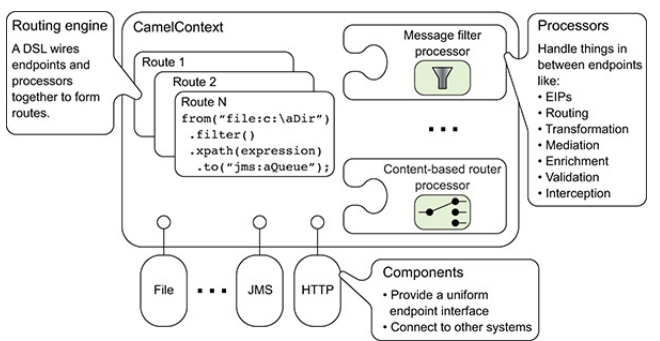

# 认识Camel

## Camel的消息模型

### MESSAGE

message按照一个方向流动，从发送方到接收方。

message包含以下部分

- body

  object类型，无大小限制，若发送接收两方使用不同的body格式，camel提供了适配器组件

- headers

  键值对的形式，存储一些与消息由关的值，比如发送方的标识，或者消息的编码、验证信息等。

  key为大小写不敏感的唯一值，value可以为任意object，且对大小，数量无限制，以map存储

- attachments

  附件，web service或者email 中使用

每个message都有一个string类型的id标识，其唯一性由消息的创建者保证。

message也有失败标识“fault flag”，在一些协议中比如soap，错误信息和返回的消息是不同的消息。 但它们都属于合法的响应

### EXCHANGE

exchange是message在routing过程时的容器

结构如下

Exchange

- Exchange ID
- MEP
- Exception
- Properties
- In message
  - Headers
  - Attachments
  - Body
- Out message
  - Headers
  - Attachments
  - Body

其中：

- exchange id

  camel自动生成的exchange唯一标识

- MEP

  标识是否需要响应，如果该值为`inOnly`

  ，则exchange只包含inMesage，如果是`inOut`，则exchange会包含请求消息和响应消息

- Exception

  如果在路由过程中出现了error，则异常会存入该字段

- Properties

  在整个exchange的过程中做数据存取操作，类似于message中的header，但是范围是整个exchange，而header只在消息中有效

- In message

  Input message, 在一个exchange中肯定会有一个in message，其内容为请求消息

- Out message

  当MEP为`InOut`，exchange中会包含out message，其内容为响应消息

## Camel的架构



### 概念

- Camel Context

  调控各种服务的运行时系统核心，主要提供如下服务

  - Components

    包含当前使用的组件

  - Endpoints

    包含当前使用的endpoints

  - Routes

    包含已添加的route

  - Type converters

    包含被加载的type converters

  - Data formats

    包含被加载的data format

  - Registry

    包含一个可以查找bean的注册表

  - Languages

    包含被加载的语言，该语言用作创建表达式，比如Xpath等

- Routing Engine

  消息路由的底层实现，不会暴露给开发者

- Routes

  路由，可用于cs之间的解耦，功能如下

  - 动态地决定调用的server
  - 提供灵活的方式来拓展处理过程
  - 允许客户端或服务端单独开发
  - 可连接不同的系统来提供更好的实现
  - 增强某些系统的特性或功能，比如消息代理和esb
  - 允许移除服务器的客户端，使用mock来进行测试

  每个camel中的route会有一个id来用于启停，记录日志，调试，监控等。

  一个route只能有一个输入endpoint，如果有多个输入route，camel有提供语法糖：

  ```java
  from("jms:queue:A", "jms:queue:B", "jms:queue:C").to("jms:queue:D");
  ```

  camel在底层会同时创建三条路由，相当于

  ```java
  from("jms:queue:A").to("jms:queue:D");
  from("jms:queue:B").to("jms:queue:D");
  from("jms:queue:C").to("jms:queue:D");
  ```

  以上在camel中合法但不建议多个input端点。

- Domain-Specific Language

  camel中使用流式java api来作为dsl，例如

  ```java
  from("file:data/inbox")
  .filter().xpath("/order[not(@test)]")
  .to("jms:queue:order");
  ```

  或者使用xml

  ```xml
  <route>
      <from uri="file:data/inbox"/>
      <filter>
          <xpath>/order[not(@test)]</xpath>
          <to uri="jms:queue:order"/>
      </filter>
  </route>
  ```

- Processor

  构成路由的节点，负责处理

- Component

  camel中的主要扩展点，用于扩展功能

- Endpoint

  信息发送与接收的端点。在camel中，使用uri来配置端点例如

  file:data/inbox? delay=5000

  Scheme:Context path?Options

  其中，Scheme表示使用何种component来处理，Context path表示上下文路径，Options表示相关操作。这里：使用FileComponent在data/Inbox每五秒进行一次轮询

- Producer

  能够向端点发送消息的实体

- Consumer

  能够接收外围系统消息的服务，将消息包装为exchange，camel 中有两种consumer：event-driven consumers 和 polling consumers

  - event-driven consumers 

    监听指定的消息通道，等待客户端向其发送信息，当消息到达，消费者开始执行相关操作，多用于大消息量的异步场景

  - polling consumers

    用于同步场景

