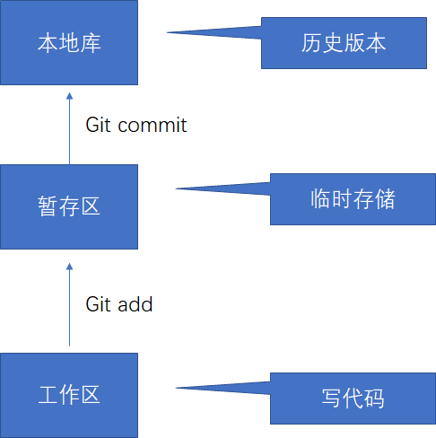

# 一些问题

- git push 时提示

  > fatal: unable to access 'https://github.com/***': Recv failure: Connection was reset

  解决办法：执行

  ```bash
  git config --global --unset http.proxy
  git config --global --unset https.proxy
  ```

  取消代理

# 简介

## 概念

- 仓库：用来保存项目元数据和对象数据库的地方
- 工作区：对应某个版本，当前的文件状态
- 暂存区：如果要commit，提交的是这里的内容
- 分支：把某些工作从开发主线上分离出来，对于协同开发起到重要作用
- 提交：每次需要修改的内容完成以后，保存一个快照
- 远程仓库：用来协同的远程仓库，作用为同步本地修改，完成写作需求

## 版本控制

- 什么是版本控制
  - 版本控制是一种记录文件内容变化,以便于将来查阅特定版本修订情况的系统.
  - 版本控制其实最重要的是可以记录文件的修改历史, 从而让用户能够查看历史版本, 方便版本切换

## git工作机制



## git和代码托管中心

代码托管中心是基于网络服务器的远程代码仓库,一般我们简单的成为远程库

- 局域网
  - GitLab
- 互联网
  - GitHub
  - GItee

## 分支

在版本控制过程中,同时推进多个任务,我们可以为每个任务创建单独的分支,使用分支意味着从主线上离开了,开发分支不会影响主分支的运行

git切换分支本质上是移动**Head**指针

# 操作

## 用户签名

签名的作用是区分不同操作者身份, 用户的签名信息在每一个版本的提交信息中能够看到,以此来确认本次提交时谁做的,必须设置,否则无法提交代码

治理设置的签名与远程仓库的用户名密码没有任何关系

```bash
# 全局配置：所有的git都使用该用户名和邮箱
git config --global user.name Boranget
git config --global user.email Boanget@orange.com
# 本地配置：当前项目使用该用户名和邮箱
git config user.name Boranget
git config user.email Boanget@orange.com
# 查看
git config user.name
git config user.email
```

## 初始化仓库

git init

初始化当前目录为一个git仓库,使得在当前目录可以进行git操作

## 查看本地库状态

git status

查看本地仓库的状态, 比如在新增文件后可以看到本地仓库中有没有追踪的文件

## 添加暂存区

git add 文件名

将工作区的文件添加到暂存区

(暂存区存在的意义: 在commit的时候,是选择将暂存区的文件提交的,如果没有暂存区的存在,我们就只能提交所有的文件到本地仓,但我们有的时候会有这样的需求:我只想将我修改的一部分提交到本地仓,此时我本就需要暂存区的帮助:将我们想要提交到本地仓的文件添加到暂存区,然后commit)

## 提交本地库

git commit -m"日志信息" 

- 自动add:  git commit -a -m""  

将暂存区的文件提交到本地库

这里日志可以有一些规范

>[IMP] 提升改善正在开发或者已经实现的功能
>
>[FIX] 修正BUG
>
>[REF] 重构一个功能，对功能重写
>
>[ADD] 添加实现新功能
>
>[REM] 删除不需要的文件

## 查看历史版本

git reflog 查看版本信息

git log 查看版本详细信息

## 版本穿梭/重做

git reset --hard 版本号

这个应该配合git reflog使用

git revert -n 版本号

重做掉某一版本

- reset相当于把整个仓库状态回归到某个提交节点，而revert是先取消某一个提交的修改内容，类似于取反
- 如果要撤销revert操作，则将该revert提交给revert掉即可

## 创建分支

git branch 分支名

## 查看分支

git branch -v

会列出一张表,其中*号所在位置代表当前所在的分区

## 切换分支

git checkout 分支名

## 合并分支

git merge 分支名

将指定分支名合并到master

合并后可能会有冲突,当前分支状态会有Merging的样式

冲突表示:在同一个文件夹的同一个位置有两种不同的修改,需要人为指定保留哪一种(或者全部保留)

可以通过git status 来查看没有合并成功的文件

解决方式为: 打开冲突文件,删除特殊符号,继续编辑,保存后add commit,此时状态恢复正常

## 创建远程仓库

在github等平台上创建仓库

## 查看远程地址配置

git remote -v

## 已有项目添加远程仓

1. 本地创建仓库根目录文件夹

2. 在文件夹内右键打开git bash

   ```bash
   # 初始化仓库
   git init
   # 配置远程仓库地址
   it remote add origin git@gitee.com:gitora/private_note.git
   # 删除远程仓库地址
   git remote rm origin
   ```


## 推送

git push 别名 分支

## 克隆

git clone 远程地址

克隆会直接初始化仓库并拉去远程代码,并且创建别名

## 拉取

git pull / git fetch

- 从远端仓库拉取代码，fatch是拉取到本地再决定是否要合并，pull是直接合并

## 脏目录

git stash

将更改储藏在脏工作目录中。

## 公钥

```bash
 # ""内是公钥名称,可随便取名
 ssh-keygen -t ed25519 -C "boranget@gitee.com"
 # 连续回车,得到公钥文件

```

将公钥内容复制到远程仓库公钥配置界面即可

## bundle

git bundle 命令用于将本地数据打包到一个文件中，然后共享给别人。在网络不通畅时，可以将本地的修改打包成一个文件，然后通过 U 盘等共享给别人。

在只有.git目录的情况下，利用bundle恢复仓库的方法

```
cd repo.git
# 创建budele文件
git bundle create ./reponame.bundle --all
# 从bundle文件中clone出代码
git clone ./reponame.bundle reponame
# 这是文件夹内会出现一个 reponame 文件夹，这个文件夹内就是所有的代码文件
```


# 规范

## 分支命名规范

- master：主分支，可用稳定的发布版本

- develop：开发主分支，最新的代码

- feature-xxx：功能开发分支

- bugfix-xxx：未发布版本的bug修复分支

- release-xxx：预发布分支

- hotfix-xxx：已发布版本的bug修复分支

## 提交描述规范

- [IMP] 提升改善正在开发或者已经实现的功能
- [FIX] 修正BUG
- [REF] 重构一个功能，对功能重写
- [ADD] 添加实现新功能
- [REM] 删除不需要的文件

# 常见开发流程

[十分钟学会正确的github工作流，和开源作者们使用同一套流程_哔哩哔哩_bilibili](https://www.bilibili.com/video/BV19e4y1q7JJ/?spm_id_from=autoNext&vd_source=7103983ce7cdb97d8715a21074de9a20)

1. 将远端仓库代码clone到本地
2. 本地checkout出一个新分支如feature
3. 在 feature 分支进行开发，开发完成
4. git diff 查看做了哪些修改
5. git add 提交到暂存区
6. git commit， 将当前修改提交到本地分支 feature
7. git push origin feature 将本地 feature push到远程仓库的feature分支
8. 本地切换到master分支
9. git pull origin master 更新本地master分支
10. 切换到feature分支，执行 git rebase master 进行合并
11. git push -f origin feature 将 feature 分支强制提交到远程仓库
12. 远程仓库新建一个 pull request，将feature合并到master
13. 远程仓库进行squash and merge，squash用于将本次push中的许多commit合并为一个commit
14. 删除远端feature分支
15. 本地切回master，git branch - d feature 删除本地 feature 分支
16. git pull origin master，更新本地master分支

# gitignore

.gitignore需要在项目初始阶段便配置好，若在push操作之后再修改或添加。gotignore是不起作用的，需要

```shell
git rm -r --cached .
git add .
git commit -m .gitignore
// 下面命令是push远程的，可以用idea的工具直接push，也可以执行下面的命令
git push origin ...
```

- 井号#用于注释
- *表示任意多个字符
- !叹号表示例外，将不被忽略
- 名称最前面为/，表示要忽略的文件在当前目录下，但子目录中名称为该名称的文件不被忽略
- 如果最后面是/，表示要忽略的是当前目录下的所有名称为该名称的目录

```
*.txt # 忽略所有txt文件
!lib.txt # 但是lib.txt除外
/temp #忽略项目根目录下的temp目录
build/ # 忽略项目里所有的build目录
doc/*.txt # 忽略项目中所有的doc目录下的txt文件，但不包括doc/*/*.txt
```

