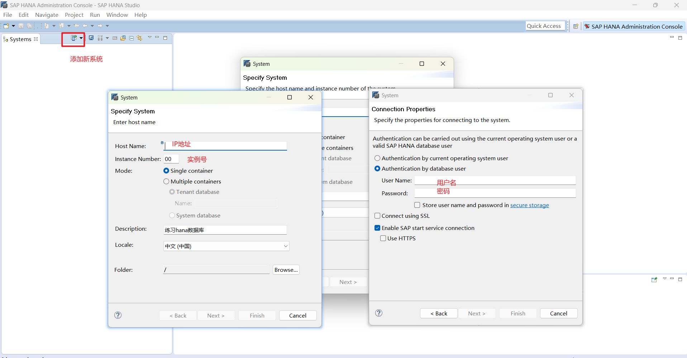

# 参考资料

[安装：https://www.easysap.com/article-39.html](https://www.easysap.com/article-39.html)

[jdbc 连接 https://blog.csdn.net/u010978399/article/details/117327475](https://blog.csdn.net/u010978399/article/details/117327475)

# HANA Studio 安装

双击安装包，选择安装路径后一直继续即可

# HANA Studio 连接数据库



# JDBC连接HANA

```xml
<dependency>
    <groupId>com.sap.cloud.db.jdbc</groupId>
    <artifactId>ngdbc</artifactId>
    <version>2.8.12</version>
</dependency>
```

```java
 /**
   * @param args
 */
public static void main(String[] args) {
    getConnection();
}

/**
	 * 和一一般的数据库链接是一样的
	 * 但是没有数据库名字
	 * @return
	 */
private static Connection getConnection(){
    String url = "jdbc:sap://192.1....119:39015?reconnect=true";
    Connection conn = null;
    try {
        Class.forName("com.sap.db.jdbc.Driver");
        conn = DriverManager.getConnection(url,"uu","pp"); 
        System.out.println(conn);
    } catch (ClassNotFoundException e) {			
        e.printStackTrace();
    }catch (SQLException e) {	
        e.printStackTrace();
    }
    return conn;
}
```

# 查询数据库端口号

```sql
SELECT * FROM SYS.M_SERVICES
```

# 概念

## SCHEMA

在 HANA 数据库中，SCHEMA 是一个非常重要的概念，它表示的是数据库对象集合，包含了各种对象，比如表、视图、存储过程、索引等等。在 HANA 中，每个用户都对应一个默认的 SCHEMA，这个 SCHEMA 就像一个容器，容纳了用户创建的各种数据库对象。

与 MySQL 相比，HANA 中的 SCHEMA 与 MySQL 中的数据库（Database）有些类似，因为它们都是用于组织和管理数据库对象的命名空间。然而，HANA 中的 SCHEMA 包含的对象类型更多，而 MySQL 主要是用于存储数据表。

在 MySQL 中，一个数据库中可以包含多个表和其他对象，而每个表都有自己的数据和结构定义。而在 HANA 中，一个 SCHEMA 中可以包含各种类型的数据库对象，例如表、视图、存储过程等。这些对象都是由用户创建并归属于该用户的。

所以，可以说 HANA 中的 SCHEMA 在一定程度上相当于 MySQL 中的数据库，但功能和用途上有些不同。

```sql
-- 创建schema:
-- 语法：CREATE SCHEMA <schema_name> [OWNED BY <user_name>]
/*OWNED BY：指定schema的拥有者，如果省略。当前用户将是这个shema的拥有者*/
create schema my_schema;
create schema my_schema OWNED BY system.
-- 删除schema:
-- 语法：DROP SCHEMA <schema_name> [<drop_option>]
/* drop_option： CASCADE | RESTRICT
    RESTRICT：直接删除没有依赖的对象,如果对象有依赖关系，会抛出错误信息。
    CASCADE：直接删除所有对象。*/
CREATE SCHEMA my_schema;
CREATE TABLE my_schema.t (a INT);
DROP SCHEMA my_schema CASCADE;
select * from tables  where schema_name='P1526659201'  --查询schema:P1526659201下的所有表
```

## 行表

hana字段名和表名强制大写，且大小写敏感

```sql
-- 创建表
-- 表名前要加schema名前缀.
create table CDS_INNOVATE.ticket_info
(
    _id CHAR(255),
    number   CHAR(255),
    flow     CHAR(255),
    flowName CHAR(255),
    PRIMARY KEY (_ id)
)
-- 插入字段，注意值要用单引号
INSERT  INTO "CDS_INNOVATE"."TICKET_INFO" ("_ID","NUMBER","FLOW","FLOWNAME") VALUES ('0c6753e0-c001-11ea-872e-3785eca9b7a7','2020070700001','f2dbf4e0-d2ac-11e9-a569-c5359b9a58f5','请假申请');
```

