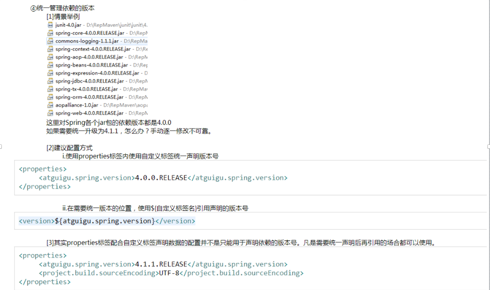

# 一些别的

- Maven生命周期及常用命令
  - maven的生命周期:就是maven构建项目的过程，清理，编译，测试，报告，打包，安装，部署
  - maven的命令: maven独立使用，通过命令，完成maven的生命周期的执行。
    maven可以使用命令，完成项目的清理,编译，测试等
  - maven的插件: maven命令执行时，真正完成功能的是插件，插件就是一些jar文件，一些类。

- optional 与 provided

  ```xmltext
  <dependency>
      <groupId>some.company</groupId>
      <artifactId>project-c</artifactId>
      <optional>true</optional>
  </dependency>
  
  <dependency>
      <groupId>some.company</groupId>
      <artifactId>project-d</artifactId>
      <scope>provided</scope>
  </dependency>
  ```
  
  效果相同，都是不传递依赖，optional表示可选，provided表示已有


# 一些问题

## idea和maven版本有匹配关系

报错：

```txt
 NoSuchMethodError: DefaultModelValidator: method 'void <init>()
```

## 命令行maven

**使用了默认库**

解决：删除user->.m2文件夹

## pom中配置远程仓库repository不生效

pom中配置了

```xml
	<repositories>
        <repository>
            <id>jitpack.io</id>
            <url>https://jitpack.io</url>
        </repository>
    </repositories>
```

但若maven的Setting配置文件中镜像的mirrorOf配置为*，则会跳过pom中的配置，去mirror中寻找，找不到报找不到异常

mirrorOf意思就是当前镜像是为那个仓库做镜像？配置为*意思就是为所有仓库做镜像

解决方法

- 将Setting中的mirrorOf排除仓库id

  注意是 !jitpack.io，做排除用

  ```xml
  <mirrorOf>*,!jitpack.io</mirrorOf>
  ```

- 或将Setting中的mirrorOf修改为central

  ```XML
  <mirrorOf>central</mirrorOf>
  ```

**插件需要单独配仓库**

```xml
	<pluginRepositories>
        <pluginRepository>
            <id>jitpack.io</id>
            <url>https://jitpack.io</url>
        </pluginRepository>
    </pluginRepositories>
```

# Maven 概念

## maven是什么

- maven是一款服务于Java平台的自动化构建工具

  演化：Make -> Ant -> Maven ->Gradle

- 构建
  - 概念：以 各种资源为原材料，生产一个可运行项目的过程。
    - 编译：java源文件转化为java字节码
    - 部署
    - 搭建

## 构建过程中的各个环节

1. 清理：将以前编译的旧的字节码文件删除

2. 编译：将java源程序编成字节码文件
3. 测试：自动测试，自动调用junit程序
4. 报告：测试程序执行的结果
5. 打包：动态web工程打包为war包，java工程打包为jar包
6. 安装：将打包得到的文件复制到仓库中指定位置
7. 部署：将动态web工程得到的war包复制到servlet容器指定目录下，使其可以运行

# 安装与配置

1. 确认java环境已经安装好
2. 将maven压缩包解压到一个文件夹下
3. 配置M2_HOME为maven文件夹
4. 将maven文件夹中的bin目录配置到path中

# 常用命令

- 注意:执行与构建过程相关的Maven命令,必须进入pom.xml所在的目录
- 常用命令
  - mvn clean：清理
  - mvn compile：编译主程序
  - mvn test-compile：编译测试程序
  - mvn test：执行测试
  - mvn package：打包
  - mvn install：安装
  - mvn site：生成站点

# Maven目录结构

## 为什么要遵守

如果我们想让框架知道我们设置了一些东西，那么有两种办法：

- 用配置的方式
- 遵守框架的约定

约定 》 配置 》 编码

## 目录结构

- 根目录：工程名
- src目录：源码
- pom.xml：Maven工程的核心配置文件
- main目录：存放主程序
- test目录：存放测试程序
- java目录：存放java源文件
- resource目录：存放框架或其他工具的配置文件

# 仓库

- 插件

  - Maven的核心程序只定义了抽象的生命周期，具体实现还需要插件。当执行Maven命令需要插件时，Maven核心程序会先去本地仓库寻找

    - 本地仓库默认目录：C:\Users\PC\.m2\repository

    - 修改：

      

  - 如果Maven核心程序在本地仓库中找不到需要的插件，他会联网在中央仓库查找，可配置镜像。

- 仓库的种类

  - 本地仓库
  - 远程仓库
    - 私服
    - 中央仓库
    - 中央仓库镜像

- 仓库中保存的内容：Maven工程

  - Maven自身所需要的插件
  - 第三方框架或者工具的jar包
  - 自己开发的Maven工程

# pom

ProjectObjectModel 项目对象模型

# 打包

maven的三种打包方式：pom、jar、war

- jar：默认的打包方式，打包为jar
- war：打包为war包，用于服务器
- pom：用在父级工程或者聚合工程中，用来做jar包的版本控制，需知名聚合工程的打包方式为pom

# 坐标

三个向量

- groupid：组织名
- artifactid：模块名
- version：版本

坐标与仓库中路径的对应关系


# 依赖

## 依赖范围


## 依赖的传递与排除

I.png)

![计算机生成了可选文字: @依赖的原则 [1]作。鮃决凄工程之河时酊包冲突河题 [2]情景过定1睑i正莖径最短者优先原则 MakeFriends g4j．1.2．14 H》0i皂nd g4j．1.2．14 满景设2：验证径河盯先声明者优先 MakeFriends HelloFriend OurFriends H》0 g4j．1．2．17 《og4j．1.2．14 《og4j．1.2．17 先声明指的是dependen（y标签的声明顺吊](maven/clip_image001.png)



# 生命周期

1. 各个构件环节的执行顺序：不能打乱顺序
2. Maven的核心程序定义了抽象的生命周期，生命周期中的各个具体任务是由插件来完成的、
3. 不论现在从哪一阶段开始执行，都是从该生命周期的初始阶段执行

- compile
  - resources
  - compiler
- test
  - resources
  - compiler
  - testResources
  - testCompiler
  - test
  - 测试报告
- package
  - resources
  - compiler
  - testResources
  - testCompiler
  - test
  - 测试报告
  - jar

4. 相似的目标会由特定的插件完成：比如编译与测试编译都是由maven-compiler-plugin完成

# 继承


# 聚合


# 