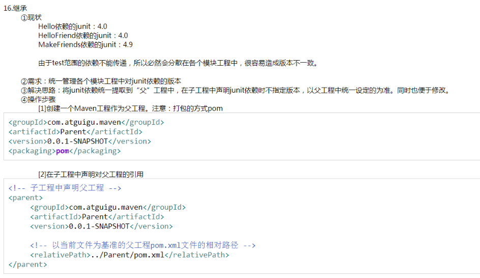
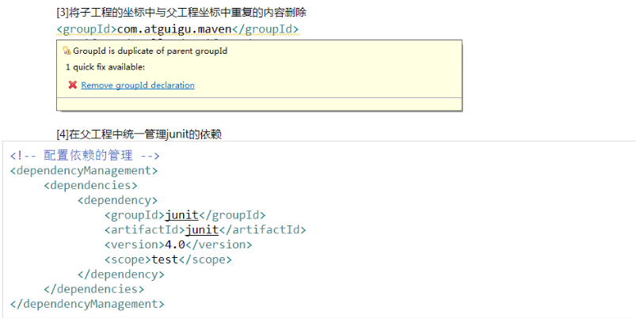
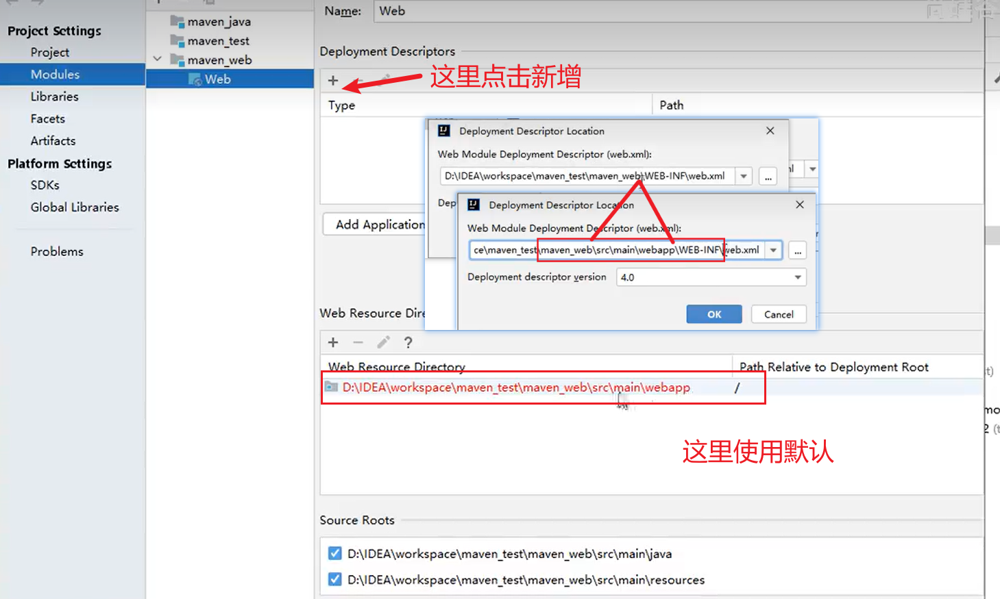

---

title: maven
date: 2023-02-28 16:50:30
tags:
  - maven
categories:
  - 笔记
---

# Maven 概念

依赖管理+项目构建

- 依赖管理

    自动引入依赖并且解决依赖的依赖关系

- 项目构建

    演化：Make -> Ant -> Maven ->Gradle

    - 批量编译
    - 组织文件结构
    - 批量复制jar包
    - ……

# 安装与配置

1. 确认java环境已经安装好
2. 将maven压缩包解压到一个文件夹下
3. 配置M2_HOME或者MAVEN_HOME为maven文件夹
4. 将maven文件夹中的bin目录配置到path中
5. cmd mvn -v验证

6. 本地仓配置 localRepository
7. 镜像配置 mirror
8. 构建项目java版本配置 profile

# Maven目录结构

## 为什么要遵守

如果我们想让框架知道我们设置了一些东西，那么有两种办法：

- 用配置的方式
- 遵守框架的约定

约定 》 配置 》 编码

## 目录结构

- 根目录：工程名
- src目录：源码
- pom.xml：Maven工程的核心配置文件
- main目录：存放主程序
- test目录：存放测试程序
- java目录：存放java源文件
- resource目录：存放框架或其他工具的配置文件

# 仓库

- 插件

  - Maven的核心程序只定义了抽象的生命周期，具体实现还需要插件。当执行Maven命令需要插件时，Maven核心程序会先去本地仓库寻找

    - 本地仓库默认目录：C:\Users\PC\.m2\repository

    - 修改：

      

  - 如果Maven核心程序在本地仓库中找不到需要的插件，他会联网在中央仓库查找，可配置镜像。

- 仓库的种类

  - 本地仓库
  - 远程仓库
    - 私服
    - 中央仓库
    - 中央仓库镜像

- 仓库中保存的内容：Maven工程

  - Maven自身所需要的插件
  - 第三方框架或者工具的jar包
  - 自己开发的Maven工程

# Pom

ProjectObjectModel 项目对象模型

# Pom标签

## modelVersion

pom文件的版本，不是项目版本也不是依赖版本，类似于xml中的1.0

# 构建

构建过程依赖于插件

## 构建过程中的各个环节

1. 清理：将以前编译的旧的字节码文件删除
2. 编译：将java源程序编成字节码文件
3. 测试：自动测试，自动调用junit程序
4. 报告：测试程序执行的结果
5. 打包：动态web工程打包为war包，java工程打包为jar包
6. 安装：将打包得到的文件复制到仓库中指定位置
7. 部署：将动态web工程得到的war包复制到servlet容器指定目录下，使其可以运行

## 常用命令

- 注意:执行与构建过程相关的Maven命令，需在pom.xml所在的目录
- 常用命令
    - mvn clean：清理编译或者打包之后的项目结构
    - mvn compile：编译项目，生成target文件
    - mvn test-compile：编译测试的程序（test目录下的程序）
    - mvn test：执行测试源码
    - mvn package：打包项目，生成jar或者war文件，存入target目录
    - mvn install：打包后上传到本地的maven仓库
    - mvn deploy：只打包，打包后上传到maven私服仓库
    - mvn site：生成站点

一次执行多个命令可以空格隔开

```shell
mvn clean test
```

# 测试

在test文件夹中编写test方法，标记@Test注解（junit）

执行

- mvn test-compile
- mvn test

注意

- 测试方法名有要求，需要test开头，否则maven扫描不到
- 测试类名需要以Test开头或者结尾（建议结尾），否则maven扫描不到

测试完成后会在target目录生成surefire-reports目录，其中为测试报告

# 打包

maven的三种打包方式：pom、jar、war

- jar：默认的打包方式，打包为jar
- war：打包为war包，用于服务器
- pom：用在父级工程或者聚合工程中，用来做jar包的版本控制，需知名聚合工程的打包方式为pom

# 安装

将打包的结果存入本地仓，方便其他项目引用

# 坐标

三个向量

- groupid：组织名
- artifactid：模块名
- version：版本

坐标与仓库中路径的对应关系


## GroupId

com.公司.业务线.子业务线，最多四级，一般三级

## ArtifactID

产品线名-模块名

## Version

- 主版本号

    不兼容

- 次版本号

    兼容的修改

- 修订号

    修复bug

# 打包方式 Packaging

- jar 默认，代表普通的java工程，打包完是jar文件
- war，java web 工程，打包完是war文件
- pom，代表不会打包，用于做继承用的父工程

# 依赖

## 依赖范围

通过设置坐标的依赖范围，可以设置对应jar包的作用范围：编译环境、测试环境、运行环境。三种依赖范围对应三个classpath。

- compile
  默认范围，在三个classpath中都会引用

- test
  只在测试classpath中有效，例如junit依赖

- provided
  provided，意思是被提供的，范围为provided的依赖会被认为在运行环境中已经默认存在了，所以运行环境的classpath并不会携带这个依赖。只在编译和测试两个classpath有效。

- runtime
  只在运行和测试classpath有效，比如jdbc的实现依赖

- system
  被系统提供。用于添加非maven仓库的本地依赖。通过dependency中的systemPath元素指定本地路径。与provided的效果相同，编译和测试有效。会导致可移植性降低

- import
  与dependencyManagement元素配合使用，其功能为将目标pom文件中的dependencyMenagement的配置导入并合并到当前pom的dependencyMenagement中。 

  


## 依赖的传递

### 作用

- 简化依赖导入过程
- 确保依赖版本正确

### 原则

- 只有compile范围依赖可以传递
- 若设置了optional标签，则不能传递（比如自定义starter）

## 依赖冲突

导入的不同依赖中引入了不同版本的同一依赖

I.png)

![计算机生成了可选文字: @依赖的原则 [1]作。鮃决凄工程之河时酊包冲突河题 [2]情景过定1睑i正莖径最短者优先原则 MakeFriends g4j．1.2．14 H》0i皂nd g4j．1.2．14 满景设2：验证径河盯先声明者优先 MakeFriends HelloFriend OurFriends H》0 g4j．1．2．17 《og4j．1.2．14 《og4j．1.2．17 先声明指的是dependen（y标签的声明顺吊](maven/clip_image001.png)


### 自动选择

- 短路优先
  顾名思义，依赖路径最短，关系最近的依赖优先
- 先声明优先
  在路径长度相同的情况下，dependency中先声明的依赖所引入的版本优先

### 手动排除

手动排除无需指定版本

```xml
<dependencies>  
    ...  
    <dependency>  
        <groupId>sample.group</groupId>  
        <artifactId>sample-artifact</artifactId>  
        <version>1.0.0</version>  
        <exclusions>  
            <exclusion>  
                <groupId>excluded.group</groupId>  
                <artifactId>excluded-artifact</artifactId>  
            </exclusion>  
        </exclusions>  
    </dependency>  
    ...  
</dependencies>  
```


# Properties

properties中设置变量

通过${变量名}引用

# Build

- 指定打包文件的名称
  filename标签
- 指定包含的文件格式和排除的文件
  比如包中的xml文件（mapper）
  resource标签
- 配置更高版本的插件
  比如修改jdk版本、tomcat插件、mybatis分页插件、mybatis逆向工程插件等

```xml
<project>  
    <build>
        <finalName>test.jar</finalName>  
        <resources>  
            <resource>  
                <directory>src/main/java</directory> <!-- 指定XML文件的目录 -->  
                <includes>  
                    <include>**/*.xml</include> <!-- 匹配所有以.xml结尾的文件 -->  
                </includes>  
            </resource>  
        </resources>  
        <plugins>  
            <plugin>  
                
            </plugin> 
        </plugins>  
    </build>  
</project>
```


# 生命周期

1. 各个构件环节的执行顺序：不能打乱顺序
2. Maven的核心程序定义了抽象的生命周期，生命周期中的各个具体任务是由插件来完成的、
3. 不论现在从哪一阶段开始执行，都是从该生命周期的初始阶段执行

- compile
  - resources
  - compiler
- test
  - resources
  - compiler
  - testResources
  - testCompiler
  - test
  - 测试报告
- package
  - resources
  - compiler
  - testResources
  - testCompiler
  - test
  - 测试报告
  - jar

4. 相似的目标会由特定的插件完成：比如编译与测试编译都是由maven-compiler-plugin完成

# 父工程

父工程不应该有任何代码，只应该作为依赖管理，不参与打包，打包方式为pom。src文件夹可删除（建议），子工程应该建在父工程下面的module。子工程的groupid与version与父工程相同，子工程的坐标只需要指定artifactid

- 父工程中引入的依赖会被继承到子工程中，这种传递没有范围限制，是无条件的。一般不会直接在父工程中引用依赖
- 一般使用dependencyMenagement用于管理版本，子工程中引用父工程中控制的依赖的时候不需要填写版本号

```xml
<project xmlns="http://maven.apache.org/POM/4.0.0" xmlns:xsi="http://www.w3.org/2001/XMLSchema-instance"  
  xsi:schemaLocation="http://maven.apache.org/POM/4.0.0 http://maven.apache.org/xsd/maven-4.0.0.xsd">  
  <modelVersion>4.0.0</modelVersion>  
  
  <parent>  
    <groupId>com.example</groupId>  
    <artifactId>parent-project</artifactId>  
    <version>1.0.0</version>  
  </parent>  
  
  <artifactId>child-project</artifactId>  
  
</project>
```

## 继承

继承是指让一个项目从另一个项目中继承信息，继承可以让我们在多个项目中共享配置信息。简化项目的管理和维护工作 





## 聚合

将多个项目组织到一个父级项目中，以便一起构建和管理

- 管理多个子项目
- 构建和发布一组相关的子项目
- 优化构建顺序，先构建被依赖的，再构建依赖的
- 统一管理依赖

父工程中这样定义聚合项目

```xml
<project xmlns="http://maven.apache.org/POM/4.0.0" xmlns:xsi="http://www.w3.org/2001/XMLSchema-instance"  
    xsi:schemaLocation="http://maven.apache.org/POM/4.0.0 http://maven.apache.org/xsd/maven-4.0.0.xsd">  
    <modelVersion>4.0.0</modelVersion>  
    <groupId>com.example</groupId>  
    <artifactId>parent</artifactId>  
    <version>1.0-SNAPSHOT</version>  
    <packaging>pom</packaging>  
    <modules>  
        <module>child1</module>  
        <module>这里是子工程的路径而非工程名</module>  
    </modules>  
</project>
```


# idea和maven版本有匹配关系

报错：

```txt
 NoSuchMethodError: DefaultModelValidator: method 'void <init>()
```

# 命令行maven使用了默认库

解决：删除user->.m2文件夹

# pom中配置远程仓库repository不生效

pom中配置了

```xml
	<repositories>
        <repository>
            <id>jitpack.io</id>
            <url>https://jitpack.io</url>
        </repository>
    </repositories>
```

但若maven的Setting配置文件中镜像的mirrorOf配置为*，则会跳过pom中的配置，去mirror中寻找，找不到报找不到异常

mirrorOf意思就是当前镜像是为那个仓库做镜像？配置为*意思就是为所有仓库做镜像

解决方法

- 将Setting中的mirrorOf排除仓库id

    注意是 !jitpack.io，做排除用

    ```xml
    <mirrorOf>*,!jitpack.io</mirrorOf>
    ```

- 或将Setting中的mirrorOf修改为central

    ```XML
    <mirrorOf>central</mirrorOf>
    ```

**此插件也需要单独配仓库**

```xml
	<pluginRepositories>
        <pluginRepository>
            <id>jitpack.io</id>
            <url>https://jitpack.io</url>
        </pluginRepository>
    </pluginRepositories>
```

# Maven生命周期及常用命令

- maven的生命周期:就是maven构建项目的过程，清理，编译，测试，报告，打包，安装，部署
- maven的命令: maven独立使用，通过命令，完成maven的生命周期的执行。
    maven可以使用命令，完成项目的清理,编译，测试等
- maven的插件: maven命令执行时，真正完成功能的是插件，插件就是一些jar文件，一些类。

# optional 与 provided

```xmltext
<dependency>
    <groupId>some.company</groupId>
    <artifactId>project-c</artifactId>
    <optional>true</optional>
</dependency>

<dependency>
    <groupId>some.company</groupId>
    <artifactId>project-d</artifactId>
    <scope>provided</scope>
</dependency>
```

效果相同，都是不传递依赖，optional表示可选，provided表示已有

# maven引入非maven依赖

将依赖的jar包放入项目根目录的lib目录下

依赖这样写

```xml
<dependency>
	<groupId>com.icbc</groupId>
	<artifactId>icbc-api-sdk-cop-io</artifactId>
	<version>1.0</version>
	<scope>system</scope>
	<systemPath>${basedir}/lib/icbc-api-sdk-cop-io.jar</systemPath>
</dependency>
```

插件配置这样写

```xml
<build>
	<plugins>
		<plugin>
			<groupId>org.springframework.boot</groupId>
			<artifactId>spring-boot-maven-plugin</artifactId>
			<configuration>
                <!--值为true是指打包时包含scope为system的第三方Jar包-->
				<includeSystemScope>true</includeSystemScope>
			</configuration>
		</plugin>
	</plugins>
</build>
```

# 依赖下载失败

- 清除本地仓缓存（*.lastUpdated文件），缓存存在的情况下刷新不会重新下载。缓存在本地仓该依赖坐标文件夹中
- 本地仓中删除该依赖后重新下载（删除版本文件夹）

# Maven创建web项目

- pom中打包方式设为war，接着刷新

- 查看ProjectStructure，会发现当前Module下出现了Web模块

- 设置web模块下的Deployment Descriprors

    

    src.main下会出现带蓝点的webapp目录 

# Maven私服

## 优势

- 节省外网带宽
- 下载速度更快
- 便于部署第三方构建
- 提升项目构建稳定性
- 降低中央仓库压力

## 产品

- apache 的 archiva
- Jfrog 的 Artifactory
- Sonatytpe 的 Nexus

## Nexus

### 下载安装

[下载地址 Download (sonatype.com)](https://help.sonatype.com/repomanager3/product-information/download)

下载后的文件是一个zip，将其解压到指定目录，其中包含两个文件夹，带版本号的文件夹是软件主体，另一个是资源文件夹。

管理员模式cmd进入软件目录的bin中，以下命令

```bash
# 启动
./nexus /run
# 出现 Started sonatype...为启动成功
```

默认端口号8081

若首页一直转圈，返回命令行，ctrl+c

### 初始化

右上角登录，显示默认账号与密码存放位置，输入新密码。

选择是否允许匿名访问。

### 仓库

- maven-central Nexus对Maven中央仓库的代理
- maven-public Nexus默认创建，共开发人员下载使用的组仓库
- maven-releases Nexus默认创建，共开发人员部署自己jar包的宿主仓库，要求为releases版本
- maven-snapshots Nexus默认创建，共开发人员部署自己jar包的宿主仓库，要求为snapshots版本

### 下载jar包

将私服以镜像的方式配置到maven配置文件中，镜像地址从nexus管理页面中，仓库后面的URL-copy按钮获取

- 若禁用了匿名访问
  在maven配置文件中的servers标签中添加server配置

  ```xml
  <settings>  
    ...  
    <servers>  
      <server>  
        <!-- 这里的id与镜像的id需一致 -->
        <id>nexus-private</id>  
        <username>your-username</username>  
        <password>your-password</password>  
      </server>  
    </servers>  
    ...  
  </settings>
  ```

- 若没有禁用匿名访问，则开放访问，无需配置

### 发布jar包

pom中：

```xml
<project>  
  ...  
  <distributionManagement>  
    <snapshopRrepository>  
      <!--这里的id值与xml中server的配置一致-->
      <id>nexus-private</id>  
      <name>demo</name>
      <url>http://nexus.example.com/repository/private/</url>  
    </snapshopRrepository>  
  </distributionManagement>  
  ...  
</project>
```

生命周期运行deploy

### 引用jar包

pom中

```xml
<project>  
  ...  
  <repositories>  
    <repository>  
      <id>nexus-private</id>  
      <url>http://nexus.example.com/repository/private/</url>  
      <snapshots>  
        <enabled>true</enabled>
        <!--
        <updatePolicy>always</updatePolicy>  
        <checksumPolicy>warn</checksumPolicy>  
		-->
      </snapshots>  
      <releases>  
        <enabled>true</enabled>
        <!--
        <updatePolicy>always</updatePolicy>  
        <checksumPolicy>warn</checksumPolicy>  
		-->
      </releases>  
    </repository>  
  </repositories>  
  ...  
</project>
```

