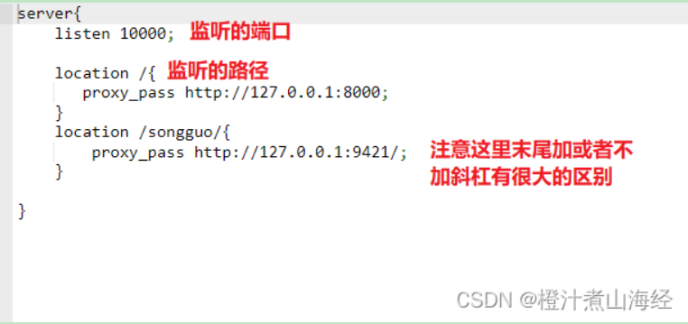

# 基本概念

## 反向代理

对客户端隐藏服务器的真实位置，与正向代理（vpn）相反

## 负载均衡

轮询，加权轮询，iphash

## 动静分离

动态页面与静态页面交给不同的服务器解析

# 默认的配置文件

```nginx
#user  nobody;
worker_processes  1;

#error_log  logs/error.log;
#error_log  logs/error.log  notice;
#error_log  logs/error.log  info;

#pid        logs/nginx.pid;


events {
    worker_connections  1024;
}


http {
    include       mime.types;
    default_type  application/octet-stream;

    #log_format  main  '$remote_addr - $remote_user [$time_local] "$request" '
    #                  '$status $body_bytes_sent "$http_referer" '
    #                  '"$http_user_agent" "$http_x_forwarded_for"';

    #access_log  logs/access.log  main;

    sendfile        on;
    #tcp_nopush     on;

    #keepalive_timeout  0;
    keepalive_timeout  65;

    #gzip  on;

    server {
        listen       80;
        server_name  localhost;

        #charset koi8-r;

        #access_log  logs/host.access.log  main;

        location / {
            root   html;
            index  index.html index.htm;
        }

        #error_page  404              /404.html;

        # redirect server error pages to the static page /50x.html
        #
        error_page   500 502 503 504  /50x.html;
        location = /50x.html {
            root   html;
        }

        # proxy the PHP scripts to Apache listening on 127.0.0.1:80
        #
        #location ~ \.php$ {
        #    proxy_pass   http://127.0.0.1;
        #}

        # pass the PHP scripts to FastCGI server listening on 127.0.0.1:9000
        #
        #location ~ \.php$ {
        #    root           html;
        #    fastcgi_pass   127.0.0.1:9000;
        #    fastcgi_index  index.php;
        #    fastcgi_param  SCRIPT_FILENAME  /scripts$fastcgi_script_name;
        #    include        fastcgi_params;
        #}

        # deny access to .htaccess files, if Apache's document root
        # concurs with nginx's one
        #
        #location ~ /\.ht {
        #    deny  all;
        #}
    }


    # another virtual host using mix of IP-, name-, and port-based configuration
    #
    #server {
    #    listen       8000;
    #    listen       somename:8080;
    #    server_name  somename  alias  another.alias;

    #    location / {
    #        root   html;
    #        index  index.html index.htm;
    #    }
    #}


    # HTTPS server
    #
    #server {
    #    listen       443 ssl;
    #    server_name  localhost;

    #    ssl_certificate      cert.pem;
    #    ssl_certificate_key  cert.key;

    #    ssl_session_cache    shared:SSL:1m;
    #    ssl_session_timeout  5m;

    #    ssl_ciphers  HIGH:!aNULL:!MD5;
    #    ssl_prefer_server_ciphers  on;

    #    location / {
    #        root   html;
    #        index  index.html index.htm;
    #    }
    #}

}
```

## 整体的配置

```nginx
...              #全局块

events {         #events块
   ...
}

http      #http块
{
    ...   #http全局块
    server        #server块
    { 
        ...       #server全局块
        location [PATTERN]   #location块
        {
            ...
        }
        location [PATTERN] 
        {
            ...
        }
    }
    server
    {
      ...
    }
    ...     #http全局块
}
```

## 配置含义

1. 全局块

   不会被{}包裹，全局块篇配置影响nginx全局的指令。一般有：运行nginx服务器的用户组、 nginx进程pid存放路径、日志存放路径、配置文件引入、允许生成worker process数等

2. events块

   配置影响nginx服务器或与用户的网络连接。 比如：

   - 每个进程的最大连接数
   - 选取哪种事件驱动模型处理连接请求
   - 是否允许同时接受多个网络连接
   - 开启多个网络连接序列化

3. http块

   可以嵌套多个server, 配置代理, 缓存, 日志定义等绝大多数功能和第三方模块的配置, 如文件引入, mime-type定义, 日志自定义, 是否使用sendfile传输文件, 连接超时时间,但链接请求数等.

   - server块

       配置虚拟主机的相关参数, 一个http块中可以有多个server

       - location块

           配置请求的路由, 以及各种页面的处理情况

```nginx
...
worker_processes  1;

events {
    worker_connections  1024;
}

http {
    ...

    server {
        ...

        location {
            ...
        }
    }

    server {
        ...
    }
}
```


## 一个示例配置文件

```nginx
########### 每个指令必须有分号结束。#################
#user administrator administrators;  #配置用户或者组，默认为nobody nobody。
#worker_processes 2;  #允许生成的进程数，默认为1
#pid /nginx/pid/nginx.pid;   #指定nginx进程运行文件存放地址
error_log log/error.log debug;  #制定日志路径，级别。这个设置可以放入全局块，http块，server块，级别以此为：debug|info|notice|warn|error|crit|alert|emerg
events {
    accept_mutex on;   #设置网路连接序列化，防止惊群现象发生，默认为on
    multi_accept on;  #设置一个进程是否同时接受多个网络连接，默认为off
    #use epoll;      #事件驱动模型，select|poll|kqueue|epoll|resig|/dev/poll|eventport
    worker_connections  1024;    #最大连接数，默认为512
}
http {
    include       mime.types;   #文件扩展名与文件类型映射表
    default_type  application/octet-stream; #默认文件类型，默认为text/plain
    #access_log off; #取消服务日志    
    log_format myFormat '$remote_addr–$remote_user [$time_local] $request $status $body_bytes_sent $http_referer $http_user_agent $http_x_forwarded_for'; #自定义格式
    access_log log/access.log myFormat;  #combined为日志格式的默认值
    sendfile on;   #允许sendfile方式传输文件，默认为off，可以在http块，server块，location块。
    sendfile_max_chunk 100k;  #每个进程每次调用传输数量不能大于设定的值，默认为0，即不设上限。
    keepalive_timeout 65;  #连接超时时间，默认为75s，可以在http，server，location块。

    upstream mysvr {   
      server 127.0.0.1:7878;
      server 192.168.10.121:3333 backup;  #热备
    }
    error_page 404 https://www.baidu.com; #错误页
    server {
        keepalive_requests 120; #单连接请求上限次数。
        listen       4545;   #监听端口
        server_name  127.0.0.1;   #监听地址       
        location  ~*^.+$ {       #请求的url过滤，正则匹配，~为区分大小写，~*为不区分大小写。
           #root path;  #根目录
           #index vv.txt;  #设置默认页
           proxy_pass  http://mysvr;  #请求转向mysvr 定义的服务器列表
           deny 127.0.0.1;  #拒绝的ip
           allow 172.18.5.54; #允许的ip           
        } 
    }
}
```

# location规则

```nginx
location [= | ~ | ~* | ^~] uri {
    .............
}
```

= : 用于不含正则表达式的uri前,要求请求字符串与uri严格匹配

# 代理转发

```nginx
server{
	// 监听的端口
    listen 80;
    location /{
    // .........代理配置
    }
}
```




两种配置区别:

```nginx
upstream my_server{
	server 10.0.0.2:8080;
	keepalive 2000;
}
server{
	listen 80;
	server_name 10.0.0.1;
	client_max_body_size 1024M;
	
	location /my/ {
		proxy_pass http://10.0.0.2:8080/;
	}
}
# 与
server{
	listen 80;
	server_name 10.0.0.1;
	client_max_body_size 1024M;
	
	location /my/ {
		proxy_pass http://10.0.0.2:8080;
	}
}
```


前者会转发到 http://10.0.0.2:8080

后者会转发到 http://10.0.0.2:8080/my

也就是说,如果转发到的地址末尾不带/斜杠的话，转发时会带上过滤路径一起转发，而如果转发地址带/斜杠，则会去掉过滤地址转发。

# 负载均衡

```nginx
upstream mysvr { 
    server 192.168.10.121:3333;
    server 192.168.10.122:3333;
}
server {
    ....
    location  ~*^.+$ {         
        proxy_pass  http://mysvr;  #请求转向mysvr 定义的服务器列表         
    }
}
```

1. 热备份

   AAAAAAA挂了BBBBBBBB............

   ```nginx
   upstream mysvr { 
       server 127.0.0.1:7878; 
       server 192.168.10.121:3333 backup;  #热备     
   }
   ```

2. 轮询

   ABABABABAB...............

   ```nginx
   upstream mysvr { 
       server 127.0.0.1:7878;
       server 192.168.10.121:3333;       
   }
   ```

3. 加权轮询

   ABBABBABB.............

   ```nginx
   upstream mysvr { 
       server 127.0.0.1:7878 weight=1;
       server 192.168.10.121:3333 weight=2;
   }
   ```

4. iphash

   ```nginx
   upstream mysvr { 
       server 127.0.0.1:7878; 
       server 192.168.10.121:3333;
       ip_hash;
   }
   ```

**其他配置**

- down，表示当前的server暂时不参与负载均衡。
- backup，预留的备份机器。当其他所有的非backup机器出现故障或者忙的时候，才会请求backup机器，因此这台机器的压力最轻。
- max_fails，允许请求失败的次数，默认为1。当超过最大次数时，返回proxy_next_upstream 模块定义的错误。
- fail_timeout，在经历了max_fails次失败后，暂停服务的时间。max_fails可以和fail_timeout一起使用。

```nginx
upstream mysvr { 
    server 127.0.0.1:7878 weight=2 max_fails=2 fail_timeout=2;
    server 192.168.10.121:3333 weight=1 max_fails=2 fail_timeout=1;    
}
```

