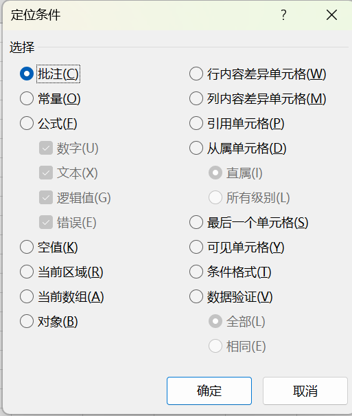

# excel

## excel中取消合并单元格并填充

1. 选中区域，点击取消合并单元格
2. 键盘“f5”，定位条件选择空值
3. 此时所选区域为刚才所选区域中的空值区域，也就是取消合并单元格之后空出来的地方
4. 键盘输入“=”，键入公式，点击空值上方单元格（合并单元格中的值）
5. “ctrl”+“enter”批量赋值

## 定位

快捷键ctrl+G，方便在选中数据集中选出符合条件的单元格



## MATCH

match函数可以比较某个值在某个数据集中是否存在，如果存在返回其行，不存在则显示“#N/A”，藉由此可以筛选出某个数据集中在指定数据集中不存在的值，配合excel的定位功能中的公式部分（错误），可以删除不存在的整行数据。

```
=MATCH(A1,J:J,0)
=MATCH(要查找的值，数据集：J,J表示整个J列，0表示完全匹配)
```

## excel中生成SQL语句

```sql
=CONCAT(
"UPDATE amer_model SET description='",C6,
"',sender='",D6,
"',receiver='",E6,
"',model_code='",F6,
"',req_mes_type='",G6,
"',res_mes_type='",H6,
"',is_sync='",J6,
"' WHERE model_name='",B6,
"';")
```

## INDIRECT

用于展示某单元格中内容，参数字符串格式

```
=INDIRECT("D12")
// 动态计算
=INDIRECT(concat("A","12"))
```

## TextJoin

通过分隔符连接字符串

第一个参数是分隔符，第二个参数为是否要忽略空白单元格，往后便是连接内容

```
=TEXTJOIN(",",FALSE,B2,D2,"password")
// 连接一列
=TEXTJOIN("|",FALSE,J2:J213)
```

## excel启动时卡顿，显示正在访问打印机

原因是windows将实体打印机设为了默认打印机，解决方法将虚拟打印机如pdf打印设为默认值

# word

## 序号续不上

右键序号，点击继续编号