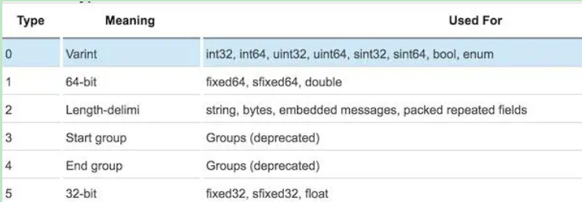

# 参考资料

[Protobuf通信协议详解：代码演示、详细原理介绍等 - 知乎 (zhihu.com)](https://zhuanlan.zhihu.com/p/141415216)

# 概述

谷歌定义的一种用于数据传输的数据序列化方式，节省流量同时省电（通信耗电）。

类似于json、xml这种，但是比json、xml更简洁，但牺牲了自描述特性。

# 特点

- 占用空间小
- 去除自描述符，需要对应的描述文件
- 无法以文本方式直接查看，以字节的方式存储
- 通信双方都需要具有描述文件才可以解析报文

# .proto文件

是proto信息的描述文件，可使用编译器根据该文件生成各种目标语言的源码，生成的源码中除了包含数据结构的实体类，同时携带从实体类生成protobuf内容的Writer与读取protobuf为实体类的Reader。

```protobuf
// LICENSE: GNU General Public License v3.0 to Beem Development (https://github.com/beemdevelopment)
// From https://github.com/beemdevelopment/Aegis/pull/406/files#diff-410b85c0f939a198f70af5fc855a21ed
// Changes: modified package name.

syntax = "proto3";

package googleauth;

message MigrationPayload {
  enum Algorithm {
    ALGO_INVALID = 0;
    ALGO_SHA1 = 1;
  }

  enum OtpType {
    OTP_INVALID = 0;
    OTP_HOTP = 1;
    OTP_TOTP = 2;
  }

  message OtpParameters {
    bytes secret = 1;
    string name = 2;
    string issuer = 3;
    Algorithm algorithm = 4;
    int32 digits = 5;
    OtpType type = 6;
    int64 counter = 7;
  }

  repeated OtpParameters otp_parameters = 1;
  int32 version = 2;
  int32 batch_size = 3;
  int32 batch_index = 4;
  int32 batch_id = 5;
}
```

# VarInt

用于在proto中存储整数，特点是整数存储时，每个字节的第一位标识着连接信息，若该字节开头位为1，则表示下一字节也用于表示这个数字，如果该字节开头为0，则表示当前字节为最后一个字节。同时，protobuf中varInt使用小端字节序，故在读取varint时，需要将读出来的值进行反向排列组装。

# kv结构

proto中的Key并不是字段名称，而是字段的id与字段的类型，这种不存字段名称只存id的做法也导致了收发双方必须拥有描述文件，当然好处是体积小。

```java
(field_number << 3) | wire_type
```

其中，field_number为字段id，wire_type为字段类型，其可选值如下



# zigzag

在protobuf中，如果使用varint表示负数，会使用zigzag编码。

zigzag对整数进行交替编码

| 编码数 | 编码后 |
| ------ | ------ |
| 0      | 0      |
| -1     | 1      |
| 1      | 2      |
| -2     | 3      |

这样较小的负数也会使用较小的编码长度，而不会像补码直接使用整数最大值来表示