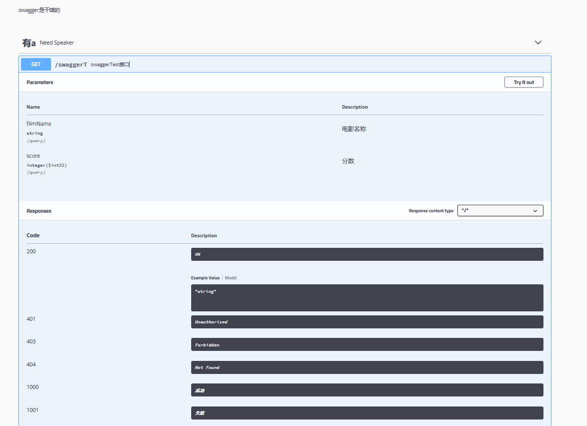

# 在网页中展示接口信息

- 引入依赖

```xml
        <dependency>
            <groupId>io.springfox</groupId>
            <artifactId>springfox-swagger2</artifactId>
            <version>2.9.2</version>
        </dependency>
        <dependency>
            <groupId>io.springfox</groupId>
            <artifactId>springfox-swagger-ui</artifactId>
            <version>2.9.2</version>
        </dependency>
```


- 编写配置

```java
@Configuration
@EnableSwagger2
public class SwaggerConfig {
    @Bean
    public Docket productApi(){
        return new Docket(DocumentationType.SWAGGER_2)
                // 设置整体的信息
                .apiInfo(apiInfo())
                .select()
                    // 扫描标有ApiOperation注解的方法
                    .apis(RequestHandlerSelectors.withMethodAnnotation(ApiOperation.class))
                    // 包括哪些地址(any表示所有)
                    .paths(PathSelectors.any())
                    .build()
                ;
    }
    private ApiInfo apiInfo(){
        return new ApiInfoBuilder().title("swagger测试").description("swagger是干啥的")
                .version("1.0").build();
    }
}
```


- 接口信息注解

```java
@Api(value = "/basicController", tags = {"有基础", "有a", "有b"})
@RestController
public class NeedSpeaker {

    @GetMapping("swaggerT")
    @ApiOperation(value = "swaggerTest接口")
    @ApiResponses(value = {
            @ApiResponse(code = 1000, message = "成功"),
            @ApiResponse(code = 1001, message = "失败"),
            @ApiResponse(code = 1002, response = Drinker.class, message = "缺少参数")
    })
    public String swaggerTest(
            @ApiParam("电影名称") @RequestParam("filmName") String filmName,
            @ApiParam(value = "分数", allowEmptyValue = true) @RequestParam("score") Short score
    ) {
        return filmName+"-"+score;
    }
}

```

**结果**




# 获取所有的接口信息

[localhost:8080/v2/api-docs](http://localhost:8080/v2/api-docs)

访问项目下的/v2/api-docs接口会获得一个json数据

```json
{
  "swagger": "2.0",
  "info": {
    "description": "swagger是干啥的",
    "version": "1.0",
    "title": "swagger测试"
  },
  "host": "localhost:8080",
  "basePath": "/",
  "tags": [
    {
      "name": "有a",
      "description": "Need Speaker"
    },
    {
      "name": "有b",
      "description": "Need Speaker"
    },
    {
      "name": "有基础",
      "description": "Need Speaker"
    }
  ],
  "paths": {
    "/swaggerT": {
      "get": {
        "tags": [
          "有a",
          "有b",
          "有基础"
        ],
        "summary": "swaggerTest接口",
        "operationId": "swaggerTestUsingGET",
        "produces": [
          "*/*"
        ],
        "parameters": [
          {
            "name": "filmName",
            "in": "query",
            "description": "电影名称",
            "required": false,
            "type": "string",
            "allowEmptyValue": false
          },
          {
            "name": "score",
            "in": "query",
            "description": "分数",
            "required": false,
            "type": "integer",
            "format": "int32",
            "allowEmptyValue": true
          }
        ],
        "responses": {
          "200": {
            "description": "OK",
            "schema": {
              "type": "string"
            }
          },
          "401": {
            "description": "Unauthorized"
          },
          "403": {
            "description": "Forbidden"
          },
          "404": {
            "description": "Not Found"
          },
          "1000": {
            "description": "成功"
          },
          "1001": {
            "description": "失败"
          },
          "1002": {
            "description": "缺少参数",
            "schema": {
              "$ref": "#/definitions/Drinker"
            }
          }
        },
        "deprecated": false
      }
    }
  },
  "definitions": {
    "Drinker": {
      "type": "object",
      "title": "Drinker"
    }
  }
}
```

