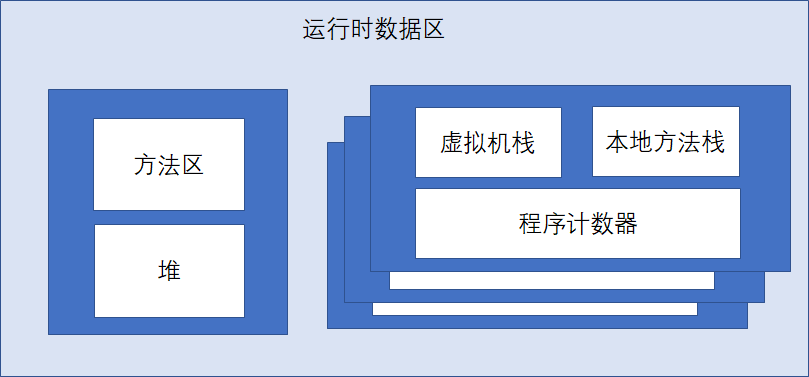
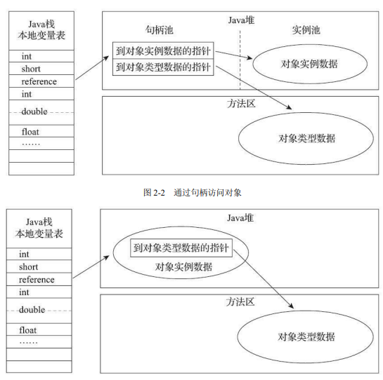
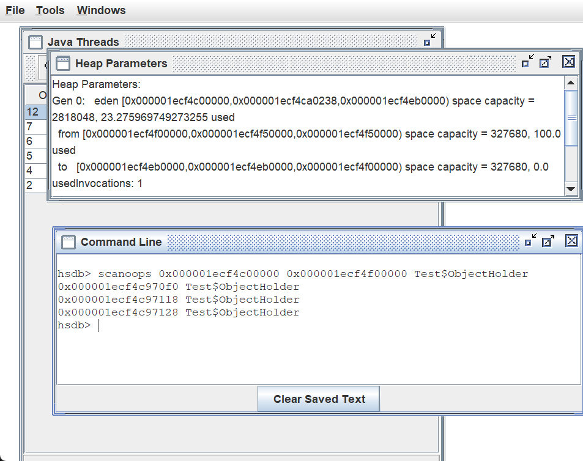
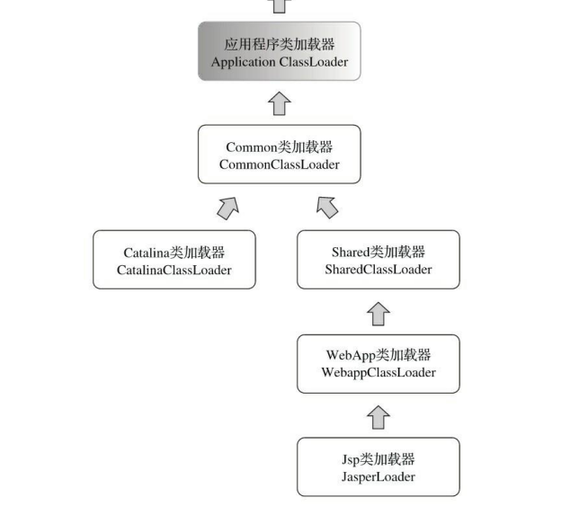

# 参考资料

《深入理解Java虚拟机：第3版》

# 概述

Java，91年诞生，95年发布

09年sun被oracle收购


# 运行时数据区



其中，方法区和堆是所有线程共享的数据区，虚拟机栈、本地方法栈、程序计数器为每份线程独有的。

## 程序计数器

当前线程所执行的字节码的行号指针，由于线程切换后需要恢复执行环境，故每条线程都需要一个独立的程序计数器来保存执行位置，这样才能保证各条线程之间互不影响。

如果当前线程执行方法为本地（native）方法，则当前线程该计数器值为空

## 虚拟机栈

Java虚拟机栈也是线程私有，描述Java方法执行的线程内存模型：每个方法执行时，Java虚拟机都会创建一个栈帧，该栈帧用于存储局部变量表、操作数栈、动态链接、方法出口等信息。每个方法从被调用直至执行完毕的过程，对应着一个栈帧在虚拟机栈中从入栈到出栈的过程。

局部变量表中存储的编译期可知的各种Java虚拟机基本数据类型（boolean、byte、char、short、int、float、long、double）、对象引用和returnAddress类型。在局部变量表中这些值会占用不同大小的变量槽，其中64为的long和double会占用两个变量槽，其余类型只占用一个。且据此，局部变量表所需的内存空间在编译期间便是完全确定的，在方法的运行期间不会改变局部变量表的大小。因为在方法运行期间有的变量生命周期会结束，变量槽空出来后可以让别的变量复用。

当当前线程请求的栈深度大于虚拟机允许的深度，会报出StackOverflowError异常，如无休止的方法递归调用。若当前虚拟机可以动态扩展（Hotspot不可以），当扩展无法申请到足够的大小时会报OutOfMemoryError异常。

栈溢出可以查看是否栈帧过大，比如局部变量表中变量过多。或者栈帧过多，比如递归调用。

有一种情况是，若方法栈分配的内存过大，会导致其余内存空间过少，也会导致内存溢出。

## 本地方法栈

与虚拟机栈类似，区别为本地方法站是执行Native方法时使用，而虚拟机栈是执行Java方法所用的栈。

在Hotspot虚拟机中，本地方法栈和虚拟机栈是合并在一起的。

## 堆

所有线程共享的一块区域，在虚拟机启动时创建，用于存放对象实例。存在垃圾回收的机制，且由于垃圾回收有着分代的设计。可通过-Xmx和-Xms设置最大和最小内存，当堆大小不满足对象分配所需空间时会抛出OutOfMemoryError

## 方法区

同样是所有线程共享的区域，用于已被虚拟机加载的类型信息、常量、静态变量、即时编译器编译后 代码缓存等区域。

早期Hotspot的永久代是相对于堆中的新生代老年代说的，目的是为了使用堆的垃圾回收机制来管理方法区，现在采取的JRockit的实现方式：使用本地内存实现的元空间。

当方法区内存大小无法满足内存分配时，抛出OutOfMemoryError

若有动态生成类的场景，不断生成新的类，填充到方法区中，导致内存溢出。比如大量的或动态生成JSP文件（JSP会编译为class文件）

运行时常量池是方法区的一部分。在class文件中的常量池表在类加载后会存放到方法区的运行时常量池中。

## 直接内存

不算虚拟机运行时数据区的一部分，但Java可以分配该区域，且当物理机剩余内存不足时会出现OutOfMemoryError

# Hotspot的内存管理

## 对象创建

1. 类加载

   当jvm遇到new指令，会首先检查质量参数能否定位到常量池中的类符号引用，接着检查这个类是否已被加载、解析和初始化，若没有，则需要先执行类加载过程。

2. 内存分配

   接着执行内存分配的操作，一个对象所需的内存大小在类加载完成后便可确定，jvm需要从堆中划分出一块存放该对象的空间。

	- 指针碰撞

      堆中维护一个指针，指针前为已分配内存，指针后为空闲内存，每次分配内存从指针开始，分配空间后指针后移。

	- 空闲列表
	
	     jvm维护一个列表，记录哪些内存块是空闲可用的。分配的时候找一块大小合适的内存分配。
	
	不同的垃圾收集器会导致不同的内存状态，从而采取不同的内存分配方式。
	
	存在多个线程分配对象内存时的线程安全问题，一种解决方法为将分配内存的操作加同步处理，另一种解决方式是使用TLAB（Thread Local Allocation Buffer 本地线程分配缓冲）。

3. 初始化

   初始化对象的实例，不保证兑现的实例字段不赋初始值便可使用

4. 其余工作

5. 执行构造方法

   先执行代码块，再执行构造方法，如果有多个代码块，则按声明的顺序执行。实际上，代码块和构造方法都会整合到\<init\>方法中，而静态代码块会被整合到\<clinit\>中。

## 对象的内存布局

内存中的一个对象可以划分为三个部分：对象头、实例数据、对齐填充

- 对象头

  对象头包含两类信息，一类是对象自身的运行数据，如hash值、GC分代年龄、锁状态标志、线程持有的锁、偏向线程ID、偏向时间戳等。另一类，存储了类型指针（对象指向它的类型元数据的指针），jvm通过则个指针来确定该对象是哪个类的实例。如果该对象是一个数组，则对象头中还有一个记录数组长度的数据。

- 实例数据

  程序代码中定义的各种类型的字段内容，包括继承父类的。

  默认情况下，相同宽度的字段会被分配在一起（longs/doubles、ints、shourts/chars、bytes/booleans、oops）。且父类中定义的变量会出现在子类之前。如果打开虚拟机参数 +XX: CompactFields，子类中较窄的变量也允许插入父类变量的空隙。

- 对齐填充

  Hotspot要求对象起始地址必须是8字节的整数倍，故对象大小必须填充至8字节的整数倍。

## 访问对象

主要有两种访问方式

- 句柄

  堆中维护一句柄池，每个句柄中要分别指向堆中对象的地址和方法区中对象的类型的地址，变量表中指向句柄

- 直接指针

  变量表中指向堆中对象地址，对象中维护一个指针指向方法区中类型



使用句柄的优点是在对象位置移动后只需修改句柄，无需修改变量表中reference的引用，缺点是增加了一次寻址。使用直接指针的方式好处在于快，Hotspot主要使用直接指针法。

## 其他

在32位的Windos系统中，单个进程的最大内存不能超过2GB（2^32），故在该系统上运行的java虚拟机能够分配的内存就超不过2GB，内存分配主要考虑

- 堆
- 方法区
- 虚拟机栈和本地方法栈
- 直接内存


# 判断对象是否存活

## 引用计数法

在对象中添加一个引用计数器，每当有一个地方引用时，计数器加一，引用失效时，计数器减一，当计数器为0时，该对象不再被使用。

但如果碰到循环引用的情况，就会因为互相之间存在引用而无法被回收。

## 可达性分析

维护一个GCRoots列表，从GCRoots中的对象向下扫描，扫描到的对象则是不可回收的，反之则是不可达的对象，可以回收。

在Java中，可以作为GCRoots的对象包括以下几种

- 虚拟机栈（本地变量表中引用的对象）
- 方法区中类静态属性引用的对象
- 方法区中常量引用的对象
- 本地方法栈中引用的对象
- jvm内部引用，比如基本数据类型对应的Class对象，一些常驻异常对象

- 所有被同步锁持有的对象
- 其他

此外，在不同的垃圾收集器中，也会动态的添加其他对象进入roots，如果只针对java堆中某一区域回收时，需要考虑该区域的对象也有可能被其他区域对象引用

**三色标记**

- 白色：表示对象未被GC访问过，在分析结束时若仍为白色，即为不可达对象
- 灰色：表示对象已被垃圾收集器访问过，但这个对象上至少存在一个引用没有访问过。
- 黑色：表示对象已经被垃圾收集器访问过，且这个对象中所有引用都已经扫描过。且黑色对象指向的对象无法被回收。注意黑色对象的所有对象都是已经被扫描过的了，所以至少是灰色对象，不可能有白色对象被黑色对象引用。

可能出现的错误

在扫描过程中，用户线程堆对象引用关系进行了修改，造成问题

- 用户线程删除了某个对象的引用，但是该对象已经称为黑色对象了，也就是说垃圾收集器在最后会保留这个垃圾，称为浮动垃圾。浮动垃圾除占用空间外无其他影响，可在下次垃圾回收期间被回收。
- 用户线程新增了对某个对象的引用，但该对象之前被别的对象的引用在收集期间（收集范围已经确定的情况下）删除了，会造成将本应存活的对象当作垃圾清理掉，会造成系统错误。

当且仅当以下两个条件同时满足时，会产生”对象消失“的情况，即原本应该是黑色的对象被标记为白色。

1. 赋值器插入了一条或多条从黑色对象对白色对象的新引用（该引用无法被扫描到）
2. 赋值器删除了全部从灰色对象到白色对象的直接或间接引用

解决方式有两种

- 增量更新 IU

  在黑色对象插入新的指向白色对象的引用关系时，将这个新插入的引用会被记录，并发扫描结束后会将这些引用重新扫描一次（黑色对象一旦插入了指向白色对象的引用，他就变为灰色对象）

- 原始快照 SATB

  灰色对象要删除指向白色对象的引用关系时，将要删除的引用记录下来，并发扫描结束之后重新扫描

问题

- 如果使用初始快照方法，如何避免黑色对象创建的新对象被回收？

  猜测并发扫描过程中新建的对象并不会在扫描和回收的范围内。扫描回收只会针对在初始扫描过程中便存在的对象。

# 引用

## 强引用

传统的引用定义，代码中普遍存在的引用赋值，无论任何情况，只要强引用关系存在，就永远不会回收。

## 软引用

一些还有用但是非必须，在系统将要发生内存此处异常之前，会把这些对象列进回收范围进行二次回收，若该次回收后空间仍然不够，则会抛出OOM异常。

JDK1.2后提供了SoftReference来实现软引用。

## 弱引用

比软引用更弱，只能生存到下一次垃圾收集发生为止。

JDK1.2后提供了WeakReference来实现弱引用。

## 虚引用

最弱的一种引用，虚引用不会对该对象的存活时间造成影响，且无法通过虚引用来获取一个实例。虚引用的存在只是为了能在这个对象被收集器回收时收到一个系统通知。

JDK1.2后提供了PhantomReference来实现虚引用。

# finalize

如果对象在经过一次可达性分析后发现没有被roots关联，则他会被第一次标记，接着判断有没有对象需要执行finalize方法：若对象没有覆盖finalize方法，或者finalize方法已经被调用过，则不需要执行；若对象被判断需要执行finalize方法，则会将该对象放置在一个名为F-Queue的队列中，稍后由JVM创建的线程Finalizer去调用他们的finalize方法，但不保证会等待其允许结束。因为如果队列中某个对象的finalize方法造成死循环，可能会导致队列中其他对象的永久等待，导致整个系统崩溃。

由于其调用的不确定性，不建议使用该方法。

```java
@Override
protected void finalize() throws Throwable {
    // 导致没有自我拯救成功
    Thread.sleep(5000);
    super.finalize();
    System.out.println("finalize method executed");
    Test.T = this;
}
```

而由于finalize只能在被标记后被调用且只能调用一次，故可以且仅可以唯一一次”自我复活“：如果在finalize中让自己和roots链上的对象发生关系，则在被二次标记时会被移出回收集合。否则在第二次标记时会被回收。

```java
public class Test {
    public static Test T = null;
    public void isAlive(){
        System.out.println("yes, i am alive");
    }

    @Override
    protected void finalize() throws Throwable {
        super.finalize();
        System.out.println("finalize method executed");
        Test.T = this;
    }

    public static void main(String[] args) throws Throwable {
        T = new Test();
        // 第一次移除
        T = null;
        System.gc();
        Thread.sleep(500);
        if(T!=null){
            T.isAlive();
        }else {
            System.out.println("no, i am dead");
        }
        // 第二次移除
        T = null;
        System.gc();
        Thread.sleep(500);
        if(T!=null){
            T.isAlive();
        }else {
            System.out.println("no, i am dead");
        }

    }
}

```

```
finalize method executed
yes, i am alive
no, i am dead
```

# 方法区回收

方法区主要回收两部分内容：废弃的常量和不再使用的类型。

判断一个类型是否属于”不再使用“，需满足以下条件

- 该类所有的实例都已经被回收，包括其子类的实例
- 加载该类的类加载器被回收，因为类加载器中是会保存自己加载过的类的引用的。
- 该类对应的Class对象没有在任何地方被引用，且无法在任何地方通过反射访问该类的方法

在大量使用反射、动态代理、CGlib等字节码框架，动态生成JSP以及OSGi这类频繁自定义类加载器的场景中会需要Java虚拟机具备类型卸载的能力。以保证不会对方法区造成过大的内存压力。

# 垃圾收集算法

## 分代收集理论

两个分代假说

- 弱分代假说：绝大多数对象都是朝生夕灭的

- 强分代假说：熬过越多次垃圾收集过程的对象就越难以消亡

两个假说共同奠定了多款常用的垃圾收集器的设计原则：收集器应该将Java堆划分出不同的区域，然后将回收对象根据其经历过的回收此说分配到不同的区域中进行存储管理。

如此可将年龄较小的，容易被回收的对象放到一块内存中进行存储，而把年龄较大的已不太可能被回收的对象一次存储，则可使用较小的代价回收大量的对象，其使用较低的频率去回收不太可能被回收的区域。

分代引用有一个主要的难点便是存在着跨代引用的情况，如此导致在回收譬如新生代的对象时，有可能其中有对象会被老年代的对象所引用，如此便需要除遍历新生代的GCRoots外，还需要遍历整个老年代中的对象，如此定会为内存回收带来很大的性能负担。如此便又引入一条假说：

- 跨代引用假说：跨代引用相对于同代引用仅占少数。

这种假说的原因是如果某个新生代的对象被老年代中某对象引用，则该对象会在不断的GC中逐渐增长年龄最后也进入老年代，这种跨代引用也会随之消除。

故采取方法：在新生代上建立一个全局的数据结构（记忆集），这个结构把老年代划分成若干小块，标识出那一块内存存在跨代引用。此后当发送新生代收集时，只有包含了跨代引用的小块内存里的对象才会被加入到GCRoots中进行扫描，代价是在改变对象引用关系时，需要维护该表。

- 部分收集（Partial GC）
  - 新生代 收集（Minor/Young GC）：目标只是新生代的垃圾收集
  - 老年代收集（Major/Old GC）：目标只是老年代的垃圾收集，但目前只有CMS收集器实现了单独收集的功能。且在不同的收集器中，Major GC的指代可能不同。
  - 混合收集（Mixed GC）：收集整个新生代和部分老年代，目前只有G1收集器有该行为。
- 整堆收集（Full GC）：收集整个Java堆和方法区

## 标记-清除算法

分为标记和清除过程，标记阶段标记所有需要回收的对象或者标记所有无需回收的对象，清除阶段清除所有需要回收的对象。

此算法有两个缺点

- 对象过多效率会更慢
- 清除过程结束后会有大量的碎片

## 标记-复制算法

将空间分为两部分，每次使用其中一部分，在回收过程中，将其中一部分空间中需要保留的对象复制到另一部分空间。适用于保留对象较少的区域。

缺点是会浪费一半的空间。优点是因为复制是顺序的，所以复制的过程中不会产生碎片。

这种算法适用于空间不大的内存区域，比如新生代。

IBM公司发现新生代中的对象由98%撑不过第一轮收集，Andrew Appeal 提出了Appel式回收：将新生代分为一块较大的Eden区和两块较小的Survivor区，每次分配空间只是用Eden和其中一块的Survivor，发生垃圾收集时，会将Eden和Survivor中仍然存活的对象一次性复制到另一块Survivor。然后清理掉Eden区和之前那块Survivor。当回收结束后Survivor空间不足以容纳存活的对象时，会使用其他区域比如老年代进行存放。

## 标记-整理算法

在存活对象较多的情况下，不建议使用标记复制，需要空出很大一部分内存用于复制。比如老年代就不适合。

标记整理算法类似于标记清除算法，区别在于标记整理算法会在清除的同时进行移动，这种对象移动操作必须全程暂停用户进程，又称 ”stop the world“。

与标记清除的利弊为，若只清除不移动，则在内存分配时会更复杂，如伴随移动，则会在回收内存时占用更多资源。

Parallel Scavenge 收集器使用标记整理算法，适合高吞吐量场景

CMS 收集器使用标记清除算法，适合低延迟场景，但在碎片过多且碎片化程度影响到对象分配时，将会采取标记整理算法。

## HotSpot的算法细节

- 根节点枚举

  在枚举根节点的时候需要保证对象的引用关系不会发生变化，故在进行根节点枚举行为时，需要暂停用户线程

  HotSpot中使用了叫做OopMap的数据结构来记录哪些地方存放着对象引用

- 安全点

  以”是否具有让程序长时间执行的特征“为标准选取安全点，在垃圾收集发生时，需要所有的线程都跑到最近的安全点然后停顿下来。

  - 抢先式中断

    发生垃圾收集时，系统会将所有用户线程全部中断，如果发现有用户线程中断的地方不在安全点上，就恢复该线程的执行，直到跑到安全点上。

  - 主动式中断

    所有的线程在按断电时不断轮询系统设置的一个标志位，如果该标志位为真，各线程就会在当前安全点挂起。

- 安全区域

  安全点的生效前提是用户线程正在运行，但如果有线程并没有在执行，该线程无法响应系统的中断请求。此时引入安全区域的概念：

  安全区域可看作扩展的安全点，在此区域中，对象的引用关系不会发生变化，当线程进入安全区的代码时，会标识自己进入了安全区，系统要发起垃圾回收时就无需担心这些声明进入安全区域的线程（但没进入安全区域的线程怎么办作者没有交代），当线程要离开安全区域时，会坚持虚拟机是否已经完成了根节点枚举（或者垃圾收集过程中其他需要暂停用户线程的阶段），如果完成了，线程继续执行，否则就一直等待。

- 记忆集和卡表

  为解决跨代引用的问题，提出的记忆集的数据结构，用于记录从非收集区域指向收集区域的指针集合。最简单但是代价最高的实现方式是将非收集区域中所有含跨代引用的对象列入一个数组。

  记忆集的标识位置为被引用的位置。

  但在具体实现时，往往不需要如此细的粒度，而是会选择粗一些的粒度，最常用的一种粒度叫做 ”卡精度“（除此外还有字长精度：每个记录精确到一个机器字长，改字包含跨代指针；对象精度：每个记录精确到一个对象，该对象有字段含有跨代指针），卡精度是指每一个记录精确到一块内存区域，该区域内有对象含有跨代指针。

  卡精度在实现记忆集的时候使用的方式叫做 ”卡表“，HotSpot虚拟机使用字节数组来实现卡表。

  >  CARD_TABLE [this address >> 9] = 0;

  一张卡页为512字节大小，通常一张卡页中不止一个对象，只要该页中有跨代引用的指针，就将该值置为1，在进行GC时，若某一块卡页中存在跨代指针就将其加入GCRoots中一并扫描。

- 写屏障

  - 卡表何时变脏

    有其他分代区域中对象引用了本区域对象时，其对应的卡表元素会变脏。

  - 如何变脏

    虚拟机层面在对象引用赋值时会通过切面产生一个环形通知，叫做写屏障。在赋值前的部分叫做写前屏障，赋值后叫做写后屏障。

    在G1之前，垃圾收集器使用写后屏障。每次只要对引用进行更新，就会更新卡表，但会产生额外的开销。

- 并发可达性

  并发标记GCRoots的引用

## 经典垃圾收集器

### Serial

最早的收集器，单线程的新生代收集器，单线程是指他工作时必须暂停其他所有的工作线程。由于每多线程工作一会儿，就需要全部暂停使得GC运行，造成了很不好的体验。

由于其与其他收集器的单线程相比简单而高效（额外内存消耗小），故迄今为止还是HotSopt虚拟机运行在客户端模式下的默认新生代收集器。

新生代采取复制算法暂停所有用户线程，老年代使用标记整理算法暂停所有用户线程

### ParNew

Serial的多线程并行版本，同时使用多线程进行垃圾收集。

在单核心处理器的环境中由于单核中线程的切换反而效果不如Serial，但在多核cpu中，默认开启线程数与cpu核心数相同，可以有效利用多核处理器来实现多线程。

目前只有ParNew可以与CMS收集器配合工作，且已相当于并入CMS，无法单独使用

### Parallel Scavenge

与ParNew类似：新生代收集器，基于标记复制算法，并行收集的多线程收集器。

专注于吞吐量，即用户线程运行时间包括垃圾收集在内的时间的比值，高吞吐量可以最高效率的利用处理器资源。主要适合在后台运算而不太需要交互的任务，（用户对停顿无感）

Parallel Scavenge 收集器提供了两个参数用于精确控制吞吐量，分别是控制最大垃圾收集停顿时间的 -XX:MaxGCPamseMillis 和直接设置吞吐量大小的-XX:GCTimeRatio。

 -XX:MaxGCPamseMillis 参数允许设置一个大于0的毫秒数，收集器尽力保证内存回收花费的时间不超过该值，停顿时间缩短以牺牲吞吐量和新生代空间大小换取，新生代空间越小，收集越快，但会导致收集更频繁。同时吞吐量也会下降。

-XX:GCTimeRatio 参数大于0小于100的整数，指定为垃圾收集器占总时间的比率，因为垃圾收集用时越长，吞吐量越小，所以可以看作是吞吐量的倒数，由于与吞吐量关系密切，也被称作吞吐量优先收集器。

-XX:UseAdaptiveSizePolicy 该参数激活后，新生代的大小（-Xmm）、Eden与Survivor区的比例（-XX:SurvivorRatio）\晋升老年代对象大小（-XX:PertenureSizeThreshold）等细节参数，虚拟机会动态调整。这种调节方式称作垃圾收集器的自适应调节策略。

### Serial Old 

serial收集器的老年代版本，使用标记整理算法的单线程收集器。

可与Parallel Scavenge收集器配合使用，其实Parallel Scavenge收集器架构中本身有一个叫做PS MarkSweep收集器进行老年代收集，但PS MarkSweep收集器和Serial old收集器的实现几乎是一样的。

### Parallel Old

Parallel Scavenge收集器的老年代版本，支持多线程并发收集，基于标记整理算法实现。与Parallel Scavenge组合。

### CMS

concurrent mark swep

HotSpot虚拟机中第一款真正的并发垃圾收集器，首次实现让垃圾收集线程和用户线程基本上可以同时工作。

其目标为获取最短回收停顿时间，适合较为关注服务的响应速度，希望系统停顿时间尽可能短的服务。

使用标记清除算法，分为如下四步。

- 初始标记

  记录GCRoots能直接关联的对象，需要STW

- 并发标记

  从直接关联对象遍历整个对象图，耗时长但是与用户线程并发

- 重新标记

  修正并发标记期间引用的改动，需要STW

  其实，由于并发标记期间改动的引用占少数，所以在并发标记结束之后再重新标记来修正也肯定比全程STW要省时间。

- 并发清除

  清除掉已死对象

其缺点：

- 如果处理器核心数很少，会影响用户线程运行

  i-CMS收集器可以改善，但效果一般，已被弃用

- 浮动垃圾的生成

  CMS并发标记的过程中系统还会产生垃圾，这部分垃圾CMS在本次回收时并不会标记清理，只会等到下一次回收的时候标记，这部分垃圾叫做浮动垃圾

  当CMS运行期间预留的内存无法满足程序分配新的对象，就会出现一次并发失败”Concurrent Mode Failure“，虚拟机将会冻结用户线程的执行启用Serial Old收集器来收集老年代

  使用参数-XX：CMSInitiatingOccu-pancyFraction 的值来提高 CMS 的触发百分比，过高则容易出现空间不够并发失败的情况，过低则有可能垃圾回收太频繁导致影响性能。

- 碎片过多的整理

  -XX： +UseCMS-CompactAtFullCollection  开启fullGC整理碎片（默认开启）

  -XX：CMSFullGCsBeforeCompaction 决定几次fullGC之后整理碎片（默认0，表示每次fullGC都整理）

### Garbage First

目标是建立”停顿时间模型“，支持指定在一个长度为M毫秒的时间片段内，小号在垃圾收集上的时间大概率不超过N毫秒

思想转变：面向堆内存中任何部分组成回收集，标准为查看效益

开创了基于Region的堆内存布局：将连续的Java堆划分为多个大小相等的独立区域（Region），每一个区域都可根据需要扮演新生代的eden、survivor或者老年代空间。

Humongous区域专门存储大对象，G1认为大小超过半个Region容量的对象即为大对象。如果有对象大小超过了整个Region，将会存放在N个连续的Humongous Region中。

G1收集器将Region作为回收的最小单元，每次收集的内存空间都是Region的整数倍。G1将会跟踪各个Region中垃圾价值的大小，价值计算为能够回收的空间和回收所需时间，优先回收价值最大的Region

G1中每个Region中会维护自己的记忆集。

G1通过原始快照方式来保证并发标记过程中的变化。

G1在每一个Region中设计了两个名为TAMS的指针（Top of Mark Start）的指针，把Region中的一部分空间划分出来并用于并发回收过程中新对象的分配新对象分配的地址必须在这两个指针以上，同时，该区域中的对象都默认存活，不纳入回收范围。

若内存回收速度赶不上内存分配的速度，G1会冻结用户线程。

整体上分为四步

- 初始标记

  标记GC Roots能直接关联到的对象，并且修改TAMS指针的值用于并发标记时新对象的分配，该阶段需要停顿线程但是耗时很短。

- 并发标记

  从GC Roots开始对堆中对象进行可达性分析，递归扫描整个堆里的对象图，找到要回收的对象。耗时长，但可并发（与用户线程），对象图扫描完成后，重新处理SATB记录下的在并发时有引用变动的对象。

- 最终标记

  对用户线程暂停，处理并发阶段结束后遗留下来的SATB记录

- 筛选回收

  负责更新Region的统计数据，对各个Region的回收价值和成本进行排序，根据用户所期望的停顿时间来制定回收计划，自由选择任意多个Region构成会收集，将决定回收部分的Region中确认存活的对象复制到空的Region中，再清理掉整个旧的Region全部空间。由于涉及到存活对象移动，故必须暂停用户线程。

G1的目标并不是单纯的减少系统的停顿时间，而是在能控制系统运行时间的情况下，尽量提高系统的吞吐量，但如果该停顿时间过短，可能收集的垃圾会很少，导致收集器收集的速度跟不上对象产生的速度，最终引发fullGC降低性能。

从G1开始，垃圾收集器的目标从"清理干净"转为”够用就行“，这样可以提高效率。

小内存应用适合使用CMS收集器，大内存应用适合使用G1

## 低延迟垃圾收集器

### Shenandoah 歇难多

redhat开发，openJDK中有但是oracleJDK没有。

控制将延迟限制在十毫秒内。

同样是基于Region的堆内存布局，拥有HRegion，回收策略价值优先。

支持并发整理，当前不使用分代收集。

放弃记忆集机制，改用连接矩阵的全局数据结构来维护跨区引用关系。

**过程**

- 初始标记

  标记与GCRoots直接关联的对象，STW，停顿时间与GC Roots数量相关

- 并发标记

  并发标记全部可达对象

- 最终标记

  处理SATB，计算回收价值最高的Region，将这些Region构成一组回收集。同样会STW

- 并发清理

  用于清理没有找到存活对象 Region

- 并发回收

  将回收集中存活对象先复制到其他未被使用的Region中

- 初始引用更新

  引用更新是将堆中所有指向旧对象的引用修正到复制后的新地址。初始阶段会建立线程集合点，确保所有线程已结束任务，该阶段会STW

- 并发引用更新

  与用户线程并发，真正的引用更新，按照内存物理地址的顺序线性搜索引用类型并做修改。将引用指向新对象。

- 最终引用更新

  修正存在于GCRoots中的引用，需要STW

- 并发清理

  将整个回收集中的所有Region回收

**并行整理技术**

- 在被移动对象原有内存上设置保护陷阱，当被访问到时，就会进入预设好的异常处理器，将访问转发到新的对象上。频繁切换核心态代价比较大。

- 转发指针，对象最前面统一增加一个二新的引用字段，在平时，这个字段指向自己，当并发回收后将引用字段指向新的地址。

  问题之一为，新对象复制后，每次更新都要写在新对象，如果系统在修改指针引用之前更新了旧对象，会出现线程不安全问题，故需要对转发指针的访问需要采取同步措施。

  需要使用读写屏障来对转发指针处理，尤其是读屏障的频率更高

### ZGC

- 同样使用Region（官方称其为Page）

- Page具有动态性，动态的创建和销毁和动态的区域容量

  在x64的硬件平台下，ZGC的Page具有三种容量

  - 小型

    固定容量2MB，用于放置小于256KB的对象

  - 中型

    固定容量32MB，防止大于等于256KB但小于4MB的对象

  - 大型

    无固定容量，最小容量为4MB，需为2MB的整数倍，用于放置 4MB或更大的对象，每个大型Page只会存放一个大对象。

- 染色指针

  将标记信息记载引用对象的指针上

**过程**

- 初始标记

- 并发标记

  在指针上更新染色指针中的Marked0，Marked1标志位

- 最终标记

- 并发预备重分配

  统计本次收集过程要清理哪些Page，将这些Page组合成重分配集，ZGC每次会扫描所有Page，用更大的扫描成本换取记忆集的维护成本。

- 并发重分配

  该过程会把重分配集中存活对象复制到新的Page中，并为重分配集中每个Page维护一个转发表，记录从旧对象到新对象的转向关系。

  如果用户线程并发访问了位于重分配集中的对象，访问会被内存屏障解惑，根据转发表将访问转发到新的对象上，同时修正该引用的值让其直接指向最新对象。称为指针的自愈。当重分配集中的某个Page中的所有对象都复制完毕，该Page便可删除，保留其转发表用于其余指针的自愈。

- 并发重映射

  修正整个堆中指向重分配集中旧对象的所有引用，此步骤会合并到下一次的并发标记中完成，因为这两步都是需要遍历所有对象的。一旦所有指针都被修正之后，转发表就可以被释放

没有分代收集的劣势便是每次都需要扫描全部的空间，对象分配的速率不能太高，否则垃圾收集的速度赶不上对象创建的速度，会产生很多的浮动垃圾。只能增加堆空间的大小，获得更多的喘息时间。

NUMA：处理器在给对象分配内存时优先考虑当前核心所管理的本地内存区域

## 其他收集器

### Epsilon收集器

不进行垃圾回收，只负责垃圾分配，适合运行时间短，在堆空间使用结束之前就会退出的应用。

## 选择收集器的标准

- 判断需要高吞吐量还是低延迟或是内存有限
  - 高吞吐量：服务需要尽快计算出结果，但是堆交互响应要求不高，用户不关注停顿带来的不适
  - 低延迟：SLA（service level agreements）应用，停顿时间会影响服务质量，甚至有可能超时
  - 若设备内存有限如嵌入式应用，则需要观察垃圾收集器的内存占用
- cpu架构，处理器核心数量
- jdk的发行商以及版本号

# 实操

**代码**

```java
public class Test {
    // -verbose:gc -XX:+PrintGCDetails -Xms20M -Xmx20M -Xmn10M -XX:SurvivorRatio=8 -XX:+UseSerialGC
    private static final int _1MB = 1024*1024;
    public static void main(String[] args) throws Throwable {
        byte[] a1,a2,a3,a4;
        a1 = new byte[2*_1MB];
        a2 = new byte[2*_1MB];
        a3 = new byte[2*_1MB];
        a4 = new byte[4*_1MB];
    }
}
```

**回收日志**

```
// 垃圾回收动作
[GC (Allocation Failure) [DefNew: 8137K->602K(9216K), 0.0040270 secs] 8137K->6746K(19456K), 0.0040722 secs] [Times: user=0.00 sys=0.00, real=0.00 secs] 
Heap
 // 新生代的三个2M对象被转移到了老年代，4M对象被分配到了新生代
 def new generation   total 9216K, used 4864K [0x00000000fec00000, 0x00000000ff600000, 0x00000000ff600000)
  eden space 8192K,  52% used [0x00000000fec00000, 0x00000000ff0297e8, 0x00000000ff400000)
  from space 1024K,  58% used [0x00000000ff500000, 0x00000000ff5968c0, 0x00000000ff600000)
  to   space 1024K,   0% used [0x00000000ff400000, 0x00000000ff400000, 0x00000000ff500000)
 // 来自新生代的三个2M对象
 tenured generation   total 10240K, used 6144K [0x00000000ff600000, 0x0000000100000000, 0x0000000100000000)
   the space 10240K,  60% used [0x00000000ff600000, 0x00000000ffc00030, 0x00000000ffc00200, 0x0000000100000000)
 Metaspace       used 3137K, capacity 4496K, committed 4864K, reserved 1056768K
  class space    used 343K, capacity 388K, committed 512K, reserved 1048576K
```

- 大对象直接进入老年代

  参数 -XX:PretenureSizeThreshold=3145728 ，支持的垃圾收集器：Serial、ParNew

- 经历过一次回收Age+1，默认到达15后进入老年代
- survivor区中同年龄对象大小总和大于老年代空间一半，则大于或等于该年龄对象可直接进入老年代

- 空间分配担保

  在发生MinorGC之前，会先检查老年代可用的最大连续空间M是否大于新生代所有对象总和

  - 若大于，则此次Minor是安全的
  - 若不大于，会查看是否允许担保失败（-XX： HandlePromotionFailure（JDK 6 UP24之前） ）
    - 若不允许，则进行一次Full
    - 若允许，查看M是否大于历次晋升到老年代的对象的平均大小，如果大于则尝试一次Minor，否则进行一次Full

  最坏的情况便是新生代所有对象都进入老年代，如果剩余空间大于这个情况，说明是肯定安全的。

  JDK6 UP64 后，默认允许担保失败

# 性能监控、故障处理工具

- jps

  查看当前JVM进程，-l带主类包名

- jhsdb jdk8以下没有，jdk11包含，且无法调试jdk8的虚拟机进程

  

上面的流程证明了只要是对象实例就会存在堆中

# 调优

## 词汇

- 亲和式集群：同一个客户端的请求发送给同一个节点
- session复制：若使用集群，不同的节点需要保持会话一致性，需要掌握相同的session，解决方法可以用redis统一管理session   
- MIS：信息管理系统（Management Information System）
- RPC服务器：远程过程调用服务器
- user、sys、 real 分别为：进程执行用户态代码耗费时间、进程执行核心态代码耗费的时间、执行动作从开始到结束耗费的时间，托为单核处理器，则前两个之和与最后一个是等价的，若为多核则真实时间一般比具体的cpu时间加起来要小

## 案例

- 大内存设备导致的FullGC时间过长

  考虑使用响应时间优先级的GC，或者采用多个jvm搭建集群

- 集群间同步数据导致的内存溢出

  集群之间同步数据是很频繁的操作，当网络情况较弱时，由于重发需求会产生大量的数据堆积，从而导致内存溢出。

- 直接内存不足但堆中空闲

  报错内存不足，但堆中是空闲的，此时考虑是否直接内存不足

  JVM在直接内存区域检测到不足后不会主动清理，只会在堆内存区域不足时调用FullGC顺便清理该区域。

  解决可以catch该异常，调用Syste.gc手动触发gc，但如果虚拟机打开”-XX:+DisableExplicitGC“开关，会禁止手动触发GC，则手动调用System.gc无效

- cpu利用率高但java进程的利用率并不高

  java代码中使用了Runtime.getRuntime().exec()来执行本地脚本，创建了新的进程（不是线程）。

- 接口调用延迟导致Socket连接过多崩溃

  异步调用改为生产者-消费者模式？（暂时不懂为什么异步请求会使得网络崩溃，异步请求不是发出去就不等了吗）

- 存活对象过多或过大导致标记复制时间过长

  考虑去掉Survivor区使得对象在一次GC之后进入老年代

- GUI界面存入虚拟内存导致的回收时间过长

  windows会将最小化后的程序存入虚拟内存（磁盘）中，在垃圾回收的时候，会将该内存先从磁盘中读出，导致回收速度变慢。

  解决方案为：保持程序在被最小化后仍在内存中：”-Dsun.awt.keepWorkingSetOnMinimize=true“

- jvm安全点设置不到位导致的延迟

  jvm在设置安全点的时候，原则为查看当前操作是否会让程序长时间执行，如果该操作确实为一个耗时操作，会在该操作之前设置安全点，便于多个线程快速跑到安全点。常见的安全点就比如方法调用，循环跳转，异常跳转这些。

  但HotSpot虚拟机为了避免安全点过多带来过重的负担，对循环有一项优化措施，那就是认为循环次数较少的循环不算耗时操作，比如使用int或者范围更小的数据类型作为索引的循环（叫做可数循环）默认不会放置安全点。若使用long或者更大的索引的循环（叫做不可数循环）则会放置安全点。

  问题在于，若某个循环索引值为int类型，但循环体本身就是耗时操作，会造成jvm的误判，不在这里防止安全点以至于其很有可能无法快速的与其他线程一起跑到安全点。

  一种解决方法是使用参数”-XX:+UseCountedLoopSafepoints“ 强制在可数循环放置安全点，但该参数在JDK8下可能会导致虚拟机崩溃，

  另一种解决方式便修改代码，将原来的int类型索引改为long，虚拟机将会将其判定为不可数循环从而放置安全点。

  查看安全点日志：

  ```
  -XX:+PrintSafepointStatistics 
  -XX: PrintSafepointStatisticsCount=1 
  ```

  安全点等待超时日志

  ```
  -XX:+SafepointTimeout
  -XX:SafepointTimeoutDelay=2000
  ```

- 初始堆空间较小，动态扩容导致的延时

  可以通过可以把-Xms 和-XX： PermSize 参数值 和-Xmx 和-XX：MaxPermSize 参数值设置为相同的值，这样会将空间大小固定，避免动态扩容导致的延迟

- 使用参数-Xverify:none停用字节码验证机制

- 禁用手动触发GC避免不必要的FullGC

- 使用CMS垃圾收集器减小延迟感

# 类文件结构

Class文件的结构如下

| 类型           | 名称                | 数量    |
| -------------- | ------------------- | ------- |
| u4             | magic               | 1       |
| u2             | minor_versioin      | 1       |
| u2             | major_version       | 1       |
| u2             | constant_pool_count | 1       |
| cp_info        | constant_pool       | count-1 |
| u2             | access_flag         | 1       |
| u2             | this_class          | 1       |
| u2             | super_class         | 1       |
| u2             | interfaces_count    | 1       |
| u2             | interfaces          | count   |
| u2             | fields_count        | 1       |
| field_info     | fields              | count   |
| u2             | method_count        | 1       |
| method_info    | methods             | count   |
| u2             | attributes_count    | 1       |
| attribute_info | attributes          | count   |

## 魔数和Class文件的版本

- 魔数 CAFEBABE，用于识别当前字节码格式，相当于文件扩展名的作用

- 版本号，minor_version是次版本号，major_version是主版本号

  次版本号在java2之前和java12之后（包括12）被使用，其余版本未使用

## 常量池

常量池之前先是一个常量池的计数，其值为常量池的容量+1，其目的是为了保留”不引用任何一个常量“

## 访问标识

用于标识访问信息，包括：

- 当前Class是类还是接口
- 是否为public
- 是否abstract
- 是否为final
- 等

## 类索引、父类索引、接口索引集合

类索引指向常量池中的Class类型，用于确定全类名，父类索引指向常量池中Class类型，用于确定父类全类名。

类的接口索引为其实现的接口按照声明顺序排列

接口的接口索引为其继承的接口列表，当然其父类只能为Object

## 字段表集合

需要注意描述符，描述字段的数据类型

| 标识字符 | 含义     |
| -------- | -------- |
| B        | byte     |
| C        | char     |
| D        | double   |
| F        | float    |
| I        | int      |
| J        | long     |
| S        | short    |
| Z        | boolean  |
| V        | void     |
| L        | 引用类型 |

属性表中可能会存变量的默认值

Java语言中字段不允许重名，但在字节码中，只要两个字段的修饰符不是完全相同，就认为是两个不同的字段。

## 方法表集合

方法中的代码会存储在方法表的属性表集合中”Code“属性中

在字节码中，两个方法就算同名同参，返回值不同也会被认作两个方法

## 属性表集合

- Code

  出现在方法表的属性集合中，抽象方法不存在该属性，其中包括

  - 属性名固定为”Code“
  - 属性长度
  - 最大操作数栈深度
  - 局部变量表大小，单位变量槽，一个变量槽4个字节
  - code_length
  - code

  - Exceptions

    表示该方法可能抛出的异常：throws 关键字抛出的异常，try-cache处理的异常不会出现在这里面

  - 行号表

    对应字节码和源码，可以选择不生成（-g:none 或 -g:lines），默认是带的，如果选择不生成，抛出异常时对战将不带行号：unknown source；且在调试时无法根据源码设断点

  - LocalVariableTable 和 LocalVariableTypeTable

    本地变量表也可以没有（-g:none 或 -g:vars），后果是程序将不会保存变量名，转而使用arg0、arg1等名称

    本地变量类型表是针对泛型变量的，其中有特征签名一栏用于描述字段泛型的类型

- sourceFile 和 SourceDebugExtension

  sourceFile用于指定生成这个class文件的源码文件的名称，同样可选（-g:none 或 -g:source）

  SourceDebugExtension，存储额外的代码调试信息，比如JSP文件调试时需要的行号信息。

- ConstantValue

  基本数据类型（包括字符串）的静态常量会有该属性，存储该属性的值在常量池中的索引。拥有该属性的静态变量将不会在clinit方法中进行赋值操作，除此之外的静态变量会在clinit中赋值。

  带 final 基本数据类型（包括字符串）的非静态变量也会有该属性。

- InnerClasses 

  存储内部类与外部类之间的关联。

- Deprecated 和 Synthetic

  充当标志的属性，存在该属性便表示一定含义，该属性不存在属性值。

  某元素存在Deprecated表示该元素过时，

  Synthetic必诵诗当前字段或方法不是由Java源码直接产生的，而是编译器自行添加的，但init和clinit除外

- StackMapTable

  新类型检查其使用

- Signature

  泛型相关

- BootstrapMethods

  保存invokedynamic指令引用的引导方法限定符

- MethodParameters

  记录方法的新参名称等信息

- 模块化相关属性
- 注解相关属性

# 字节码指令

Java虚拟机操作码的长度为一个字节，意味着总数不超过256条，且在操作超过一个字节的数据时无法直接入栈而是需要部分入栈然后运行时重建数据。

## 加载和存储指令

用于在栈帧中的局部变量表和操作数栈之间传输数据

- 将一个局部变量加载到操作数栈：ilod、iload_\<n\>、lload、lload_\<n\>、fload、fload_\<n\>、dload、dload_\<n\>、aload、aload_\<n\>
- 将一个数值从操作数栈存到局部变量表：istore、istore_\<n\>、lstore、lstore_\<n\>、fstore、fstore_\<n\>、dstore、dstore_\<n\>、astore、astore_\<n\>

- 将一个常量加载到操作数栈：bipush、sipush、ldc、ldc_w、ldc2_w、aconst_null、iconst_ml、iconst_\<i\>、iconst_\<l\>、iconst_\<f\>、iconst_\<d\>

- 扩充局部变量表的访问索引：wide

## 运算指令

- 加法指令：iadd、ladd、fadd、dadd
- 减法指令：isub、lsub、fsub、dsub
- 乘法指令：imul、、、
- 除法指令：idiv、、、
- 求余指令：irem、、、
- 取反指令：ineg、、、
- 位移指令：ishl、ishr、iushr、lshl、lshr、lushr
- 按位或指令：ior、lor
- 按位与指令：iand、land
- 按位异或指令：ixor、lxor
- 局部变量自增指令：iinc
- 比较指令：dcmpg、dcmpl、fcmpg、fcmpl、lcmp

## 类型转换指令

- 宽化类型转换无需显式指令
  - int 到 l、f、d
  - long到f、d
  - float到d

- 窄化类型的转换

  - 将int或long类型的数据窄化为整数类型时会丢弃高位。可能会导致符号位改变
  - 将浮点数转化为整数时
    - 若浮点值是NAN，则转化结果是0
    - 若大于范围值或无穷大，则为该范围最大值（或最小负数）
    - 若小于该范围，则向0取整（正数变小负数变大）

  - double转float
    - 最接近数舍入模式
    - 若绝对值太小，无法用float表示，则返回正负0；
    - 若绝对值太大，无法用float表示则返回float的正负无穷大
    - NAN转为NAN

## 对象创建于访问指令

- 创建类实例的指令：new
- 创建数组的指令：nwearray、anewarray、multianewarray
- 访问类字段（static| 类变量）和 实例字段（非static | 实例变量）：getfield、putfield、getstatic、putstatic
- 将一个数组元素加载到操作数栈：baload、caload、saload、iaload、laload、faload、daload、aaload
- 将一个操作数栈的值存储到数组元素：bastore、castore、sastore、iastore、fastore、dastore、aastore （没有lastore吗？）

- 取数组长度的指令：arraylength
- 检查类实例类型的指令：instanceof、checkcast

## 操作数栈管理命令

- 将操作数栈栈顶元素出栈：pop
- 将操作数栈栈顶两个元素出栈：pop2 
- 复制栈顶的一个或两个数值并将复制出的值重新压入栈顶：dup、dup2、dup_x1、dup2_x1、dup_x2、dup2_x2
- 将栈最顶端的两个数值互换：swap

## 控制转移指令

- 条件分支：ifeq、iflt、ifle、ifne、ifgt、ifge、ifnull、ifnonnull、if_icmpeq、if_icmpne、if_icmplt、if_icmpgt、if_icmple、if_icmpge、if_acmpeq、if_acmpne
- 复合条件分支：tableswitch、lookupswitch
- 无条件分支：goto、goto_w、jsr、jsr_w、ret

在比较boolean、byte、char、short类型时会使用int类型的比较指令，在比较long、float、double类型的数据时会限制性对应的比较运算指令（dcmpg、dcmpl、fcmpg、fcmpl、lcmp），该指令会返回一个整形的值，接着调用int类型的条件分支。

## 方法调用和返回指令

### 调用指令

- invokevirtual：用于调用对象的实例方法，根据对象的实际类型进行分派（虚方法分派）（在c++中由虚方法的概念，其意义为：若有子类的实例地址赋给了父类类型的指针变量，若父类中某方法标为了虚方法且该方法在子类中被重写了，则调用该指针的方法时会执行子类的实现，可以看出，java中默认方法都是虚方法）
- invokeinterface：用于调用接口方法，会在运行时搜索一个实现了这个接口方法的对象，找出适合的方法进行嗲用
- invokespecial：调用一些需要特殊处理的实例方法，包括实例初始化方法、私有方法和父类方法
- invokestatic：用于调用类静态方法
- invokedynamic：用于在运行时动态解析出调用点限定符所引用的方法。并执行该方法。

### 返回指令

- ireturn
- lreturn
- freturn
- dreturn
- areturn
- return （除了void类型方法，还用在实例初始化方法，类和接口的类初始化方法）

## 异常处理指令

显示抛出异常 throw ：athrow

处理异常由异常表实现

## 同步指令

同步方法的同步无需通过指令来完成，由虚拟机检测方法表中的ACC_SYNCHRONIZED访问标志来确定该方法是否为同步方法，若为，则执行线程会要求先获取其需要的锁。

方法内部的同步代码块由synchronized关键字来定义，在java虚拟机中有两条指令：monitorenter和monitorexit两条指令来支持该语义。

示例代码：

```java
void sout(Test t){
    synchronized (t){
        System.out.println();
    }
}
```

其反编译结果如下：

```
 0 aload_1		// 加载t（0是this）
 1 dup			// 这里复制一份是因为接下来的两条指令都要用，用两次
 2 astore_2		// 存起来释放用
 3 monitorenter	// 开始同步
 4 getstatic #5 <java/lang/System.out : Ljava/io/PrintStream;>
 7 invokevirtual #6 <java/io/PrintStream.println : ()V>
10 aload_2      // 把复制的对象提取到栈
11 monitorexit	// 退出同步
12 goto 20 (+8)	// 跳过异常处理部分
15 astore_3		// 这里是异常表的处理范围，先保存异常
16 aload_2		// 取出锁
17 monitorexit	// 退出同步
18 aload_3		// 取出异常
19 athrow		// 抛出
20 return		// 返回
```

# 类加载

## 类加载的时机

类的生命周期包括以下几个阶段：

加载；验证、准备、解析；初始化；使用；卸载

其中，验证、准备、解析三个部分统称为连接

规范中规定，在以下情况发生的时候必须进行对类进行初始化（在此之前肯定是要加载的）。

- 遇到 new、getstatic、putstatic 或 invokestatic 四条字节码指令时，如果类型没有经过初始化，则需要先触发其初始化阶段，如：
  - 使用new关键字实例化对象的时候
  - 读取或设置一个类型的静态字段（被final修饰的静态常量除外，因为其结果已被存入常量池）
  - 调用一个类型的静态方法的时候
- 使用java.lang.reflect包的方法对类型进行反射调用的时候，如果类型还没有进行初始化，则需要先触发其初始化
- 当初始化类的时候，若发现其父类还没有初始化，则需要先初始化其父类（接口不需要，一个接口在初始化时，并不要求其父接口全部初始化，只有真正使用到父接口时（如引用接口中定义的常量）才会初始化）
- 当虚拟机启动时用户需要指定一个执行的主类（包含main方法），虚拟机会先初始化这个主类
- 当使用（？这个没有接触过）JDK7新加入的动态语言支持时，若一个java.lang.invoke.MethodHandle 实例最后的解析结果为 REF_getStatic、 REF_putStatic、REF_invokeStatic、REF_newInvokeSpecial 四种类型的方法句 柄，并且这个方法句柄对应的类没有进行过初始化，则需要先触发其初始化。

- 当一个接口中定义了JDK8中新加入的默认方法（default）时，如果这个借楼的实现类发生了初始化，那接口要在其之前被初始化（没有默认方法的接口在其实例被初始化之前不用初始化吗？）

以上情况称之为对一个类的“主动引用”，除此之外的引用情况，称之为“被动引用”。如：

- 对于静态字段，只有直接定义这个字段的类才会被初始化。所以如下这种时候是不会对Son类进行初始化的。

```java
public class Test {
    public static void main(String[] args) throws IOException {
        System.out.println(Son.a);
    }
}
class Parent{
    static {
        System.out.println("parent init");
    }
    static String a = "hello world";
}
class Son extends Parent{
    static {
         // 不会输出
        System.out.println("son init");
    }
}
```

- 在创建某个类的数组时，只会初始化该数组对象

```java
  public class Test {
      public static void main(String[] args) throws IOException {
          Parent[] ps = new Parent[10];
      }
  }
  class Parent{
      static {
          // 不会输出
          System.out.println("parent init");
      }
      static String a = "hello world";
  }
```

- 调用某个类的静态常量（基本类型和字符串）可以直接从常量池中获取

```java
public class Test {
    public static void main(String[] args) throws IOException {
        // 第一个输出
        System.out.println(Parent.b);
        // 第三个输出
        System.out.println(Parent.a);
    }
}
class Parent{
    static {
        // 第二个输出
        System.out.println("parent init");
    }
    static String a = "hello world";
    final static int b = 1;
}
```

## 类加载的过程

加载-验证-准备-解析-初始化

### 加载

个人更倾向于理解为“导入”动作，为“导入字节流”之意（总过程都叫加载了子过程还叫加载，很容易混淆）

具体的字节码加载动作，在加载阶段，jvm需要完成以下动作

- 通过类全限定名获取定义该类的二进制字节流
  - 如zip压缩包中获取，演变为 jar，ear，war
  - 从网络中获取，如 web applet
  - 运行时计算生成， 如动态代理等
  - 由其他文件生成，如jsp文件
  - 数据库中读取
  - 从加密文件中获取
- 将该字节流转化为方法区的运行时数据结构
- 在内存中生成一个代表着该类的Class对象，作为方法区这个类的各种数据的访问入口

对于非数组类型的加载阶段，开发人员可以自定义类加载器控制字节流的获取方式（重写类加载器的findClass或loadClass方法），而对于数组类，并不是由类加载器创建的，而是由jvm在运行过程中动态构造出来的，但数组 元素类型还需要靠来加载器来加载。

加载阶段结束后，包含类信息的二进制字节流会按照虚拟机设定的格式存储在方法区中，其存储格式由虚拟机自行定义，接着jvm在堆内存中实例化一个Class对象，这个对象将作为程序访问方法区中类型的外部接口。

### 验证

此步骤有可能与加载阶段是混在一起的（其实五个阶段我更倾向于理解成五个动作，既然都互相穿插了那叫阶段就很难容易让人捋清）

验证属于连接阶段的第一步，其目的为确保Class文件中信息符合规范要求，保证这些信息被当作代码运行后不会危害虚拟机自身安全

在java代码中如果出现了不安全行为，java编译器会拒绝编译，但如果是在已经生成的class文件中做修改甚至从0开始在二进制层面编写出的class文件，就需要jvm在加载时进行安全验证了。

- 文件格式验证
  - 是否以魔数开头
  - 主次版本号是否在java虚拟机接受范围内
  - 常量池中是否有不支持的常量类型
  - 指向常量的各种索引值是否会指向不存在的常量或不符合类型的常量
  - utf-8类型的常量中是否有不符合UTF-8编码的数据
  - Class文件本身是否有被删除或被附加的信息

- 元数据验证

  - 该类是否有父类（除Object外都有父类）
  - 这个类的父类是否继承了不允许被继承的类（final）
  - 如果当前类非抽象类，是否实现了父类接口中要求实现的方法
  - 类中字段、方法是否与父类产生矛盾（如覆盖了父类中的final字段，或出现了不符合规则的重载：例如方法参数都一致，但返回值类型不同等）

  该阶段主要是对元数据信息进行语义校验，保证不存在不符合java语言规范的元数据信息。

- 字节码验证

  - 保证操作数栈中数据与调用其的方法不会出现类型不匹配的情况
  - 保证任何跳转指令不会跳转到方法体以外的字节码指令上
  - 保证方法体的类型转换总是有效的

  此步骤在jdk6中将尽可能多的校验辅助措施调整到了编译器中进行，具体做法是给方法体Code属性的属性表中增加了一项名为“StackMapTable”的新属性，这项属性描述了方法体中所有的基本块开始时本地变量表和操作数栈应有的状态，在字节码验证期间jvm就只需要验证StackMapTable属性的纪录是否合法即可。

  该优化在jdk7之前可关闭，7之后主版本号大于50（jdk6）的class文件不允许关闭。

- 符号引用验证

  虚拟机需要将符号引用转为直接引用，该动作属于解析阶段，符号引用验证是对常量池中的各种符号引用进行匹配性校验，查看当前类是否确实或者被禁止访问它依赖的某些外部类、方法、字段等。

  - 符号引用中通过字符串描述的全限定名是否能找到对应的类
  - 在指定类中是否存在符合方法的字段描述符以及简单名称所描述的方法和字段
  - 符号引用中的类、字段、方法的可访问性（private、protected、public、default）等可否被当前类访问

  符号引用验证的主要目的是保证解析行为能正常执行。如果无法通过符号引用验证，java虚拟机会抛出一个 java.lang.IncompatibleClassChangeError 的子类异常，如： java.lang.IllegalAccessError、java.lang.NoSuchFieldError、 java.lang.NoSuchMethodError 等。

验证阶段是一个重要但非必须执行的过程，如果某系统的所有代码都已经被反复的验证和执行过，则可以通过虚拟机参数-Xverify:none参数关闭大部分的验证动作，从而提高虚拟机类加载效率。

### 准备

准备阶段是正式为类中定义的变量（static）分配内存并设置类变量初始值的阶段。（初始值一般是指0值，用户主动初始化的值会在clinit中赋值，但上面的静态常量我记得字符串和基本类型是不在clinit中的，字段本身有ConstantValue属性，在准备阶段就可以赋用户自定义值）

JDK7及之前，静态变量会存储在方法区中，但在JDK8及之后，静态变量会随着Class对象一起存放在Java堆中。

需要注意此阶段只是进行类变量的分配而不包括实例变量，实例变量会随着对象实例化的过程一起分配在java堆。

### 解析

解析动作：java虚拟机将常量池内的符号引用替换为直接引用，符号引用可以是任何形式的字面量，要求定位目标时无歧义。且引用的目标不一定是已经加载到虚拟机内存中的内容。而直接引用是指向目标的指针、相对偏移量或者一个能间接定位到目标的句柄。直接引用引用的目标必须在虚拟机内存中已存在。

- 类或接口的解析
  - 使用类加载器加载类
  - 访问权限验证

- 字段解析

  - 先解析该字段索引中的Class，接着在该Class中自下向上（先接口后父类）寻找该字段，若类中不同接口或父类中有重复字段会拒绝编译。

  - 访问权限验证

- 方法解析

  与字段相同，首先需要找到该方法所属的Class并解析

  - 若该方法的类索引是个接口，抛出java.lang.IncompatibleClassChangeError 异常
  - 若该类中找到该方法则返回直接引用
  - 若该类中没有找到则递归向父类中查找，找到则返回该直接引用
  - 否则在类的接口列表中递归查找是否有匹配的方法，若查找到有非default方法，抛出AbstractMethodError
  - 若完全没有找到，则抛出nosuchmethod

  - 访问权限验证

- 接口方法解析

  - 如果在接口方法表中发现了class_index索引是个类而不是接口，则抛出java.lang.IncompatibleClassChangeError 异常
  - 否则在接口C中查找是否有简单名称和描述符都匹配的方法，如果有则返回这个方法的引用
  - 否则在接口的父接口中递归查找，直到Object类，如果有则返回该方法引用
  - 由于java接口允许多继承，若C的不同父接口中有多个简单名称和描述符都与目标相匹配的方法，则从多个方法中返回一个
  - 否则nosuchmethod
  - 权限校验（jdk9及之后）

### 初始化

准备阶段变量已经赋了初始零值，在初始化阶段，会跟小开发者自定义取初始化类变量或其他资源。这个步骤即为clinit方法执行的过程。

clinit为编译器自动生成的方法，编译器收集类中所有类变量的复制动作和静态代码块，按照顺序合并产生，在静态语句块中，前面的语句可以给后面的变量赋值，但不能访问。

```java
static {
    // 合法，但由于顺序会被后面的操作覆盖
    i = 0;
    // 非法的前向引用
    System.out.println(i);
}
static int i = 1;
```

虚拟机会保证再执行子类的clinit之前先执行父类的clinit

如果一个类中没有静态代码块也没有堆变量的赋值操作，则可以不生成clinit

在接口中是不能存在静态语句块的，但仍有变量初始化的2赋值操作，因此接口与类一样会生成clinit方法（前面是作者的说法，但是，接口中的字段默认是final static的，如果是字符串或者基本类型的变量初始化，是不会有clinit生成的，这里注意，字符串类型的变量需要是字面量的初始化，若为new String()这样，还是会通过clinit方法赋值），且接口只有在被使用其中的变量时才会被初始化。

执行接口的clinit方法不需要先执行父接口的clinit方法，因为只有当父接口中定义的变量被使用时，父接口才会被初始化，而且接口的实现类在初始化的时候也不会进行其接口的clinit。

clinit的执行会加锁，确保每个类的clinit只会执行一次

## 类加载器

类加载器的导入动作设计到了jvm外部实现，实现该动作的装置称为类加载器。

### 类与类加载器

任意一个类都与加载其的加载器绑定在一起，两个加载器加载的同一个字节码得到的两个类由于其加载器不同，也不算是同一个类。

### 双亲委派

很容易误解的概念，说是双亲其实和双没有关系，只是一种层级关系。

类加载器分两种，一种是c++语言实现的启动加载器，另一种是由java语言实现的其他加载器。

- 三层类加载器
  - 启动类加载器，该类加载器负责加载存放在JAVA_HOME/lib 类库、或者被-Xbootclasspath参数指定的路径中的类库（并不是加载所有，只加载指定名称的），将这些类库加载到虚拟机的内存中。启动类加载器无法被Java程序直接引用，如果需要将某个类的加载委托给引导类加载器，可以在自定义加载器的getClassLoader中返回null值。
  - 扩展类加载器，负责加载JAVA_HOME/lib/ext目录，或者被Java.ext.dirs系统变量所指定的路径中的所有类库，该设计允许开发者将自定义的类库放入ext目录来扩展javaSE的功能。该加载器可在程序中直接使用。
  - 应用程序加载器，负责加载用户类路径上的所有类库（ClassPath），可通过ClassLoader.getSystemClassLoader()获取，故又称系统类加载器

- 双亲委派

  类加载器之间的层级关系被称作双亲委派，除了引导类加载器，其余加载器都需要有自己的父加载器，这种层级的实现一般是以委托的形式实现。

  双亲委派的工作过程：一个类加载器收到了类加载请求，首先不会自己尝试加载这个类，而是会将该请求委派给自己的父加载器加载，以此向上类推，最后的请求都会传到启动类加载器，若父加载器无法完成这个加载请求（否则就由父加载器加载），子加载器就会尝试自己加载，一直往下类推。

  如此机制的优势是可以确保在加载一些特定的类比如Object的时候可以保证是唯一的类加载器去加载他。

  ```java
  protected synchronized Class<?> loadClass(String name, boolean resolve) throws ClassNotFoundException {
      // 首先，检查请求的类是否已经被加载过了
      Class c = findLoadedClass(name);
      if (c == null) {
          try {
              // 如果父加载器不为空，则调用父加载器解析
              if (parent != null) {
                  c = parent.loadClass(name, false);
              } else {
                  // 如果父加载器为空，说明父加载器是bootstrap
                  c = findBootstrapClassOrNull(name);
              }
          } catch (ClassNotFoundException e) {
              // 如果父类加载器抛出 ClassNotFoundException
              // 说明父类加载器无法完成加载请求
              // 但是也无需处理，因为当前类加载器会尝试加载
          }
          if (c == null) {
              // 在父类加载器无法加载时
              // 再调用本身的 findClass 方法来进行类加载
              c = findClass(name);
          }
      }
      if (resolve) {
          resolveClass(c);
      }
      return c;
  }
  ```

双亲委派的一个现象是，子类加载器加载的类可以访问父类加载器加载的类，但父类加载器加载的类不能访问子类加载器加载的类，因为加载器在 寻找一个类的时候是向上查找的，若找不到会报类找不到异常。

### 破坏双亲委派

- 在双亲委派之前出现的类加载器：1.2之前的jdk

- 使用ContextClassLoader 上下文类加载器，可以向下申请类加载器

  ```java
  Thread.currentThread().setContextClassLoader(Main.class.getClassLoader());
  final ClassLoader contextClassLoader = Thread.currentThread().getContextClassLoader();
  ```

### jdk9

引入了模块化的概念，同时类加载器也有很多变化，这里不做记录

# 虚拟机字节码执行引擎

## 栈帧

每一个方法从执行到结束的过程对应着一个栈帧在虚拟机栈中从入栈到出栈的过程。

每一个栈帧都包括了局部变量表、操作数栈、动态链接、方法返回地址和附加信息，且局部变量表和操作数栈的大小在编译期间就可以确定，并且写入方法的Code属性中。

### 局部变量表

用于存放方法参数和方法内部定义的局部变量（包括实例方法的this等）

以变量槽为最小单位，一个变量槽可以存放一个32位以内的数据类型，包括（boolean、byte、char、short、int、float、reference和returnAddress），其中returnAddress用于早期的异常处理

64位的数据类型包括long和double两种，会一次性占用两个变量槽，已高位对齐的方式分配两个连续的变量槽空间，JVM以索引定位的方式访问局部变量表，对于64位数据类型，JVM禁止单独访问其中的一个变量槽。如果碰到这种字节码，JVM会在类加载的校验阶段抛出异常。

为了节省空间，变量表中的槽是可以重用的，当当前程序执行位置已经超出了某个局部变量表的作用域时，该局部变量表的空间便可交给其余变量使用，但类似于删除，该变量实则还在该位置存储着，直到有新的变量对该槽进行读写。（一个变量槽内变量对垃圾回收的影响的例子）

### 操作数栈

操作数栈的每一个元素都可以是包括long和double在内的任意java数据类型。32位数据类型占用的栈容量为1，64位数据类型所占用的栈容量为2。操作数栈种元素的数据类型必须与字节码指令的序列严格匹配。

在虚拟机的实现种，会对虚拟机栈的栈帧做一些优化，是的代表两个方法的栈帧部分区域重叠，比如局部变量表的部分，如此操作一可以节约空间，而可以两个方法共用一部分数据，省去了参数的复制传递。

### 动态链接

每个栈帧包含一个指向运行时常量池中该栈帧所述方法的引用

### 方法返回地址

退出方法的两种方式：

- 执行引擎碰到了方法返回指令，将返回值传递给上层的方法调用者，称之为正常调用完成
- 方法执行过程中遇到了异常，且异常没有在方法体内处理。会导致方法退出，这种退出方法称之为异常调用完成，该种返回方式不会向上层调用者返回返回值

无论何种退出方式，都需要返回到调用者调用该方法的位置。在方法退出时，会恢复其调用者的方法，比如局部变量表、操作数栈、若存在返回值，则将返回值压入操作数栈，将PC计数器的值调整到方法调用指令后一条。

### 附加信息

取决于虚拟机自我实现

## 方法调用

方法调用任务为确定被调用方法的版本

### 解析

在类加载的解析阶段，会将一部分方法调用中的目标方法从符号引用转为直接引用，要求方法的目标代码在编译时期便已经确定（反多态），主要有静态方法和私有方法两种，静态方法与类绑定，私有方法类外部不可访问。

- invokestatic：用于调用静态方法
- invokespecial：\<init\>方法、私有方法和父类方法

- invokevirtual：用于调用所有虚方法（默认实例方法都是虚方法）
- invokeinterface：用于调用接口方法，会在运行时再确定对象
- invokedynamic：在运行时动态解析调用的方法再执行（lambda表达式会用到）

由invokestatic和invokespecial指令调用的方法可以在编译时期就确定。除此外还有被final修饰的方法同样在编译时期就可确定。这种方法由于是确定的，类似于c++中的“非虚方法”，除此之外的方法便是“虚方法”

### 分派

- 静态分派

  （参考书上的例子，“稍有经验的程序员都可以得到正确结果”,然后我错了）

  ```java
  
  public class StaticDispatch {
      static abstract class Human {
      }
  
      static class Man extends Human {
      }
  
      static class Woman extends Human {
      }
  
      public void sayHello(Human guy) {
          System.out.println("hello,guy!");
      }
  
      public void sayHello(Man guy) {
          System.out.println("hello,gentleman!");
      }
  
      public void sayHello(Woman guy) {
          System.out.println("hello,lady!");
      }
  
      public static void main(String[] args) {
          Human man = new Man();
          Human woman = new Woman();
          StaticDispatch sr = new StaticDispatch();
          sr.sayHello(man);
          sr.sayHello(woman);
      }
  }
  
  ```

  结果是两个都是hello guy

  原因如下：

  ```java
  Human human = new Man();
  ```

  变量类型分为“静态类型”和“动态类型”，（也叫“外观类型”和“运行时类型，实际类型”）静态类型是声明时的类型，如上方代码的Human，动态类型是运行时可知的类型，如上方的Man，如果感觉动态性不强的话，可以看看这个代码：

  ```java
  Human human = (new Random()).nextBoolean() ? new Man() : new Woman();
  ```

  完全随机性的，不运行到该段代码的时候是完全不知道动态类型到底是Man还是Woman。

  Q：静态类型可以改变吗？

  A：使用强制转换 

  ```java
  sr.sayHello((Man) human) // hello gentleman
  ```

  java编译器在重载的方法选择时是根据参数的静态类型而不是动态类型来作为实际判断依据。而静态类型是编译可知的。

  由于是根据静态类型来进行方法的选择（分派），所以这种分派方式叫做静态分派，静态分派发生在编译阶段。

  但如果是字面量类型，则不确定。因为字面量不需要定义，所以字面量没有显式静态类型。比如char类型的静态分派优先级从高到低依次为：char>int>long>Character>Serializable|Comparable>Object>char..(变长参数)

- 动态分派

  由于多态性，在方法调用时的不同效果

  invokevirtual 指令运行过程：

  - 找到操作数栈顶的第一个元素指向的对象的实际类型，记作C
  - 如果在类型C中找到与常量中的描述符和简单名称都相符的方法，则进行访问权限校验，如果通过则返回这个方法的直接引用，不通过则返回java.lang.IllegalAccessError异常
  - 否则，按照继承关系从下往上依次对C的各个父类进行搜索和验证过程
  - 如果始终没有找到合适的方法，抛出java.lang.AbstractMethodError异常

  可以看到invokevirtual在第一步就会去找到实际类型（动态类型）

  多态主要便是体现在invokevirtual上

  故对于字段来说，是不存在多态概念的，只有虚方法会有多态性，而不存在“虚字段”：如果是类内部调用，则子类字段会覆盖父类同名字段（子类与父类中的同名字段会同时存在于子类的内存中），如果是在类外部调用，则会通过变量的静态类型来获取字段值。

- 单分派和多分派

  方法的调用者和方法的参数等称为方法的宗量，使用单一宗量来决定目标方法叫做单分派，使用多个宗量决定目标方法叫做多分派

  在重载方法的选择时，决定方法的宗量有两个，一个是方法的调用者（静态类型），另一个是方法接受的参数，故方法的静态分派为多分派

  而在多态调用时，invokevirtual决定方法是通过方法的实际调用者（实际类型、动态类型），故方法的动态分派是单分派。

- 虚方法表

## 动态类型语言支持

### 动态类型语言

类型检查的主体过程是在运行期间而不是编译期间进行，变量本身无类型，变量值才有类型。

### java.lang.invoke

动态确定目标方法，称为“方法句柄”。类似于c中的函数指针，将函数作为参数传递。

方法句柄：MethodHandle

方法句柄与反射的异同：

- 反射和句柄本质上都是模拟方法调用，但反射是模拟代码层面的调用，句柄是模拟字节码层次的调用。

  MethodHandles.Lookup中的方法：findStatic、findVirtual、findSpecial对应着字节码中的invoke指令，而这些细节在使用反射时无需关心。

- 反射包含的信息全于句柄包含的信息，句柄只包含方法执行所需的信息，相对于反射来说属于轻量级。

- 反射只是为了Java语言诞生的，句柄服务于更多语言。

```java
static class ClassB {
        public void println(String s) {
            System.out.println("B:"+s);
        }
    }
    public static void main(String[] args) throws Throwable {
        Object obj = System.currentTimeMillis() % 2 == 0 ? System.out : new ClassB();
        // 获得obj中的该方法
        MethodHandle printlnMH = getPrintlnMH(obj);
        // 调用获取的方法句柄，参数为方法参数
        printlnMH.invokeExact("hello world");
    }
    private static MethodHandle getPrintlnMH(Object reveiver) throws Throwable {
        // 第一个参数：返回值；第二个及以后的参数为方法的具体参数。
        // 这里属于是构造一个方法的约束，声明这个方法是长什么样子的
        MethodType mt = MethodType.methodType(void.class, String.class);
        // 直接引入静态方法
        // import static java.lang.invoke.MethodHandles.lookup;
        // lookup()方法来自于 MethodHandles.lookup，在指定类中查找符合给定methodtype的方法
        final MethodHandle println = lookup().findVirtual(reveiver.getClass(), "println", mt);
        // 绑定对象，获取绑定对象之后的句柄
        final MethodHandle methodHandle = println.bindTo(reveiver);
        return methodHandle;
    }
```


### invokedynamic

```
//  new Thread(System.out::println).start();
invokedynamic #9 <run, BootstrapMethods #0>
```

invokedynamic与MethodHandle的作用相同。字节码为invokedynamic的位置称之为“动态调用点”，该指令第一条参数为"CONSTANT_InvokeDynamic_info" 常量，该常量记录引导方法（Bootstrap Method）、方法类型（MethodType）和名称。引导方法是固定的参数，返回值规定是java.lang.invoke.CallSite对象，这个对象代表真正要执行的目标方法调用。虚拟机可以根据该常量找到并执行引导方法，从而获得一个Callsite对象，最终调用要执行的目标方法。

## 字节码执行引擎

### 基于栈的指令集和基于寄存器的指令集

基于栈的指令集其优势在于可移植，不用受寄存器的约束，虚拟机自行决定寄存器的使用。但执行速度理论上会弱于寄存器架构。完成相同的功能所需的指令数要多于寄存器架构，且由于栈在内存中，会造成内存的频繁读写，也是慢的原因之一。

## 案例分析

### tomcat类加载的优化

对于一个web服务器来说，要将各个web实例所依赖的jar包隔离，避免不同应用依赖的jar包之间发生冲突，且相同的java类库应该可以在不同web应用之间共享，以避免类库被加载到方法区时造成的过度膨胀（不理解），同样服务器本身依赖的jar包也不能与各web服务冲突。有时服务器需要支持如jsp等文件的热部署功能。

如此便需要多个ClassPath来满足不同的需求。

在tomcat中，有四组目录，将java类库存放在这四组目录中起到不同的作用

- /common目录：被tomcat和所有的web应用共同使用
- /server目录：被Tomcat使用，对所有web应用不可见
- /shared目录：被所有web应用程序共同使用，对tomcat不可见
- /WebApp/WEB-INF目录：仅能被当当前web程序使用，对其他web程序和tomcat不可见

在tomcat中，针对这些路径构建了多个类加载器：Common类加载器、Catelina加载器、Shared类加载器、WebApp类加载器和Jsp类加载器（jasperLoader）。分别对应common、server、shared、webapp目录，其中webapp和jsp的类加载器还可能存在多个实例，因为每一个web应用都要对应单独的webapp类加载器，每个jsp文件对应一个jasperLoader类加载器。



### OSGi

动态的模块加载机制，一个模块一个加载器

作者曾经碰到过一个死锁问题，原因是A模块需要调用B模块的加载器加载B模块中的类，而B模块恰好也会同时调用A模块的类加载器加载A模块中的类，而由于jdk7之前的loadClass是同步方法：

```java
protected synchronized Class<?> loadClass(String var1, boolean var2) throws ClassNotFoundException {
    Class var3 = this.findLoadedClass(var1);
    if (var3 == null) {
        try {
            if (this.parent != null) {
                var3 = this.parent.loadClass(var1, false);
```

导致双方会互相等待造成死锁

用户可启动单线程串行加载

在jdk7之后，代码更新为

```java
protected Class<?> loadClass(String name, boolean resolve)
    throws ClassNotFoundException
{
    synchronized (getClassLoadingLock(name)) {
        // First, check if the class has already been loaded
        Class<?> c = findLoadedClass(name);
```

锁从类加载器本身变为要加载的对象名

### Backport

工具如 Retrotranslator 可以将jdk5编译出的class文件转变为可以在jdk1.4或1.3上部署的版本。Retrolambda可以将lambda表达式转为内部类的实现

### 实战

在根据书实战的过程中，出现了main方法访问权限不足的问题，解决方法是在method invoke之前先设置一下访问权限为true

# 前端编译与优化

前端编译指将java文件转变为class文件的过程

- 前端编译器： JDK的javac、Eclipse JDT中的增量式编译器（ECJ）
- 即时编译器：HotSpot虚拟机的C1、C2编译器，Graal编译器
- 提前编译器：JDK的Jaotc、GNU Compiler for the Java（GVJ）、Excelsior JET

## javac编译器

javac编译器是由java语言实现的

## 泛型

泛型是参数化类型的应用，将操作的数据类型指定为方法签名的一种特殊参数，这种参数类型能用在类、接口和方法的创建中，分别构成泛型类、泛型接口和泛型方法。

java泛型实现方式称为类型擦除式泛型，只存在于程序源码中，在编译后的字节码文件中，全部被替换为原来的裸类型，并且在相应的地方插入了强制转型代码

导致的问题是无法对基本类型做强制转型，故使用了包装类且不支持基本类型

## 语法糖

- for each循环的底层实现是使用了iterater

```java
public static void main(String[] args) {
 List<Integer> list = Arrays.asList(1, 2, 3, 4);
 int sum = 0;
 for (int i : list) {
 sum += i;
 }
 System.out.println(sum);
}
// 编译后
public static void main(String[] args) {
 List list = Arrays.asList(new Integer[]{
 Integer.valueOf(1),
 Integer.valueOf(2),
 Integer.valueOf(3), Integer.valueOf(4)});
 int sum = 0;
 for (Iterator localIterator = list.iterator(); localIterator.hasNext(); ) {
 int i = ((Integer) localIterator.next()).intValue();
 sum += i;
 }
 System.out.println(sum);
}

```

- 关于自动拆箱装箱

  java中会将128到-127中的Integer数据进行缓存，

  ```java
  	public static void main(String[] args) {
          Integer a = 1;
          Integer b = 2;
          Integer c = 3;
          Integer d = 3;
          Integer e = 321;
          Integer f = 321;
          Long g = 3L;
          System.out.println(c == d);
          System.out.println(e == f);
          System.out.println(c == (a + b));
          System.out.println(c.equals(a + b));
          System.out.println(g == (a + b));
          System.out.println(g.equals(a + b));
      }
  ```

  这里引用文心一言的回答

  >在Java中，`==`运算符用于比较两个对象的引用是否相等，即它们是否指向内存中的同一对象。对于`Integer`类型，Java在内部对值在-128到127之间的对象进行了缓存，因此当比较两个在这个范围内的`Integer`对象时，直接使用`==`可能会得到预期的结果。但是对于超出这个范围的值，Java并没有进行这样的缓存，因此直接使用`==`进行比较通常不会得到预期的结果。
  >
  >Integer 、Byte 、Short 、Long 、Character 五大包装类都有缓冲机制，且缓冲的默认值范围都是-128~127
  >
  >而Float,Double,Boolean 三大包装类并没有缓冲机制。
  >
  >在你的代码中：
  >
  >- `c == d`：由于`c`和`d`都是指向同一个`Integer`对象（值为3），所以结果为true。
  >- `e == f`：由于`e`和`f`都是`Integer`对象，但它们的值（321）超出了Java的缓存范围，所以它们并不指向同一个对象，结果为false。
  >- `c == a + b`：由于`a + b`的结果（3）在Java的缓存范围内，所以`a + b`返回的实际上是一个已经存在的`Integer`对象，这个对象和`c`指向的是同一个对象，所以结果为true。
  >- `c.equals(a + b)`：这是使用`equals()`方法进行比较，这个方法在`Integer`类中已经被重写，用于比较两个`Integer`对象的值是否相等，所以结果为true。
  >- `g == (long)(a + b)`：这里将`a + b`的结果强制转换为`long`类型，且结果在缓存范围，结果为true。
  >- `g.equals(a + b)`：这里同样使用了`equals()`方法进行比较。但equals不会处理数据转型，故这里是false

- 条件编译

  在java中，if如果使用常量作为条件，在编译期便不会编译无法执行到的部分。

- 内部类也算一种语法糖，在内部类创建时，Init方法会将外部类的对象传入，名为this$0，内部类中如果调用OutClass.this，实际上是调用this$0.

  自然的，静态内部类由于可能被别的对象使用，故不能将外部类对象传入，也无法使用外部类的this。但静态内部类是可以有自己的main方法的

- String的switch，使用hashcode和equals