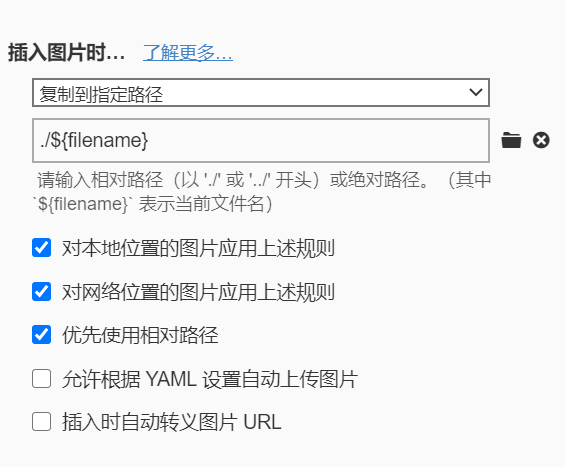

# 环境准备

## 安装git

## 安装node-js

可使用淘宝镜像的cnpm

```bash
npm install -g cnpm --registry=http://registry.npm.taobao.org
```

# hexo搭建

- 安装hexo框架

	```bash
	cnpm install -g hexo-cli
	```

- 初始化博客目录
  - 新建一个文件夹"blog"用来存放博客文件

  - 进入"blog"目录执行

    ```bash
    hexo init
    ```

    会在该目录下生成博客框架文件
  
  - 启动博客服务器 
  
    ```bash
    hexo s
    ```

- 清理与生成

  ```bash
  hexo clean # 清理已生成的文件
  hexo g     # 生成博客页面文件
  ```

# 相对路径图片

- 配置hexo的_config文件

  ```yml
  post_asset_fokder: true
  ```

- 安装图片插件

  ```bash
  npm install https://github.com/CodeFalling/hexo-asset-image --save
  ```

- typora设置

  

# 上传到git

**这里建议与下面的分支管理部分一起看,看完后再进行实操**

- 创建一个仓库, 仓库名为"用户名.github.io"

- 安装部署插件

  ```bash
  cnpm install --save hexo-deployer-git #在blog目录下安装git部署插件
  ```

- 配置hexo的_config.yml

  ```yml
  deploy:
  	type: git
   	repo: *** # 你的仓库地址,这里我使用的是ssh地址
    	branch: master # 这里建议新建一个pages分支
  ```

- 运行命令

  ```bash
  hexo d
  ```

  进行部署

此时, 打开"用户名.github.io"这个网址,即为个人博客

# 分支管理

在使用hexo进行博客和笔记的管理时, 会有一个需求, 那便是如果我们将生成的博客页面上传到github, 但我们一般也需要将我们的博客原文进行管理,所以这里使用多分支的方式, 同时在一个仓库中管理我们的博客工程与生成的博客页面,其中master分支存储博客工程, pages分支存储hexo生成的博客页面. 届时我们只要在blog目录下执行

```bash
git push
hexo d
```

便可以方便的将工程文件和博客页面都部署

**注意**

如果对node不是很熟悉, 建议首先删除blog目录下的".github"目录, 其中有一个"dependabot.yml"的文件, 该文件是

## master分支

master分支用于存储我们的博客工程, 在我们的git仓库创建完成之后, 我们先不进行部署,而是先在blog文件夹中执行

```bash
git init
git rmote add origin 仓库地址
git pull origin master
git push
```

此时 ,我们就可以将我们的博客工程文件上传到远程仓库的master分支中

## pages分支

回到之前我们说的hexo工程下的_config文件, 将其中的配置改为

```yml
deploy:
	type: git
 	repo: *** # 你的仓库地址,这里我使用的是ssh地址
  	branch: pages # 这里使用pages分支
```

意思是在部署我们的博客页面时, 我们将其部署到pages分支下

此时我们执行

```bash
hexo d
```

hexo 的 git 插件会自动帮我们将博客页面上传到仓库的pages分支中

# 主题安装

这里选用的主题是butterfly

> [Butterfly - A Simple and Card UI Design theme for Hexo](https://butterfly.js.org/)

在hexo的根目录执行

```bash
git clone -b master https://github.com/jerryc127/hexo-theme-butterfly.git themes/butterfly
```

如果速度太慢的话也可以进入这个地址直接下载压缩包, 将其中内容解压到blog/themes/butterfly中

## 本地搜索功能

本地搜索功能是指在博客中, 通过关键词, 对博客的内容进行一个搜索, 这里我使用的是hexo-generator-searchdb插件

- 在blog目录中执行

  ```bash
  cnpm install hexo-generator-searchdb --save
  ```

- 在blog目录中的"_config"文件中添加以下内容

  ```yml
  # hexo-generator-searchdb 的搜索配置
  search:
    path: search.json # 索引文件
    field: post # 搜索范围: post-所有文章, page-顶部导航选项页面, all-所有文章和顶部导航选项页面
    content: true # 是否包含文章主体/内容
    format: html # 将html原文本省略
  ```

- 修改主题配置文件

  进入路径 blog/themes/butterfly, 编辑该目录下的"_config"文件

  ```yml
  # Local search
  local_search:
    enable: true
    # Preload the search data when the page loads.
    preload: true
    # Show top n results per article, show all results by setting to -1
    top_n_per_article: 1
    # Unescape html strings to the readable one.
    unescape: true
    CDN:
  ```

  