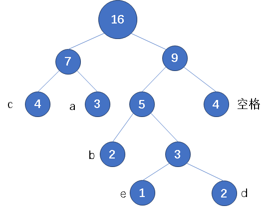
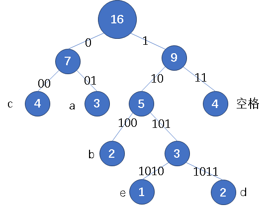

# 基本概念

一棵节点带权值的二叉树，若带权路径长度达到最小，称为最优二叉树，也叫哈夫曼树。权值越大离根节点越近。

- 带权路径

  指当前节点值乘当前节点的层数

- 树的带权路径长度 WPL 为所有叶子节点的带权路径长度之和，注意是叶子节点，不包括分支节点

# 构造方法

1. 给定N个权值，N个权值将会构造出一个有N个叶子节点的哈夫曼树。
2. 将N个权值作为N个森林，每个森林的树只有一个节点
3. 在森林中选出两个根节点的权值最小的树合并，作为一棵新的树，新树的根节点权值为其左右子树根节点权值之和。
4. 从森林中删除选取的两棵树，并将新树加入森林。
5. 重复3，4，直到森林中只剩一棵树，该树即为所求哈夫曼树

# 哈夫曼编码

出现频率高的字符编码成较短的二进制数，而出现频率低的字符编码成较长的二进制树，这样可以用更少的比特数表示更多的字符，可应用于如数据压缩。

举例：

对字符串“aaa bb cccc dd e”其中的字符进行哈夫曼编码

1. 统计各个字符出现的次数

   | a    | 空格 | b    | c    | d    | e    |
   | ---- | ---- | ---- | ---- | ---- | ---- |
   | 3    | 4    | 2    | 4    | 2    | 1    |

2. 根据出现次数为权值进行哈夫曼树的构造

   

3. 在树上进行编码，左分支编0，右分支编1

   

   

   | a    | 空格 | b    | c    | d    | e    |
   | ---- | ---- | ---- | ---- | ---- | ---- |
   | 01   | 11   | 100  | 00   | 1011 | 1010 |