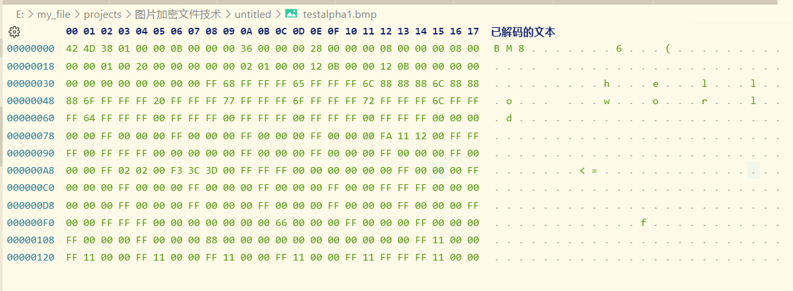
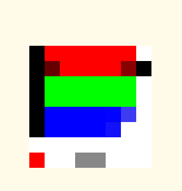
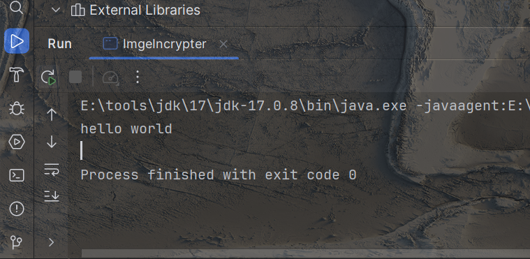

# 原理

bmp文件是不会压缩图片内容的，所以可以用来存储信息，在32位格式的bmp图片中，每个像素都有四个通道，分别为ARGB，也就是透明度，红色，绿色，蓝色。但bmp的透明度通道似乎不会被软件所解析，所以当修改其内容时并不会对图片显示有影响。

故可进行操作：将待加密文件转为字节数组，将每一个字节逐个存入 bmp的alpha通道中即可完成加密，解密则是将图片的alpha通道内容读出并拼接。

同时用了bmp文件本身的保留区（06-09）来存储原文大小，保留区本身无意义，进行修改不会影响

# 代码

```java
import java.io.*;
import java.nio.ByteBuffer;
import java.nio.ByteOrder;

public class ImgeIncrypter {
    public static void main(String[] args) {
//        enc();
        dec();
    }

    static void closeStream(Closeable closeable) {
        if (closeable != null) {
            try {
                closeable.close();
            } catch (IOException e) {
                throw new RuntimeException(e);
            }
        }
    }

    static void dec() {
        File bmpFile1 = new File("./testalpha1.bmp");
        FileInputStream bmpFileInputStream = null;
        ByteArrayOutputStream bmpByteArrayOutputStream = null;
        ByteArrayOutputStream encByteArrayOutputStream = null;
        try {
            bmpFileInputStream = new FileInputStream(bmpFile1);
            bmpByteArrayOutputStream = new ByteArrayOutputStream();
            encByteArrayOutputStream = new ByteArrayOutputStream();
            byte[] buf = new byte[1024];
            int len = 0;
            // 将bmp图片读入到字节数组，存入内存
            while ((len = bmpFileInputStream.read(buf)) != -1) {
                bmpByteArrayOutputStream.write(buf, 0, len);
            }
            byte[] bmpByteArray = bmpByteArrayOutputStream.toByteArray();
            // 获取加密文件内容长度
            int length = getIntFromLittleEndian(bmpByteArray, 0x06, 4);
            // 找到bmp像素开始位置，循环操作alpha通道写入待加密文件
            int beginIndex = getIntFromLittleEndian(bmpByteArray, 0x0A, 4);
            for (int i = 0, currentAlpha = beginIndex + 3; i < length; i++, currentAlpha = currentAlpha + 4) {
                encByteArrayOutputStream.write(bmpByteArray[currentAlpha]);
            }
            byte[] byteArray = encByteArrayOutputStream.toByteArray();
            String encContent = new String(byteArray);
            System.out.println(encContent);
        } catch (FileNotFoundException e) {
            throw new RuntimeException(e);
        } catch (IOException e) {
            throw new RuntimeException(e);
        } finally {
            closeStream(bmpFileInputStream);
            closeStream(bmpByteArrayOutputStream);
        }
    }

    static void enc() {
        File bmpFile = new File("./testalpha.bmp");
        File bmpFile1 = new File("./testalpha1.bmp");
        File encFile = new File("./test.txt");
        FileInputStream bmpFileInputStream = null;
        FileInputStream encFileInputStream = null;
        ByteArrayOutputStream bmpByteArrayOutputStream = null;
        ByteArrayOutputStream encByteArrayOutputStream = null;
        FileOutputStream bmpFileOutputStream = null;
        try {
            bmpFileInputStream = new FileInputStream(bmpFile);
            encFileInputStream = new FileInputStream(encFile);
            bmpByteArrayOutputStream = new ByteArrayOutputStream();
            encByteArrayOutputStream = new ByteArrayOutputStream();
            bmpFileOutputStream = new FileOutputStream(bmpFile1);
            byte[] buf = new byte[1024];
            int len = 0;
            // 将bmp图片读入到字节数组，存入内存
            while ((len = bmpFileInputStream.read(buf)) != -1) {
                bmpByteArrayOutputStream.write(buf, 0, len);
            }
            byte[] bmpByteArray = bmpByteArrayOutputStream.toByteArray();
            // 将待加密文件读入到字节数组，存入内存
            while ((len = encFileInputStream.read(buf)) != -1) {
                encByteArrayOutputStream.write(buf, 0, len);
            }
            byte[] encByteArray = encByteArrayOutputStream.toByteArray();
            // 在bmp文件的保留位存储待加密文件的长度
            byte[] bytes = getLittleEndianByteArray(encByteArray.length);
            for (int i = 0; i < 4; i++) {
                bmpByteArray[0x06 + i] = bytes[i];
            }
            // 找到bmp像素开始位置，循环操作alpha通道写入待加密文件
            int beginIndex = getIntFromLittleEndian(bmpByteArray, 0x0A, 4);
            for (int i = 0, currentAlpha = beginIndex + 3; i < encByteArray.length; i++, currentAlpha = currentAlpha + 4) {
                bmpByteArray[currentAlpha] = encByteArray[i];
            }
            // 保存bmp文件
            bmpFileOutputStream.write(bmpByteArray);
        } catch (FileNotFoundException e) {
            throw new RuntimeException(e);
        } catch (IOException e) {
            throw new RuntimeException(e);
        } finally {
            closeStream(bmpFileInputStream);
            closeStream(encFileInputStream);
            closeStream(encByteArrayOutputStream);
            closeStream(bmpByteArrayOutputStream);
            closeStream(bmpFileOutputStream);
        }
    }

    static int getIntFromLittleEndian(byte[] buf, int offset, int len) {
        ByteBuffer wrap = ByteBuffer.wrap(buf, offset, len);
        wrap.order(ByteOrder.LITTLE_ENDIAN);
        int anInt = wrap.getInt();
        return anInt;
    }

    static byte[] getLittleEndianByteArray(int src) {
        byte[] buf = new byte[4];
        ByteBuffer wrap = ByteBuffer.wrap(buf, 0, 4);
        wrap.order(ByteOrder.LITTLE_ENDIAN);
        wrap.putInt(src);
        return wrap.array();
    }
}

```

# 运行

加密内容：hello world



不影响图片显示（图片本来就是这个样子）



读出：

