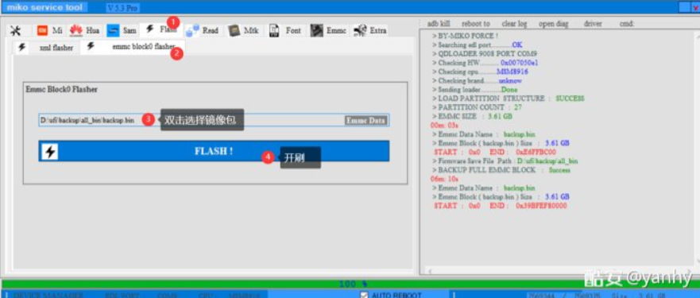
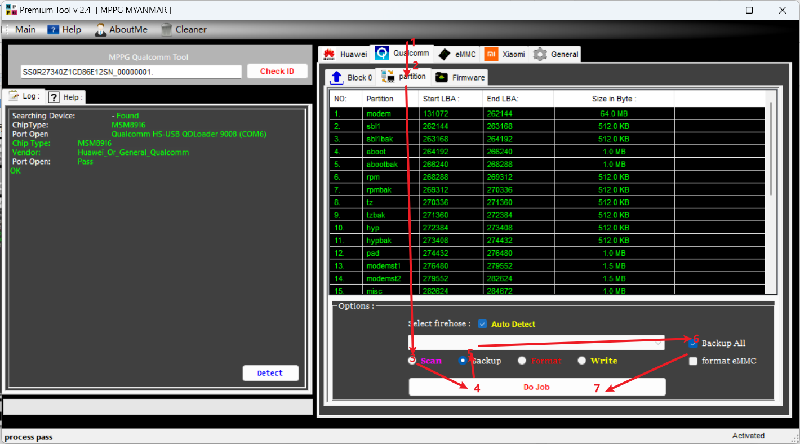
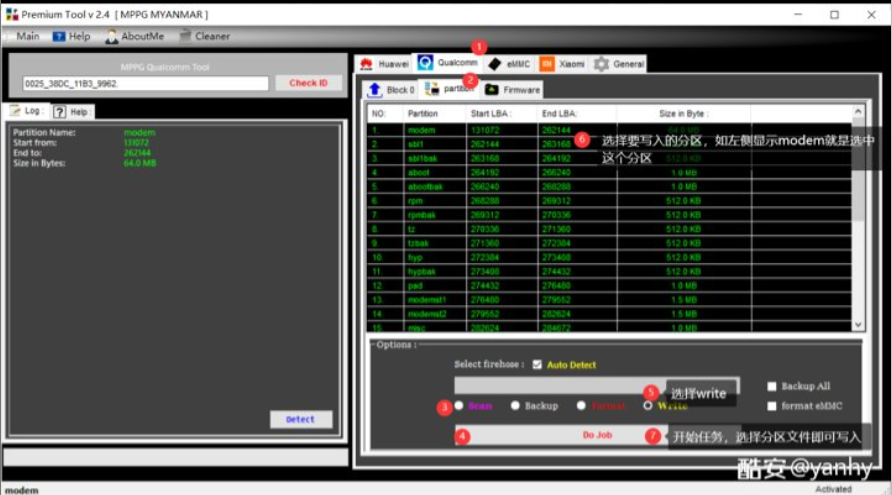
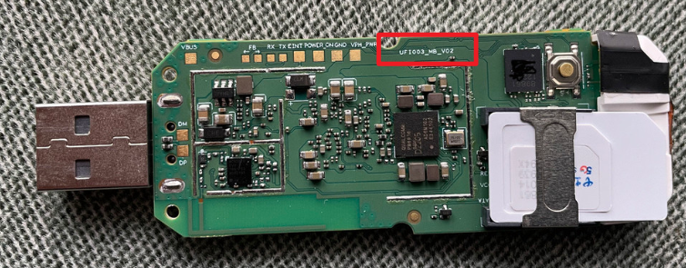
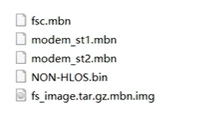

# 参考资料

[随身wifi折腾入门（1）-- 开箱&备份 来自 yanhy - 酷安 (coolapk.com)](https://www.coolapk.com/feed/45320764?shareKey=ZTU4ZGY2ZWFjNDRlNjQ1ZTNjNTI~&shareUid=24743986&shareFrom=com.coolapk.market_13.1.3)

[随身WiFi刷纯净版Debian教程+Debian设置中文+插手机卡上网+设置主机名内存4G剩2.4G_哔哩哔哩_bilibili](https://www.bilibili.com/video/BV1oT411n75V/?spm_id_from=333.880.my_history.page.click&vd_source=7103983ce7cdb97d8715a21074de9a20)

# 购买

选择为410的芯片的主板，可以查看店铺购买评论来判断, 一般客服也不知道

# 环境

win11

# 所需文件

链接：https://pan.baidu.com/s/1b8S9iy8W1EF6lMcQCLpgUQ 
提取码：2u69

# 软件安装

建议新建一个文件夹并将其加入杀毒软件白名单，避免杀毒软件误删文件

1. 安装vivo9008驱动

   连接板子的驱动

3. 解压9008分区操作工具

   建议解压到全英文路径, 虽然笔者中文路径使用的时候没有出现问题

4. 解压9008全量备份工具

   运行miko.exe进行安装, 安装结束后将Loader.exe拖入安装目录, 之后使用Loader.exe来运行

5. 解压[ADB&Fastboot工具]platform-tools.zip, 可将文件夹命名为tools文件夹

   进入该文件夹, 打开cmd, 指令adb, 有正常输出

   ```
   Android Debug Bridge version 1.0.41
   Version 31.0.3-7562133
   Installed as D:\[yanhy]����wifiˢ���ر�\tools\adb.exe
   
   global options:
    -a         listen on all network interfaces, not just localhost
    -d         use USB device (error if multiple devices connected)
    -e         use TCP/IP device (error if multiple TCP/IP devices available)
    -s SERIAL  use device with given serial (overrides $ANDROID_SERIAL)
    -t ID      use device with given transport id
    -H         name of adb server host [default=localhost]
    
    ..............
    
   ```

6. 下载7z

   7z格式文件压缩/解压工具: [下载地址](https://www.7-zip.org/a/7z2201-x64.exe)

6. 下载FinalShell

   ssh连接工具 [FinalShell SSH工具,服务器管理,远程桌面加速软件,支持Windows,macOS,Linux,版本3.9.8,更新时间2023.1.30 - SSH工具 SSH客户端 (hostbuf.com)](http://www.hostbuf.com/t/988.html)

# 进入9008模式

- 方法一

  - 按住棒子上的rst按钮插入电脑, 自动进入9008模式, 可在设备管理器中端口树下看到一个9008设备

- 方法二

  - 将棒子插入电脑, 此时默认会进入adb模式. 打开设备管理器, 查看是否可以看到android device

    

  - 进入tools文件夹进入cmd, 执行adb devices, 此时可以看到输出设备列表

    ```
    List of devices attached
    0123456789      device
    ```

  - 指令 adb reboot edl, 棒子会自动重启到9008, 此时adb devices 设备列表为空, 且设备管理器可以在端口树下看到一个9008设备

# 备份

这里借用酷安大佬yanhy的图

## 全量备份

1. 打开9008全量备份工具(miko)

2. 备份过程

   

   点击加载分区后左边会出现列表, 此时再点击一次全选, 然后按顺序即可

3. 恢复过程

   

## 全分区备份

1. 进入9008分区操作工具目录(Qpt)

2. 打开CMD_KEYGEN_CRACKED_by_FACEBOOK.exe破解器, 点击GenerateKey生成key文件, 将其保存到指定位置.

3. 打开9008分区操作工具, 点击左上角help->activate, 选择刚刚生成的key文件, 激活成功

4. 按照如下步骤备份全部分区,时间比较长, 左边控制台显示backup finish即可

   

5. 恢复过程

   

# 刷机

## 资源下载

资源一：Debian系统可以下载地址 https://github.com/OpenStick/OpenStick/releases 

资源二：Debian系统说明 https://www.kancloud.cn/handsomehacker/openstick/2637559 

资源三：boot.img获取地址 https://www.123pan.com/s/XwVDVv-WICn3

## 组装刷机包

1. 在资源一中下载base.zip与debian.zip两个文件, 并分别解压到base文件夹, debian文件夹

2. 在资源三中下载对应板子型号的boot文件,并解压内容到boot文件夹

   

3. 打开boot文件夹, 找到boot.img, 将该文件移入debian文件夹, 替换debian文件夹中的boot.img文件

4. 打开备份过程中备份的全分区备份文件夹, 找到如下五个文件

   

   重命名fs_image.tar.gz.mbn.img为fsg.bin;

   重命名fsc.mbn为fsc.bin;

   重命名modem_st1.mbn为modemst1.bin;

   重命名modem_st2.mbn为modemst2.bin;

​       将四个文件移入base文件夹

## 刷机

1. 重新把棒子插到电脑上, 进入tool文件夹, cmd执行adb reboot bootloader, cmd执行fastboot devices, 出现设备列表则说明棒子已经进入fastboot模式

2. 进入base文件夹, 运行flash.bat,一路回车,直到cmd窗口关闭

3. 进入debian文件夹, 运行flash.bat, 一路回车, 直到显示all done, 再次回车cmd窗口关闭

4. 此时系统已经刷入, 将棒子拔下来重新插入

## 更换驱动

1. 进入设备管理器

2. 选择android device下的adb设备，右键更新驱动为“Android Composite ADB Interface”
3. 拔下重插，设备管理器读到一个未知设备

4. 点击未知设备, 右键更新驱动->浏览我的电脑查找驱动程序->让我从计算机上的可用驱动程序列表中选取->网络适配器->Microsoft->基于远程NDIS的Internet共享设备->不推荐安装...是否继续(是)
5. 此时无线wifi会作为硬件网卡使用

## ssh链接

地址 192.168.68.1

用户名 user 密码 1

- 方法一

  使用cmd, 运行ssh user@192.168.68.1,回车

  输入密码, 进入ssh界面

- 方法二

  使用FinalShell链接

便可进入系统

## 工具安装

### root用户

1. 配置超级用户

   sudo passwd root

   输入user用户密码1

   输入root用户密码如123456

2. 切换到超级用户

   sudo su - 

3. 允许root用户远程登录，重启服务或系统后生效

   echo "PermitRootLogin yes" >> /etc/ssh/sshd_config

### 连接wifi

1. nmtui 进入网络设置界面
2. 选择 Active  a connection
3. 选择wifi热点, 输入密码进行连接
4. ifconfig 查看网络状态

### 更新依赖

```bash
true > /etc/apt/sources.list.d/mobian.list
apt-get update
apt-get install curl
apt-get install -y wget
apt update
apt install vim git cron dnsutils unzip lrzsz fdisk gdisk exfat-fuse exfat-utils
```

### 配置时间与中文环境

```bash
dpkg-reconfigure tzdata
# 选6.然后选70（亚洲 上海）
apt-get install locales
# 然后配置locales软件包：
dpkg-reconfigure locales
# 在界面中钩选487. zh_CN.UTF-8 UTF-8
# 输入487
# 然后输入3
# 重启设备
reboot
```

## 一些命令

### 查看磁盘剩余空间 

df -lh

### 开机自启配置

```bash
#创建启动脚本
touch /etc/rc.local 
echo '#!/bin/sh -e' > /etc/rc.local 
echo "exit 0" >> /etc/rc.local 
chmod +x /etc/rc.local 
systemctl daemon-reload 
systemctl start rc-local 
#修改启动脚本 
vi /etc/rc.local 
```


